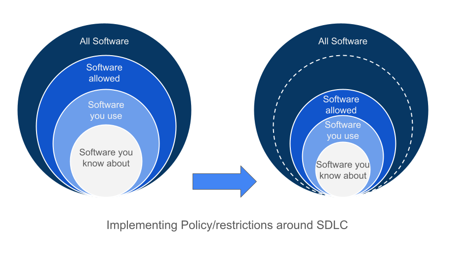

== Aggregation and Synthesis

This chapter covers:

* Understanding important questions that metadata should answer about your SDLC
* Learning how to answer those critical SDLC questions in a scalable way through a supply chain knowledge graph 
* Exploring examples of insights one can get from a supply chain knowledge graph

In chapter 7, we introduced aggregation and synthesis as the third layer of the framework for scaling software supply chain security.
In the previous chapter, we covered metadata and attestations, which provided the needed collection of documents to start understanding and making decisions on the SDLC.
In this chapter we will go into how you can take the raw data and make sense out of it.

=== Metadata, check. What now?

Previously, we’ve shown a sampler of the different types of metadata and attestations that inch you closer to finally answering some questions about the software produced by our organization’s SDLC.
Let’s start with a couple use cases and explore how you’d attempt to tackle those today.
These use cases fall into three main themes:
reactive (responding to an incident), preventive (checking for known threats), and proactive (identifying high risk areas for future investment).

==== Reactive: Log4shell, how is my organization affected?

Two of the most common questions asked when a big vulnerability like log4shell is released are “am I affected?” and “how do I respond to it?”
Today, this is a more challenging question to answer than one may imagine.
Back in the 1990s, the software and services you ran could be counted on your fingers and you’d just have to go through the list of 10 machines.
In today’s world of cloud native computing, that is no longer the case.
In the world of microservices, spot instances and a plethora of IaaS, PaaS, and SaaS services, the number of services that make up an organization is hard to keep track of.
A common phrase used to describe the shift in the attitude to computation is to treat workloads like “cattle, not pets”.
Gone are the days where an organization had a spreadsheet of all the physical servers and each was manually patched.
Today, an organization has multiple services, running across multiple service offerings, and potentially across multiple clouds.

Having metadata across multiple services is only one of many ways in which metadata silos manifest themselves.
Organizational silos are usually another offender.
Different engineering teams often have different requirements and preferences.
For example, a team focused around frontend development will use a different set of toolchains and services from a team developing a backend, while a team developing an AI model may have different infrastructure needs (e.g. GPU compute, spot instances).
Therefore, individual teams often result in having their own tech stacks, resulting in further metadata silos.

Thus, it is unsurprising that when faced with the “am I affected by log4shell?” question, many organizations struggle to find the answer.
In response to log4shell, according to the Cyber Safety Review Boardfootnote:[https://www.cisa.gov/sites/default/files/publications/CSRB-Report-on-Log4-July-11-2022_508.pdf] (CSRB), many organizations ended up scrambling.

[quote,Cyber Safety Review Board, Review of the December 2021 Log4j Event]
Defenders faced a particularly challenging situation; the vulnerability impacted virtually every networked organization and the severity of the threat required fast action. The fact that there is no comprehensive “customer list” for Log4j, or even a list of where it is integrated as a sub-system, hindered defender progress. Enterprises and vendors scrambled to discover where they used Log4j.

The response to the “am I affected” question results in a swath of queries across many different services, platforms and vendors.
This is due to the fragmentation of metadata caused by silos and the lack of organizational aggregation of this data.
This results in a query to answer the question making multiple calls to different services as seen in Figure 9.1.

Figure 9.1 shows how different teams across an organization can be siloed, and have different software stacks and services, each with their own set of metadata of query endpoints.
These boundaries can also overlap across services, which makes the exercise of metadata collection (as illustrated in the above figure with the “Accounting” software stack) more complicated.
You see from this that you need to effectively aggregate the metadata available in the different silos to be able to do these queries effectively in an organization.

.Figure 9.1. An example siloed metadata across teams and different development tools/services.

==== Preventive: How do I prevent running of insecure software?

Security breaches, data leaks, and other security badness often are a result of running vulnerable software.
Most of the time, these are avoidable if you ensure good security posture and hygiene of software that you release and run.
It may be that an old version of software was run for some reason, or an unauthorized build from a developer’s machine was used.
How do you create controls to reduce the risk of such occurrences?

This can be done through policy and enforcement points to ensure that software meets security policy.
A prerequisite of being able to enforce these policies is that you have the software metadata readily available.
However, this is mostly not the case today. 

If you’re familiar with security compliance (e.g. SOC2, FISMA, FEDRAMP, ISO 27001, HIPAA, PCI), you will be familiar with the spreadsheets and how much of the process is rooted in manual workflows.
In less-mature security organizations, compliance is still largely a manual process which is part of each product’s team responsibility.
Teams show that they pick from a list of “blessed” list of services and write a couple paragraphs on why they do not violate the relevant NIST SP 800-53 controls.
This works, but it is very slow.
Because of the high maintenance cost, the advancement of technology stacks moves _very_ slowly.
During our time working with certain government organizations, there were versions of browsers in use which were dangerously close to being at the end of support life.

Today, because of OMB memo M22-18footnote:[https://www.whitehouse.gov/wp-content/uploads/2022/09/M-22-18.pdf] that the Biden administration put out, organizations are scrambling to produce SBOMs and NIST SSDF self-attestations.
It is apparent from the delayed deadlines from the original memo and open letters that this muscle is still in development by most organizations.
This is a complex problem due the need to aggregate internal software data with data from other vendors and open source software, and to be able to synthesize and create links between the supply chain to effectively produce these documents.

With the increase in supply chain security controls in compliance frameworks, we expect within the next decade that organizations will need to be able to produce documents and evidence related to not only their software but its supply chain.
This means incorporating software metadata like SBOM, SLSA, and VEX into your compliance work streams.

==== Proactive: How do I not be on the front page of the WSJ? Finding log4shell before others do

There are many factors that lead to “branded vulnerabilities”, such as Meltdown and Heartbleed, being prominent in the industry.
Among those are the impact that they have (leaking keys in Heartbleed) as well as how widespread they are (Meltdown affected almost every machine).

On one hand, it is unrealistic to try to make software bulletproof to future vulnerabilities.
However, it is also not productive to assume there will be vulnerabilities and not do anything about them.
This is where security executives have to make a decision on where to invest.
Performing a security audit against a public facing website versus an internal tool used by a team of five will provide vastly different return on investments.
This, however, is only one of many ways in which analysis can be done to figure out the best opportunity to reduce software risk.
This is an exercise in determining software criticality.

Software criticality is the measure of how important a piece of software is.
This is dependent on its risk:
the impact associated with the compromise of a piece of software and the likelihood that it will be compromised, according to a particular ecosystem’s scope.
For example, the OpenSSF criticality score projectfootnote:[https://openssf.org/projects/criticality-score/], which calculates criticality of open source projects based on multiple factors like repository age, number of contributors, number of dependents, etc.
The OpenSSF then uses this information to help inform how it distributes rewards through its Secure Open Source Rewards program (SOS), which rewards a very broad range of improvements that proactively harden critical open source projects and supports infrastructure against application and supply chain attacks.

Note that software flagged as critical in the open source ecosystem may not actually be used within your own organization.
Similarly, your organization’s most critical software dependencies may not be widely used and thus have a low criticality score when measured by external parties.
The criticality of software always depends on the context of the organization using it.
Google for example, has formed an Open Source Security Upstream team, which helps to fix issues within open source projects.
Among many factors, this team considers both open source criticality and organizational criticality in determining the list of projects to help.

Organizations have multiple approaches to determine criticality, but largely today are based on manually flagging certain pieces of software.
However, analytics can be done through synthesizing software metadata such as finding the most-depended-on library within an organization or identifying stale or unmaintained but heavily relied on packages within the ecosystem.

=== Let’s solve it!

In exploring the problems, we briefly touched on several hurdles to overcome, such as metadata silos, the inability to perform transitive analysis on the software supply chain, and the need to do more advanced synthesis on one’s software catalog.
These problems fall largely in the domain of aggregation and synthesis of software metadata, and are generally hard problems to solve at scale.
Looking back on the CSRB report on log4shell, we note that there was a rather grim outlook on these sets of problems:

[quote,Cyber Safety Review Board, Review of the December 2021 Log4j Event]
Industry experts have called for increased automation to help organizations identify vulnerable software and execute Enterprise Risk Management at scale, but they also recognize that cataloging software components at this depth can be prohibitively labor intensive. Solutions to enable these necessary capabilities do not exist.

Fortunately, we, the authors of the book, had something brewing!
Since the log4shell event, we’ve been working on exactly such capabilities with our project GUACfootnote:[https://guac.sh] (Graph for Understanding Artifact Composition), a software supply chain knowledge graph.
In the rest of this chapter, we will talk through what a software supply chain knowledge graph is, and how you can use GUAC and other tools to overcome some of these hurdles in your security response.

==== What is a Software Supply Chain Knowledge Graph?

A software supply chain knowledge graph provides a wealth of knowledge of software in your software supply chain.
It acts as a source of truth for software metadata, whether in your organization, or from external open source or third party software.
It provides the ability to make queries across your software metadata.
A software supply chain knowledge graph should be able to answer questions about your entire supply chain, from endpoint, development environment, software factory, to runtime.

Starting with reactive queries, like knowing if you are affected by log4shell, a query to the knowledge graph could be “tell me which of my running container images are affected by log4shell”, or “show me where log4shell is introduced in my software so that I can fix it.”
For risk analysis, it could be “what are the most critical running services that have access to PII that are affected by log4shell that I should fix first?”.

To answer the preventive queries around compliance and policy, you may ask questions of a supply chain knowledge graph like “give me all the SBOMs and SLSA attestations for this container image and all its dependencies”, “show me that payment-service:v2.0.3 has complete recent vulnerability scans, and VEX statements exists for critical vulnerabilities”, or “give me all the evidence that my software development process is in accordance with NIST SSDF.”

Finally, in terms of proactive queries, a software supply chain knowledge graph would be able to answer questions like “What is the most depended-on library for all of my services that have access to PII?” or “which pieces of open source software am I depending on which have not been maintained?”

This is only scratching the surface of the capabilities a software supply chain knowledge graph can provide.
However, before you get overly excited on what such a knowledge graph can provide us, you need to understand that a supply chain knowledge graph is only as good as the quantity and quality of software metadata it has access to!
So in order to figure out how your organization can use a supply chain knowledge graph, let’s find out more about how it works!

==== How does a Supply Chain Knowledge Graph work?

The foundations of a supply chain knowledge graph work via a continuous loop of aggregation and synthesis.
It continuously does these two functions in order to collect all the metadata across the supply chain and creates relationships between the data so that they can be queried and analyzed to derive answers to the questions.

===== Aggregation

An example of aggregation is collecting software metadata from different sources, from endpoints, to source repositories, artifact repositories to runtime orchestration systems – this provides the ability to query data throughout all aspects of the supply chain.
In addition, aggregation also includes bringing in information external to your organization – for example, from your ingested dependencies.
This can include common security metadata such as vulnerabilities, threats, known supply chain compromises, and additional data like release dates, maintainers, etc. which can be useful, too.
For example, an organization may not want to use released software that is less than a week old so that it can observe it being used in the wild, since there is a chance newly released software may be compromised or include malware would be reported by other users (for example, the faker/colors javascript sabotagefootnote:[https://github.com/cncf/tag-security/blob/main/supply-chain-security/compromises/2022/js-faker-colors.md]).

===== Synthesis

Synthesis helps derive meaning from the software metadata and creates relationships between them.
The most common example of this is deriving dependencies.
For example, SBOMs encode not only a list of package dependencies but also the relationships between them.
Today, most users only use the information from an SBOM that says PaymentApp depends on vault-sdk and go-difflib, as illustrated in Figure 9.2. 

.Figure 9.2. How software is most commonly viewed, as a flat list of dependencies.

From this naïve view of the dependencies, you might determine that package go-difflib should not be used.
This could be for one of many reasons – e.g. compromised maintainer or project is unmaintained, etc.
You might naïvely remove PaymentApp's usage of the go-difflib library, but doing that will not actually remove the dependency on go-difflib!
Why not?

If you properly synthesize additional information, you will realize that the vault-sdk package also depends on go-difflib.
Figure 9.3 shows you that the dependency tree also includes an additional relationship between vault-sdk and go-difflib.

.Figure 9.3. How software is represented in actuality, as a graph of dependencies.

Thus, with synthesis, you would realize from the outset that that you not only need to change your code to not depend on go-difflib, but you would need to also make upstream changes to vault-sdk, or find an alternative library that provides the same functionality.

This is a simple example of synthesis of a single file, but synthesis shines when you look at the creation of relationships between files.
For example, if you have multiple documents that describe related components, synthesis will be able to bring them together to provide additional insight.
If you take a list of metadata documents for a popular tool like kubernetes, you are able to establish additional relationships between the documents that would not be possible on their own.
In this case, ingesting an SBOM, SLSA provenance and Scorecard information for the kubernetes controller manager will result in the relationships shown in Figure 9.4.

.Figure 9.4. A graph created from forming links between metadata from a Kubernetes container image.
image::images/fig-kubernetes_graph.png[]

From the SBOM of the kubernetes controller manager image generated by the Syft SBOM generation tool, you can see that there was an executable binary included with the hash “sha256:13d8…”.
From the SLSA provenance that was generated by the build release pipeline you learned that the binary with hash “sha256:13d8…” was produced by a build process invoked on the git repository “github.com/kubernetes/kubernetes” at commit “1ff6..”.
Finally, you have an OpenSSF Scorecard document which tells you that the repo at that commit has an overall score of 8.7!
From this synthesis process, you were able to answer “what is the security posture of the code that produced this container?”, which in this case is good (8.7).

In the following sections, we will showcase how your organization can leverage the power of a supply chain knowledge graph with the GUAC project, and showcase the true capabilities of aggregation and synthesis!

=== Getting started with your own supply chain knowledge graph

In this chapter, we will use an open source implementation of the supply chain knowledge graph, Graph for Understanding Artifact Composition (GUAC).
GUAC provides both aggregation and synthesis capabilities, and works by ingesting software metadata from your organization, public sources and vendor tools and synthesizes them as a knowledge graph.
This graph can then be queried to gain insights into the supply chain to solve the issues tackled in this chapter.
Figure 9.5 is a high-level flow of how a supply chain knowledge graph is set up with GUAC.
You see that metadata from many different sources all go through the ingestion process and translate to a supply chain knowledge graph in GUAC.
This includes different types of metadata that we talked about in chapter 7 (build provenance, software bill of materials, scorecards, certifications, vulnerability and vulnerability exploitability information, etc.), and joining data from various sources (within the organization, as well as public databases and vendor/third party tooling and services).

.Figure 9.5. A high level overview of what GUAC provides.

These all get translated to a common data model that takes the shape of a graph, exposing a set of query interfaces that users, such as CISOs, or analytics and policy engines can call to retrieve the information.
This common data model (called the GUAC ontology), is a key aspect of GUAC.
The GUAC ontology is what enables GUAC to be pluggable and extendable.
CISOs and organization policy are aimed at achieving certain answers by asking questions such as “am I using a vulnerable version of log4j?” rather than include implementation specifics like “do I have an SPDX document that contains a dependency log4j”.
If a new SBOM standard comes out or a new vulnerability scan format comes out, the questions you ask of your supply chain graph should not change.
Instead, GUAC abstracts this away by translating new documents to its common data model.
This allows questions to be asked across different formats today – agnostic of whether SBOMs are CycloneDX or SPDX.

However, it is not to say that showing how you end up to the answer to that question isn’t important.
As with every tool, especially those that help us synthesize large amounts of data (artificial intelligence (AI), machine learning and large language models (LLMs) being an extreme example), you want to be able to validate and understand the answers you get.
Therefore, with every relationship created within the supply chain knowledge graph, GUAC stores when and why it made that conclusion.
Whenever an answer to a supply chain question is provided, GUAC follows up and provides the list of evidence to why it made that conclusion.
Thus, in some sense, you can imagine GUAC to be a telescope in order for you to help focus in on a sea of supply chain data.
In fact, GUAC ties in nicely to the generative AI and LLM space — one of the challenges of security being the ability to translate policy and requirements into understanding and synthesis of data.
We will touch on that more in the next chapter.

=== Starting with Aggregation

Great!
Now that you have an idea of how a supply chain graph should work, let’s get started with getting that data in!
After all, the fidelity of answers you get from your knowledge graph is only as good as the data that you put in.

==== Tearing down metadata silos

Aggregation is where most organizations run into the trouble of metadata silos we hinted at earlier.
The SDLC is a complex beast and consists of many different components across many products, teams and services.
Unless you’ve made a conscious effort to keep track of where all your systems are, getting a good sense of what systems you have will be a good first step.
The bigger the organization you have and the more diverse the set of technologies you support, the harder the exercise will be.
You will have to start by asking:

* What are the different end-to-end workflows that can be used to produce software?
* How do we and our customers consume software (both internal and external)?
* For each component of the SDLC, what systems are running?

==== How is software produced?

For the Secure Bank example, let’s start with any end-to-end workflows that you know of.
One way to do this is through interviewing different teams on their workflow.
In addition, having an organization-wide program can be greatly beneficial to get the cooperation of different development teams and product owners.
An example of this is the United States Executive Order 14028https://www.federalregister.gov/documents/2021/05/17/2021-10460/improving-the-nations-cybersecurity, which helped organizations supplying software to federal agencies to rally around documenting their software inventory.
An example of this is the United States Executive Order 14028,footnote:[] which helped organizations supplying software to federal agencies to rally around documenting their software inventory.

Drawing from the example in chapter 6, you have a golang payment application back-end.
You go through the flow of how the Golang payment application is developed.
What are the different end-to-end workflows that can be used to produce software?

. A software developer logs into their workstation
. They SSH into a remote machine where their code lives, and a web interface to an IDE that gives access to code files
. The code files that they have access to include golang code as well as the container build file (e.g. Dockerfile)
. When development is done, the push their code to the internal hosted GitHub repo github.example.com/golang-payment-app
. The code is then reviewed by team members, approved and merged into the repository
. Automatically, a CI is launched which 
.. runs a vulnerability scanner (e.g. govulncheck) on the application 
.. builds the application binary and the container image
.. runs a vulnerability scanner and generates an SBOM for the container image 
.. pushes the container image to the internal container registry oci.registry.example.com/payment-app
. A site reliability engineer updates the deployment files (via a similar flow to the software developer) in github.example.com/payment-deployment in the staging branch
. Automatically, a continuous deployment (CD) process applies a deployment config is applied to application cluster defined within the files (e.g. configured OpenTofu process)
. The continuous deployment process checks against policies and make the appropriate changes to the runtime cluster
. The same is done when upgrading applications from staging to production

From the above list of processes you can gather quite a bit of knowledge about which information would be relevant for you:

* Developer workstation access logs
* Development machine IP/hostnames that are used for development and their logs and any relevant information
* The code repository for the payment application github.example.com/golang-payment-app
* GitHub repository and infrastructure logs and relevant information (PRs, Issues, commits, security settings, etc.).
* CI process configuration
* Artifacts that are coming from the CI process
* The repository where the container images are stored oci.registry.example.com/payment-app
* The deployment configuration code changes (and associated metadata) at github.example.com/payment-deployment
* CD process configuration in OpenTofu
* Policy engine logs and policy configurations
* Cluster runtime logs

You have a wealth of information from a development team’s interview – which is great!
However, you notice that there are some gaps and known unknowns – for example, you know there is a CI process, but are unsure what the exact nature of that setup is.
Also, you know certain information exists, such as SBOMs and vulnerability scan results, but you do not know where those are stored.
This is when you need to do more investigation in order to get a more holistic picture. 

===== How Is software consumed (both internal and external)?

Continuing along the lines of the workflow for the payments application, let’s start with how is software being consumed throughout the SDLC:

* There is a high likelihood that the code developed may depend on other Golang libraries.
** In this case, what are the lists of libraries that are used? 
** Are they approved for organization use?
* Is there an internal mirror (or in Golang’s case a go proxy) with a list of libraries used within the organization?
* In building the container image – what base images are being used? 
** Are you using base Linux distributions from public registries? 
* If you are using any third-party libraries,
** do you have any SBOMs for them?
** do you have a vulnerability SLA with your vendor?

This is not an exhaustive list;
consider everything that is involved in the process from build tools all the way down to the operating system that the developer runs on their workstation and development box.
Ask similar questions about those.

Another aspect to remember is how customers consume software that you produce.
Even if you produce the most secure software, if it is not being consumed in the right way, it can still create risk for customer data, and possibly also reputational risks to the company.
If a user has to download a client to use an application, how do you know if they are able to do it securely and not be affected by a person-in-the-middle attack?
One may argue that this is not “our problem”, but reputational risk comes in the form of the perception of the security of an organization.
As a bank, it’s definitely worth considering how to make users consuming your software as secure as possible. 

In the payment application case, it is a web application, and so it is hosted on your infrastructure?
The questions here would be:
which domain is it hosted on?
Who owns that domain and how are the credentials for them managed?
Is HTTPS enabled and how are certificates and keys secured?

===== Curating your inventory

You’ve gathered quite a lot of information already thus far through the approach of inspecting SDLC processes.
However, with any type of discovery, you will get the most out of it by adopting different approaches.
In this case, let’s look at observing what you can “see”.
What relevant assets are out there?
These are tangible assets and thus should not be ignored.
“We don’t use it anymore” doesn’t make the unpatched Windows XP machine plugged into your data center any less dangerous.

To help do this, here are a few starter questions that you can think about – and adapt them to specifics of your organization:

* What cloud providers are you using?
* Which language ecosystems and technology stacks do you use?
* Where is software stored and run?
* How do customers interact with the software you produce?

For Secure Bank, let’s say that you mostly use Google Cloud Platform.
In that case, you could login to your Google Cloud Platform console and retrieve a list of all services and assets in the cloud.
You would also look through the list of software vendors that you have services with, for example GitHub, Slack, etc.
You can then take this list of assets and cross check them against the list you got from your exploration of software production and consumption processes.
It is highly likely that there will be discrepancies in the lists, which will probe further questions.
For example, you may find that you have an AWS account, but are unsure which teams are using the services.
Likewise, the OCI registry you pushed the payments container to may not be present in your asset list, and perhaps there are more OCI registries that are not accounted for.

==== It’s impossible!?

When going through this exercise, do not let perfect be the enemy of good.
You’ll notice that in certain cases, it is impossible to scope.
For example, if developers within their dev environment are able to download and use any software, or there are no restrictions on what programming languages can be used.
In this case, it can be worth taking a step back to create policy and enforcement to narrow the technologies present in the software supply chain.
A policy can be instilled to require all development within an organization to only use Rust as a programming language, require all container images to be built via GitHub Actions, and so on.
As such restrictions get implemented, your organization will slowly begin to have a better sense of the software that is in scope of your supply chain.

Figure 9.6 visualizes how creating restrictions and best practices around software development impacts the ability to reason about your software supply chain data.
We note here that software refers broadly to software, code, services, tools, platforms, and any other systems that exist within the SDLC.
Eventually, the set of software you know about should also expand to encompass the software you use, so you know about all of the software that is being used within your organization.

.Figure 9.6. Policy restrictions can reduce the horizon of software used in an organization.

Of course, having alignment with organization policy doesn’t come in a snap of a finger.
Developer velocity and other business needs often need to be balanced with rolling out security policy.
What is helpful here is to make the policy easier to adopt.
Creating a set of maintained and supported well-lit paths for software development can help focus new development efforts towards good supply chain security practices, and can help teams reduce toil to meet compliance or develop faster!

==== Getting it done

Based on the example, let’s say you now have a list of repositories, services, assets, SBOMs, SLSA attestations, etc. gathered.
How do you now translate that into a software supply chain knowledge graph?

GUAC has a set of services called collectors, which are responsible for gathering documents from different metadata stores and collecting and ingesting them into a knowledge graph.
There are a variety of GUAC collectors, each of them is developed to understand protocols of different services. For example, there is an OCI registry collector, which is able to gather container images’ metadata from a registry, keeping it updated with the software it holds and the SBOMs, attestations, and other metadata associated with it.
Another example is the GitHub collector, which is able to gather metadata from GitHub repositories.

Regardless of the specific collector, when GUAC sees a new identifier, it will be added to the collection list.
The running collectors will automatically search and collect information about those identifiers.
For example, if an SLSA attestation contains a git path “git+https://github.com/kubernetes/kubernetes”, it will trigger the GitHub collector to get release information about kubernetes releases automatically to add to the knowledge graph.

Getting all the metadata into the knowledge graph is as easy as running collectors in your organization for each of these metadata sources.
In addition, if there are services that are not supported, or you have a collection of stray documents (e.g. provided by vendors, etc.), you can put them in any form or storage (file system, GCS bucket, S3 bucket, etc.), and run a GUAC collector that pulls the documents from blob storage.

GUAC supports many different document types, and is actively being extended to ingest more.
The nature of GUAC’s pluggability, as well as being an open source project, allows constant collaboration and support of the newest and latest standards.

===== Aggregating against unknowns

Now you’re able to ingest all the information that you know about!
But recall from earlier that there are likely going to be many known unknowns and unknown unknowns.
This is where GUAC provides additional facilities to help.
In GUAC, there are a set of collector and certifier services that help augment your knowledge graph.
They make your organization’s knowledge graph dynamic and are constantly adding in information to fill the gaps and enrich the understanding of your supply chain. 

The idea behind these services is fairly simple;
they constantly look at the software in the knowledge graph and reach out to external sources to help fill in the gaps.
These sources include vulnerability databases, license databases, package managers, dependency databases, etc.
They gather a variety of metadata and add it to your knowledge graph.

Figure 9.7 shows the ingestion of organization documents such as SPDX and CycloneDX SBOMs, and shows that additional vulnerability, OpenSSF Scorecards data, and dependency information is imported automatically into your GUAC supply chain knowledge graph.
Through the set of services of the supply chain knowledge graph GUAC, you are able to better aggregate organization information, and have better visibility into unknowns by querying external services.
These services can be public, but also can include paid threat intelligence provided by security vendors.
Organizations today regularly pay for threat intelligence feeds, and having these automatically overlaid in your software supply chain knowledge graph makes them easily actionable. 

.Figure 9.7. How GUAC helps to augment the data with external metadata sources through collectors.

=== Synthesizing the data

Now, you should have a pretty good starting point for the data in your supply chain knowledge graph.
Let’s see how you can leverage that knowledge!
The following sections will showcase how synthesis can answer supply chain questions and provide interesting findings that can then be done to drive policy and change in the following chapter.

Let us revisit the 3 questions raised at the start of the chapter and see how you can solve them with the help of synthesis capabilities.

==== Responding to vulnerabilities and compromises

“How is my organization affected by new vulnerability/compromise X” is the question you’d like to answer.
To illustrate, look at an example from the popular open source project curl, a commonly-used tool and library for HTTP requests.
This event is none other than CVE-2023-38545.
Let’s look at how events unfolded and how Secure Bank can respond.

===== CVE-2023-38545

This all started on October 4th 2023, when a curl maintainer created an issue titled “Severity HIGH security problem to be announced with curl 8.4.0 on Oct 11”, with very little detail on what the issue is and which functionality and users may be affected.
If you’re part of a large technology company or critical infrastructure, you may have access to the information of the CVE as part of a security embargo program, but for this case, assume you don’t have that privilege.
You will only work with what is known publicly:
that there’s a CVE and it affects curl.

===== Am I affected?

Assume you’ve constructed a GUAC supply chain graph from a corpus of Secure Bank container image SBOMs.
Since the information provided didn’t give you much, you have to assume that every aspect and version of curl is affected.
Therefore you start with a search in your knowledge graph to find out what curl libraries/tools exists in your catalog.
You do this by making a call to the GUAC API “findSoftware”.
This does a search through all software identifiers that GUAC has extracted from SBOMs, SLSA, and other metadata that was ingested as part of constructing the supply chain graph. 

This yields 27 relevant results, including package and libraries from debian, alpine, pycurl, rpm/amzn, etc.
With this list, you now know that you are potentially affected.
The next step is to drill down and figure out where you are affected, and to figure out a plan to remediate the issue.
Note that in this example of the pre-disclosure of CVE 2023-38545, you don’t have the ability to apply a granular filter.
However, in cases where that information is available, the knowledge graph would be able to provide a more succinct list.
For example, being able to specify affected versions or filtering based on a specific content hash (e.g. finding malware).

===== Where am I affected?

Now let’s start with one of the potentially-affected packages: pkg:deb/debian/curl.
To find out where the package exists in Secure Bank, you’ll use the help of the GUAC command called “patch plan”.
This command will find all usages of pkg:deb/debian/curl within the knowledge graph and provide facilities to aid remediation.

Using this tool gives you a lot of information, at multiple levels. It tells you the following:

* All the versions of Debian-packaged curl used within your organization.
This is useful for you to then check later on if any of them fall into the version range that requires patching.
* The consumers of these packages.
In this example, it includes all the container images that are using these Debian packages.
* Point of contact information which can help you find the appropriate developers to help with patching
* a URL to the visualizer that shows the output in a visual format

.Tangent: why frontiers are important in remediation
****
Before we show the graph visualizer output, let us explain what “frontier” means.
Imagine that you are doing an exploration of a graph from a node;
the first frontier (frontier 0) would be the node itself.
The next frontier (frontier 1) would be the nodes directly connected to it (1 hop from the original node), and the following frontier (frontier 2) would be the nodes that are two hops away from the original node.
The higher the frontier, the more difficult the remediation.
This is because you may have to patch multiple packages to fix a single vulnerability.
****

In Figure 9.8, you see an example of a frontier, starting from library A (LibA).
LibA is used by another library LibB, and an application App5 directly.
They are both part of frontier 1 since they are one hop away from LibA.
From frontier 1, the only connection is that LibB is used by App1, thus, it becomes the next frontier, and so on.
This is an important concept to know when it comes to remediation as sometimes an issue may be multiple levels deep – a vulnerability in a library like openssl may be used by an HTTP library, that is used by a web framework library that you then use.
Thus, in order to patch your application, you rely on the underlying libraries to be first patched.
Does someone in your organization know how to patch the HTTP library code?
Maybe, but chances are if you’re not a company working on web frameworks you’ve “outsourced” that capability to frameworks to work on business critical logic (Secure Bank is a banking company not a web framework company after all).

.Figure 9.8. An example of a graph frontier in exploring software dependencies.

This is largely a problem rooted in economics, and sometimes organizations are at the mercy of open source projects to update and patch their software.
However, there are still middleground solutions to this.
If control over a project is important enough for a company they usually either end up hire expertise who contribute to these open source projects (many companies hire Linux developers because they are dependent on performance of the operating systems running their workloads).
Others choose to pay a vendor to handle that – for example, users of PostgreSQL could hire a company like Percona which has expertise and influence on the PostgreSQL project, therefore any issues that need to be resolved in upstream libraries/applications can be handled by the vendor.
This of course is not specific to open source and third party software.
Dependencies across libraries, applications, container base images, middleware, etc. exist within in-house written software.
Therefore knowing the pathway to remediation (and the points of contact) from the bottom up from where these vulnerabilities and compromises happen is helpful to the remediation action plan.

===== Acting on the patch plan

In Figure 9.9, you can see the different versions of pkg:deb/debian/curl returned by the patch plan.
The curl packages are in the bottom right, and the rest of the image shows which ones are being used by which container images (in the top left), joined by a dependency relationship.
In this case, you can immediately patch the container images since they are in the first frontier.
Therefore, when details of the vulnerability are disclosed on Oct 11 a week later, you would then be able to prioritize by looking at the versions that are affected and patching the container images that are dependent on them.

.Figure 9.9. GUAC output of exploration of a patch plan path for the debian curl package.

Unfortunately, in this case (as we found out later), the CVE affected all 7.* versions, which means that all versions you used are affected.
Therefore, you would just go through the list of affected container images and patch them (and go through the same exercise for the other curl instances that you found in the earlier findSoftware API call). Once all the container images are patched, you can run through the same exercise for the other affected curl packages.

===== A more complex query plan

In the previous example, you didn’t have a complex hierarchy of software that was dependent on the vulnerable package.
However, let’s use another example to illustrate a more complex patch plan.
We will be simulating a CVE in a library that is used by several applications including kubernetes.
This is the pkg:golang/github.com/antlr/antlr4/runtime/go/antlr library.

After running the patch query, you see that the blast radius of what’s affected is more complicated than the previous curl example.
You observe that the antlr library is used by cel-go which is used by kubernetes apiserver (kube-apiserver) directly, but also used in a library called caddy, which has a container image using it.
In this case, because of the dependency chain, you would need to go along the frontiers to make sure things are using a new version or need to be rebuilt and re-released once a dependency has been patched.
To illustrate this complexity, you can look at the visualizer output for the query, as shown in Figure 9.10.
Figure 9.10 shows the frontiers going from the antlr package (on the top right) and how it has multiple levels of dependencies landing up in the kubernetes apiserver and caddy container image (on the bottom left). 

.Figure 9.10. A patch planning graph from GUAC to fix a bad package in the golang antlr library.

==== Knowing your supply chain

As introduced at the start of the chapter, responding to compliance requirements on software is part and parcel of an organization that deals with sensitive data.
For example, part of showing compliance with Executive Order 14028 is being able to produce documents that show a secure development framework in accordance with the NIST Secure Software Development Framework (SSDF).
Responding to a request to show evidence of this can be tricky — especially since the software development process can be fairly scattered and siloed.
Thankfully, you can make use of your software supply chain knowledge graph!

Let’s consider an example for Secure Bank.
As it is a financial institute, it may be asked to provide evidence to show a secure software development process for Golang payments application v1.3.
Now let’s do this for one of your packages by using GUAC to query the knowledge graph on _all_ known software metadata for the container application and all its dependencies.
In this case, to mimic a real world example, we will use one of the Hashicorp Consul images retrieved off DockerHub as a stand-in for the payments application.
In Listing 9.1, we used a formatting script to make the output more readable.

.Listing 9.1. GUAC query for information known about the golang-payments package.
----
$ guacone query known package "pkg:oci/golang-payments@sha256:e9edd0e93cdd325b144aed2c68d53999875c907c5a37b2d1a9456c8a45886158?repository_url=ghcr.io/securebank&tag=v1.3" | ./format.sh

 NODE TYPE : ADDITIONAL INFORMATION         < SUBJECT
... #A
 certifyVuln : vulnerability ID: ghsa-4374-p667-p6c8        < pkg:golang/golang.org/x/net@v0.5.0
 certifyVuln : vulnerability ID: ghsa-3vm4-22fp-5rfm        < pkg:golang/golang.org/x/crypto@v0.0.0-20190211182817-74369b46fc67
 certifyVuln : vulnerability ID: ghsa-qppj-fm5r-hxr3        < pkg:golang/google.golang.org/grpc@v1.19.0
 certifyVuln : vulnerability ID: go-2021-0064       < pkg:golang/k8s.io/client-go@v0.18.2
... #B
 hasSBOM : SBOM Download Location: s3:///s3.example.com/docs/cyclonedx/syft-cyclonedx-ghcr.io-securebank-golang-payments.v1.3.json      < pkg:oci/golang-payments@sha256:e9edd0e93cdd325b144aed2c68d53999875c907c5a37b2d1a9456c8a45886158?repository_url=ghcr.io/securebank&tag=v1.3
... #C
 hasSLSA : SLSA Attestation Location: s3:///s3.example.com/docs/slsa/golang-payments-slsa.json         < sha256:e9edd0e93cdd325b144aed2c68d53999875c907c5a37b2d1a9456c8a45886158
 hasSLSA : SLSA Attestation Location: s3:///s3.example.com/docs/slsa/payments-slsa.json         < pkg:guac/files/sha256%3Ab1e9eade89e6ad60e3925d73ee73616226149fc8bdf676ed1236e3fdee306852#usr/local/bin/payments
 hasSLSA : SLSA Attestation Location: s3:///s3.example.com/docs/slsa/payments-slsa.json         < sha1:aaf024b5e8dc5e08e4414583203968ca0a5ec043
... #D
 hasSrcAt : Source for Package: pkg:golang/cloud.google.com/go      < git+https://github.com/googleapis/google-cloud-go
 hasSrcAt : Source for Package: pkg:golang/cloud.google.com/go/bigquery         < git+https://github.com/googleapis/google-cloud-go
 hasSrcAt : Source for Package: pkg:golang/cloud.google.com/go/compute      < git+https://github.com/googleapis/google-cloud-go
... #E
 scorecard : Overall Score: 2.000000        < git+https://github.com/modern-go/reflect2
 scorecard : Overall Score: 2.100000        < git+https://github.com/openzipkin-contrib/zipkin-go-opentracing
 scorecard : Overall Score: 2.400000        < git+https://github.com/alecthomas/units
 scorecard : Overall Score: 2.400000        < git+https://github.com/stackexchange/wmi
 scorecard : Overall Score: 2.500000        < git+https://github.com/go-logfmt/logfmt
 scorecard : Overall Score: 2.500000        < git+https://github.com/pascaldekloe/goe
 scorecard : Overall Score: 2.500000        < git+https://github.com/posener/complete
 scorecard : Overall Score: 2.600000        < git+https://github.com/cespare/xxhash
 scorecard : Overall Score: 2.600000        < git+https://github.com/go-stack/stack
 scorecard : Overall Score: 7.200000        < git+https://github.com/go-logr/logr
 scorecard : Overall Score: 7.500000        < git+https://github.com/prometheus/client_model
 scorecard : Overall Score: 7.800000        < git+https://github.com/google/uuid
 scorecard : Overall Score: 7.900000        < git+https://github.com/hashicorp/raft
 scorecard : Overall Score: 8.000000        < git+https://github.com/prometheus/common
#A Vulnerability scanning reports of vulnerabilities of the contents of the software being queried
#B SBOMs relevant to the software being queried
#C The SLSA build provenance attestations relevant to software being queried
#D Source repositories that are relevant to the software being queried
#E Scorecard scores for package source repositories that are relevant to the software being queried
----

In Listing 9.1, you should notice several helpful details.
You can see from the section marked B that the SBOM for this package is located in a file in a blobstore at `s3.example.com/docs/…ghcr.io-securebank-golang-payments.v1.3.json`.
A compliance officer can easily respond to a request for SBOMs by retrieving the document and passing it along to regulators.

You should also notice that you have additional information that can show the security posture of the software:
namely that a scanning process is in place, as well as security metrics (e.g. Scorecard scores and vulnerability susceptibility).

Lastly, you can show the integrity of the payment application container software from the SLSA build provenance attestations (from section C), that includes not only the build provenance of the container image itself (SLSA attestation for subject `sha256:e9ed...`), but in addition to that, the build provenance of the Golang binary that was included in the image (SLSA attestation for subject `sha1:aaf0...`). These documents can then be passed to regulators.

From this example, you've seen two great benefits of having a software supply chain knowledge graph:

* The ability to easily and recursively query metadata is one of the strong points of a supply chain knowledge graph, and it makes reasoning about a multi-stage software supply chain easier
* The benefits of GUAC’s external data source integration.
In this case, the only document you ingested was the SBOM.
However, through the GUAC deps.dev collector, you automatically got additional information of source repositories and scorecard information, as well as automatic vulnerability scanning done via the OSV certifier.

==== Finding the next big risk

Lastly, it’s time to take a journey towards a proactive approach to security.
Recall from chapter 8 unknown unknowns, and how you can use general security posture and health checks to help reduce the risk through hardening and policy around coding practice and hygiene.

The next example will show how Google has used GUAC internally to gather some insights into its stack.
Like most other organizations in the United States, Google went through the process of generating SBOMs to meet the requirements of Executive Order 14028.
This meant it had a wealth of SBOMs (a total of 100 million SBOMs).
Google took a subset of these SBOMs for container images, and with the help of GUAC, looked at where it may have upstream open source risk.
The question Google sought to ask was “What are the most critical open source packages we use and which potentially pose the highest risk?”

With the help of GUAC, Google weighed the scores of the open source dependencies by the number of containers, together with some usage and download information that it had on each container’s use.
This was then multiplied with risk introduced through the OpenSSF Scorecard score to determine the total risk score.
Google performed the analysis across the entire fleet and produced the list shown in Table 9.1 of most risky software (name of packages obfuscated for privacy reasons).

.Table 9.1. An organization’s top third party risk based on its usage and Scorecard scores
[%autowidth]
|===
| Software | Frequency | Scorecard Score | Criticality

| Package A
| 394
| 2.90
| 2.87

| Package B
| 427
| 3.30
| 2.74

| Package C
| 320
| 2.60
| 2.60

| Package D
| 411
| 3.80
| 2.29

| Package F
| 419
| 4.00
| 2.21
|===

Figure 9.11 is a scatter plot visualization of the same data (with more data points) in the table above.
Note the problem areas are in the top left-hand corner, where packages are both frequently used and have a low Scorecard score.
Such information can be used to inform security policy and investments/prioritization, which we will cover more in the next chapter.
Note that in most scenarios, security tooling provides risk mitigation strategies for a single code base or an application (e.g. scanning an SBOM as we saw in chapter 8).
What you see here is that you are able to reason across the entire fleet and prioritize security investments, which results in higher return on investment on software risk reduction.

.Figure 9.11. A mapping of an organization’s third party risk mapped with frequency on the y-axis and the scorecard score on the x-axis.

=== Getting more out of your Software Supply Chain Knowledge graph

Getting set up with a software supply chain knowledge graph is the first step, but extracting value out of it is an ongoing effort.
The more investment put into improving the data quality and honing the skills of using the knowledge graph, the greater the insights into your organization’s software risk you will achieve.

==== Getting as much (good) data as possible, getting more sources

Your supply chain knowledge graph is only as good as the data you give it!
It is important to treat the exercise of cataloging your organization’s SDLCs processes well.
Here are some potential blind spots to take note of.

===== Code is only one aspect

Remember the rest of the SDLC!
Often whenever you think about software metadata, you just think about source repositories and software repositories.
However, don’t forget that build information and software authorization information and all aspects of the secure SDLC are important.

Recall from the first few chapters that tooling across the entire SDLC constitutes your supply chain and thus, each of them produces metadata, and uses metadata from other parts of the SDLC.
For example, checking the provenance of a build from runtime (software authorization using secure software factory), or ensuring that a tool that is being packaged in a container uses the correct payment service application that has been approved for official release (part of the secure software factory using metadata from software authorization). 

===== But the metadata is there

If there’s metadata for something, that doesn’t necessarily mean it’s useful
Anyone can generate an SBOM.
However, there are many different ways SBOMs can be generated.
Not all tools and processes produce the same quality of SBOMs.
Perhaps an SBOM that is provided is empty – which happens today on commonly-used tools.
This is due to some ecosystems not supporting the production of metadata, or that the part of the SDLC that the tool is run doesn’t have access to the necessary information (e.g. running an SBOM tool on a built binary doesn’t yield any dependency information, but running the same tool on the source of the application will yield some results).
Therefore, it is important to constantly audit the metadata that is being produced and consumed to ensure that your knowledge graph is not based on a false sense of security.

Another aspect of unhelpful metadata comes from the lack of metadata.
Knowing about your software is not only about knowing what metadata you have, but knowing what you don’t have!
For example, you can audit this by querying for all packages with an associated artifact occurrence, and find out which ones do not have an associated SLSA attestation, and use that list of artifacts to drive better build practices or find gaps in metadata aggregation.

===== Good identifiers recorded (for synthesis)

The ability to link data is reliant on the consistency and availability of software identifiers present in the software metadata.
Ensuring consistency and availability of the types of identifiers used will ensure that matching can be done effectively.
Having a SLSA attestation referring to a software artifact using its SHA256 hash would not be able to link to an SBOM linking to the same artifact if the SBOM only included the SHA512 hash.
Thus, in the knowledge graph they would be seen as distinct pieces of software although they are in actuality the same.

To avoid this, policies and systems should be set to use the same software identifier formats whenever possible - for example, producing sha256 hashes and usage of Package URL (PURLs) for software URIs throughout the organization.
General guidelines to identifiers should include at least one that provides uniqueness of artifacts (e.g. via content hashes), and having identifiers that threat intelligence sources reference (e.g. pURL, git/GitHub paths/ commit hashes, etc.).
We note that what is defined as a good software identifier is a nuanced topic which is still being discussed in the larger community, and could be its own book.
Thus we will not go through specific recommendations as they may change in the future.
However, we encourage you to look at the different software identifier definitions and figure out which works best for your organization.

=== Conflicts and Counterfactuals

While setting up and using your supply chain knowledge graph in this chapter, you haven’t run into any conflicts in the data.
However, conflicts within data exist in the real world.
For example, you may have one vulnerability scanner say the Secure Bank payment app is vulnerable to CVE xyz, whereas another vulnerability scanner may say that the Secure Bank payment app is NOT vulnerable to CVE xyz.
This happens because of different capabilities in scanners or different interpretations of a CVE by different scanners.
These types of conflicts are called counterfactuals, where in a knowledge graph, multiple attestations of statements exist.
How do you go about handling them?

One way to handle this is to borrow from the concept of multiple experts, or similarly in the AI field, a “mixture of experts.”
This is where you poll different experts (in this case different scanners), and take the consensus among them.
Having multiple scanners — like Grype, osv-scanner, and Snyk — would lead to multiple vulnerability scan attestations within the graph.
You can encode the way to handle counterfactuals by stating that you determine an application is affected by the CVE by observing the majority consensus.

In certain scenarios, you can be more intentional with evaluating evidence provided by attestation.
If you are able to evaluate how trustworthy the attestation is, you can weigh it against other counterfactuals accordingly.
To illustrate this, look at a different piece of metadata: SBOMs.
SBOMs provide information about dependencies of software.
However, when it comes to generating SBOMs, the quality may vary depending on the stage in which they are generated.
There are three common ways to generate SBOMs today:
source SBOMs, build-time SBOMs and analysis SBOMs.
A source SBOM uses dependency manifests to generate an SBOM, which may end up including libraries that are used by tests.
An analysis SBOM tries to decompose a built software artifact and uses heuristics to help determine the dependencies.
Build-time SBOMs generate SBOMs during the time where the artifact is produced and has the most accurate software dependency information.
Therefore, you may choose to weight dependency information that comes from a build-time SBOM than a source or analysis SBOM which may over- or under-report dependency information.

This is part and parcel of dealing with inaccurate or incomplete information.
It does not affect your workflow in a major way, but requires the person using the system to be aware of the nuance, and work to improve it over time.
With the other recommendations around data above, the accuracy and completeness of queries against the knowledge graph will sharpen and provide more accurate and valuable insights to manage software risks.
Thus, it is important that a security decision maker should account for the quality of their data into their risk management framework.

=== Software Supply Chain Knowledge Graphs and AI

As mentioned in Chapter 8, AI, as software, is part of the supply chain.
You can thus employ techniques such as the software supply chain knowledge graph to AI models.
However, you can also imagine AI being applied to the software supply chain as well.

==== Knowledge graph for AI

As discussed in chapter 8, data lineage is an integral part of understanding the software supply chain of AI models.
Since models are trained by multiple parties and multiple systems (e.g. using a foundation model like GPT), a model’s supply chain graph suffers from the issue of siloed metadata, and can benefit from aggregation within a knowledge graph.
In addition, since models are trained and retrained many times, the complexity of the supply chain can go many levels deep, and a graph model is useful to understand the many layers leading to a model’s derivation.
By chaining SLSA provenances, and joining them against data metadata, data lineage can be derived if metadata is provided by each participant of the model’s creation.

==== AI for knowledge graph

The software supply chain can be complex, and at times, it can be hard to understand the complex interweaving of various supply chain components. This could be an opportunity for AI to help summarize information and understand software relationships. Figure 9.12 shows how some GUAC community members prototyped an AI interface for communicating with GUAC.footnote:[https://github.com/sozercan/guac-ai-mole]

.Figure 9.12. An example of an Generative AI application for understanding one’s software supply chain via an AI wrapper around GUAC.

=== Summary

* There are several use cases that you can solve with the help of software security metadata.
These follow three main themes of security response:
reactive (responding to an incident), preventive (checking for known threats), and proactive (identifying high risk areas for future investment). 
** Reactive:
when a big vulnerability like log4shell is released is – am I affected?
And how do I respond to it?
** Preventive:
How do I prevent running of an old version of software or an unauthorized build from a developer’s machine?
** Proactive:
How do I not be on the front page of the WSJ?
Finding “log4shell” before others do.
* In attempting to use metadata for software risk reduction, many organizations face problems such as metadata silos, the inability to perform transitive analysis on the software supply chain, and the need to do more advanced synthesis on one’s software catalog. 
* A software supply chain knowledge graph provides a wealth of knowledge of software in your software supply chain.
It acts as a source of truth of software metadata, whether in your organization, or from external open source or third party software, and provides the ability to make queries across your software metadata. 
* A software supply chain graph works via a continuous loop of aggregation and synthesis.
** Aggregation is collecting software metadata from different sources, from endpoints, to source repositories, artifact repositories to runtime orchestration systems.
** Synthesis is deriving meaning from the software metadata and creating relationships between them (e.g. dependency chains), which provides a more complete view of software risk within an organization.
* Aggregation is where most organizations run into the trouble of metadata silos.
The bigger the organization you have and the more diverse the set of technologies you support, the harder the exercise will be. 
* The starter questions to ask to address aggregation are
** What are the different end to end workflows that can be used to produce software? 
** How do we and our customers consume software (both internal and external)? 
** For each component of the SDLC, what systems are running?
* When going through the exercise of aggregating software metadata within your organization, do not let perfect be the enemy of good.
You’ll also notice that in certain cases, it is impossible to scope.
* Less is more.
It can be worth taking a step back to create policy and enforcement to narrow the technologies present in the software supply chain to ease the aggregation process.
For example, a policy can be instilled to require all development within an organization to only use the Rust programming language.
* Graph for Understanding Artifact Composition (GUAC) is an open source software supply chain knowledge graph, providing both aggregation and synthesis capabilities.
It works by ingesting software metadata from your organization, public sources and vendor tools and synthesizes them as a knowledge graph.
* GUAC has a set of services called collectors, which are responsible for gathering documents from different metadata stores and registries.
These can be helpful to aggregate your organizations’ software metadata.
* In GUAC, there are a set of services that help augment your knowledge graph with external sources.
They make your organization’s knowledge graph dynamic and are constantly adding in information to fill the gaps and enrich the understanding of your supply chain (e.g. deps.dev, osv). 
* Patch planning functionality through GUAC can be helpful to responding to vulnerabilities and compromises by providing a step-by-step action plan to incident response.
* Transitive queries through GUAC can help retrieve the necessary data to enforce security policy and meet compliance requirements.
* With the help of GUAC, you can determine potential fleet-wide risk and influence security investment in an organization.
* Your supply chain knowledge graph is only as good as the data you give it!
Better data leads to better insights for risk reduction.
* Whenever you think about software metadata, you often think about source repositories and software repositories.
However, don’t forget that build information and software authorization information and all aspects of the secure SDLC are important.  
* If there’s metadata for something – it doesn’t mean that it’s useful.
Anyone can generate an SBOM.
However, there are many different ways SBOMs can be generated.
Not all tools and processes produce the same quality of SBOMs.
* The ability to link data is reliant on the consistency and availability of software identifiers present in the software metadata.
Ensuring consistency and availability of the types of identifiers used will ensure that matching can be done effectively. 
* Conflicts within data in a knowledge graph do exist (e.g. two scanners with different results).
This is part and parcel of dealing with inaccurate or incomplete information.
It requires the person using the knowledge graph to be aware of the nuance, and work to improve it over time.
* Having software supply chain knowledge graph capabilities is a great start to getting a handle on your software risk, but the right integration into your organization’s practices is equally important to be proactive instead of reactive.