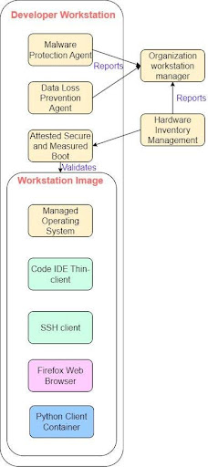
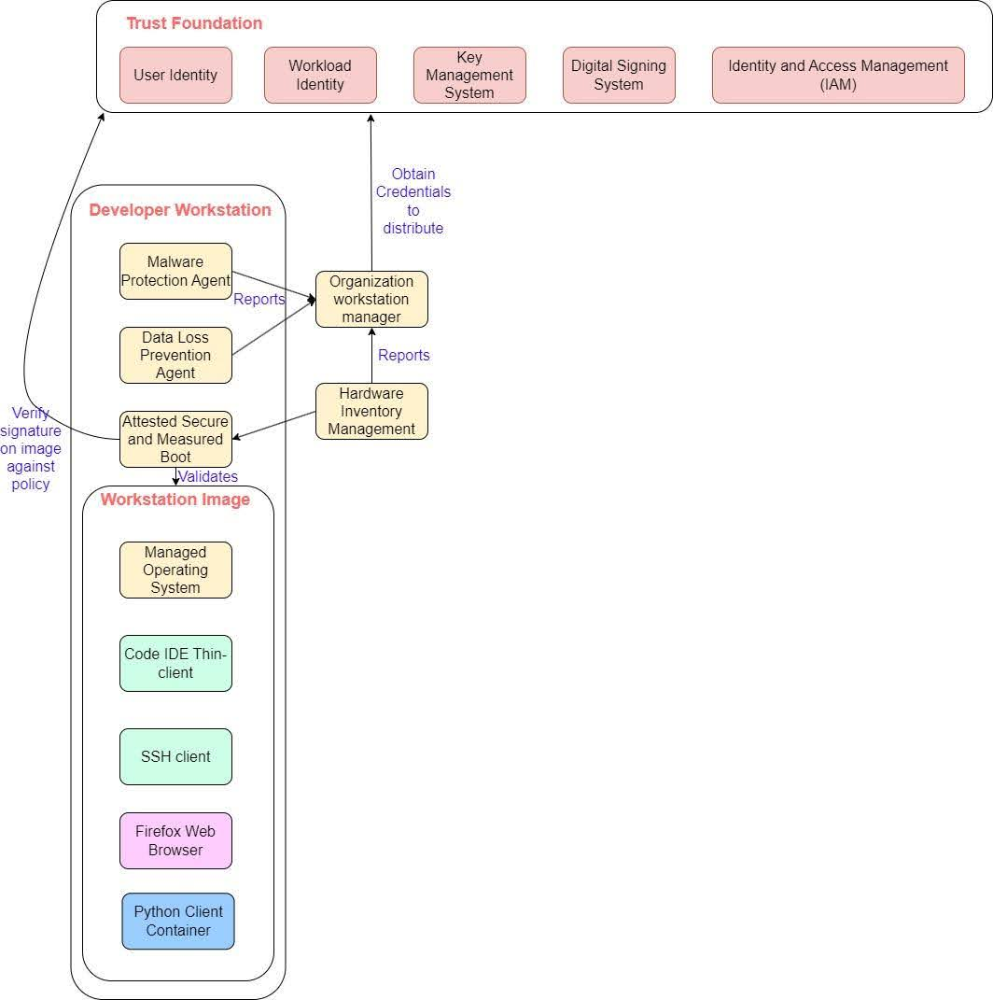
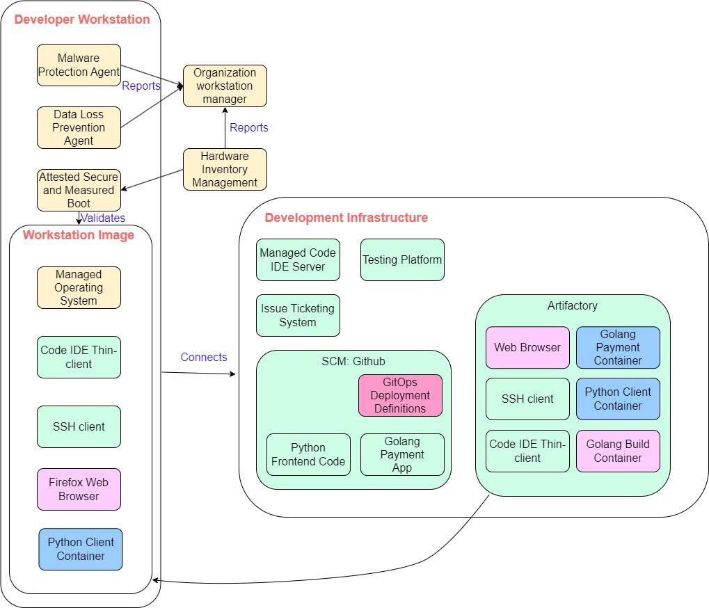
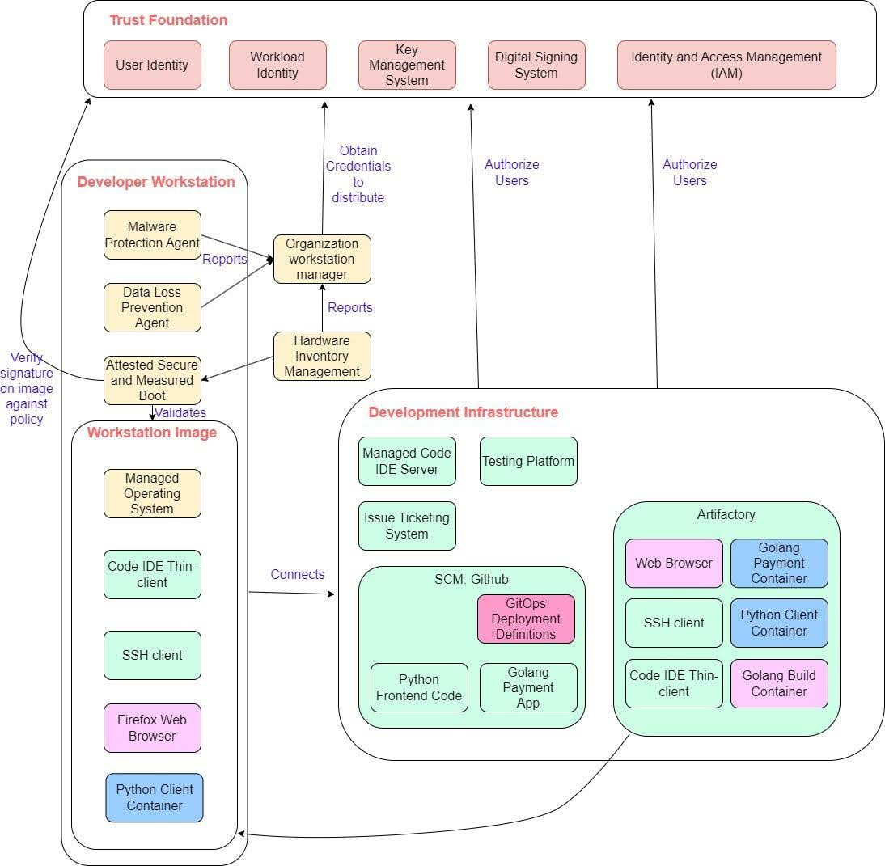
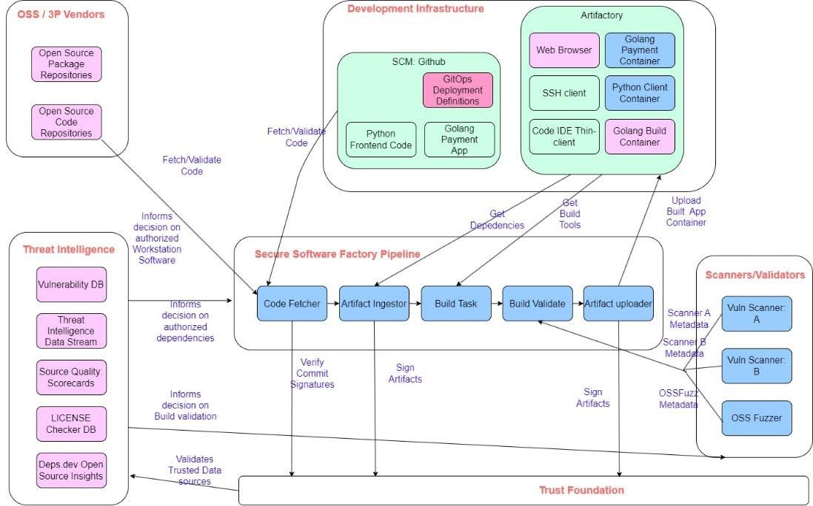
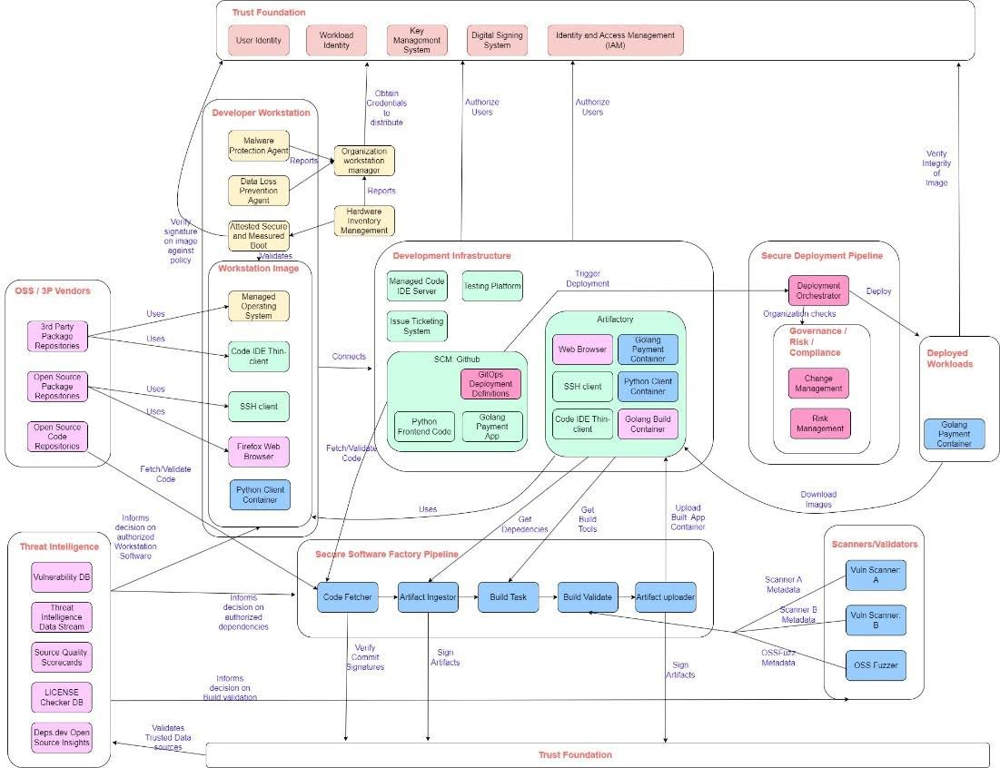
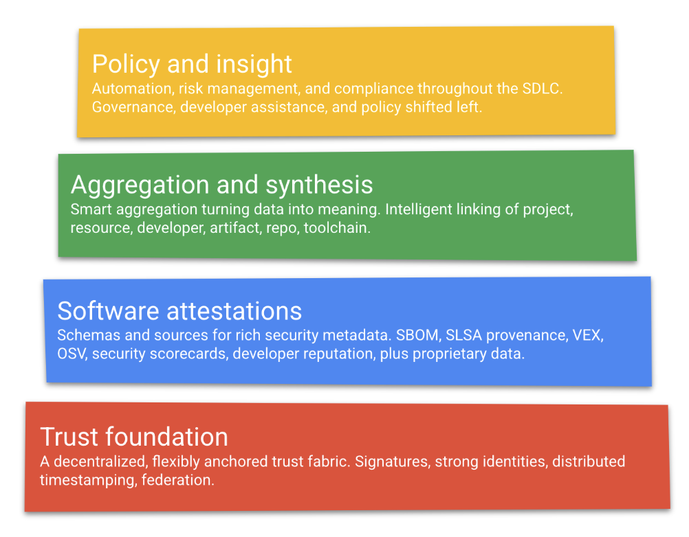

== Architecting Supply Chain Security

This chapter covers:

* Understanding how components of a software supply chain interact with each other
* The challenges of scalable software supply chain security
* Learning a framework for developing a strong scalable foundation of software supply chain security

In the previous chapters, you learned  concepts, methodologies and tooling to secure the steps of the SDLC.
This chapter will explore what it means to integrate these practices in concert, the challenges in doing so, and how to scale them.

=== The SSC Integrated Architecture

Software supply chain security applies to the end-to-end flow of the SDLC, from the keystrokes first entered into a developer’s laptop to the lines of software executed on a server.
This encompasses developer workstations, the productivity tools and services used in both writing and managing software, the development of software, building and packaging of software, and to the eventual running of the software.
Each step of the SDLC brings about risk of software supply chain compromise, and with each, a set of security practices and controls to mitigate them. 

This chapter will continue to use the bank example.
Imagine the bank runs a payment service written in golang that requires a client to interact with it written in Python.
You've been tasked with making sure the entire system is secure.
Let’s get started!

==== Endpoint Protection

Your organization runs a couple of services, which are written in-house, so let’s start with the code.
For every piece of software written, there is a great team of people behind it! Thus, in order to trust software, you need to know that the software produced was created by trusted developers and using a set of trusted tools.
In most organizations today, every employee is provided with hardware and software which interacts with the IT services of the organization.
Workforces today are largely mobile or remote — after all, we don’t expect every employee to badge into a data center to go about their day to day business.
These endpoint devices operate in an uncontrolled environment — a developer in a café doesn’t know if someone’s looking over their shoulder, a laptop in a hotel room is left unattended and accessible by hotel staff, etc.
These are concerns that have led to compromise, such as the evil maid attackfootnote:[https://en.wikipedia.org/wiki/Evil_maid_attack].
Thus, endpoint protection is of utmost importance.
The last thing you want is for an unauthorized device to be connected to a developer’s laptop, infecting it with malware and inserting a backdoor into your payment application!

Endpoint protection within the context of a software supply chain is about ensuring that the developer endpoints (e.g. developer workstations) are secure.
This involves ensuring that workstations are secure at boot, and continue to be secure and in compliance with your policies through their usage.
This includes:

* Enabling attestation/measurement of endpoint systems with hardware based root of trust
* Ensuring that workstation images are approved through signed secure boot and/or measured boot via UEFI and TPM features.
* Enabling remote managed operating systems
* Installing/Enabling malware protection agents to detect installation and execution of known malware
* Installing/Enabling data loss prevention agents to detect if sensitive content is not exfiltrated
* Establishing hardware inventory and organization workstation management to create and enforce organization wide compliance and security policy of endpoint hardware

==== Secure Development

After ensuring that your endpoints are secure, you need to make sure that the software that is being created by our developers is secure.
For example, attackers can modify code in insecure code repositories which result in injection of malware like in the case of Wordpress plugins hosted by AccessPressfootnote:[https://jetpack.com/2022/01/18/backdoor-found-in-themes-and-plugins-from-accesspress-themes/].
It doesn’t matter if you’ve written secure code if the code can be modified.

Secure development is about ensuring that the process of developing software and the code produced in development is protected and not tampered with.
This consists of ensuring that development tooling is secure, including source control management services, issue ticketing systems, etc.
This includes:

* Ensuring that code does not live on developer workstations where possible through the use of a remote code IDE such as VS Code Server or Gitpod, so as to minimize code compromise through developer workstations
* Providing a secure deployment of a source control management system (e.g. GitHub) with repository access restricted to authorized developers
* Setting up a secure deployment of issue ticketing systems (e.g. JIRA) with access restricted to authorized developers and project/product managers
* Providing a secure deployment of artifact repositories (e.g. Artifactory) and with access restricted to authorized build systems, workload clusters, and developers
* Ensuring that SSH or remote desktop connection configuration is secure to prevent person-in-the-middle attacks
This can include, but is not limited to, zero-trust configurations or VPNs. Keep defense-in-depth in mind.

==== Secure Ingestion

Great — the software your organization has written is safe!
However, consider a payment application which has a frontend;
this involves many things including cryptography routines, front-end frameworks, network proxies, HTTP servers, etc.
Unless Secure Bank wants to rewrite the history of computing, it is inevitable that it relies on external software.
So what about the code you haven’t written?

The functionality of software today is so much greater than it was 20 years ago.
This is only possible through the ability to re-use code.
However, the risk of using a simple library that reverses a list versus an entire container orchestration system like kubernetes is very different.
Ecosystems have made it very convenient for developers to re-use functionality, but have not made it very easy to reason about the code being used.
When a piece of software is used by a developer, the chance the developer understands the risk is low — not because of their competency, but because it takes a lot of time and effort to do so.
Therefore, organizations need to be able to make policies and manage their risk of software they use.
If an organization needs to use open source code, it needs to evaluate, mitigate and accept the risks.
The same must be done with third-party software vendors, including the use of contracts to provide security assurances.
Security is as strong as its weakest link, and open source and third-party software SDLC must be held to the same level of security in order to not degrade the overall security posture of an organization’s software.

Secure ingestion is about ensuring that only authorized and approved software and its metadata is used within an organization’s software supply chain ecosystem.
This applies to the software itself (through policies around what software is approved for use), but is equally important in ingesting the software metadata.
For example, an unreliable source can provide false information about the security posture of a software package leading to an undesirable policy decision of deploying an application.
Secure ingestion includes:

* Establishing a policy on open source and other third-party software used within the organization
* Establishing a policy on usage of threat intelligence and vendor threat intelligence to be used within the organization
* Enforcing the use of a proxy or secure mirror for open source packages in the organization
* Creating an allow list for approved third-party code and package and code repositories
* Providing a mechanism to ingest software metadata and threat intelligence and use them in continuous integration and continuous deployment (CI/CD) checks.

==== Secure Software Factory

The software supply chain, as a supply chain, draws parallels to the food supply chain.
One of the key characteristics they share is that ingredients need to be processed so that they can be consumed.
In software, the ingredients are source code, and the produced output is compiled machine code or packages that can be executed to run the software.
Because the process of compilation and code transformation is inherently lossy, it is not possible to confidently know the decomposition of the output just by analyzing the output alone — the same way it is not possible to detect peanut particles by visual inspection.
For example, if you are provided with a software executable, and are asked under oath, “is this the approved latest version of the payment application?”, as a CISO, you would not be able to give a confident answer without knowing its provenance.
It is important in software supply chains to, as the saying goes, know how the sausage was made – verifying that the code was processed securely. 

This is done through a secure software factory.
As you learned in the previous chapter, the secure software factory is about being able to perform a secure build and the necessary checks to ensure that the produced software artifacts from builds are attested and reflect the specified organization policies.
This includes:

* A build system that is able to create, orchestrate and perform secure build pipelines which are tamper-resistant and have the ability to create attested provenance
* Included in the build system:
** Attested build compute provided with machine identity that has been authenticated and attested (preferably with a hardware root of trust)
** Routines to be able to fetch and verify code, artifacts and metadata from trusted and approved sources
** Mechanisms to securely build artifacts and produce non-falsifiable provenance
** Ability to securely upload a produced artifact and its attestation of what steps were taken to produce the build
* Routines to carry out security posture checking of software being built including checking for known vulnerabilities and malware, SAST/DAST and fuzzing.

==== Software Authorization

With a catalog of secure software, you should now be able to run all software wherever you want, right?
Unfortunately, things are not that simple.
Security is not a binary decision but the evaluation of what should run on a continuous (and often fuzzy) spectrum called risk.
Different environments have different requirements and organizations need to be able to make policies on what software can run where.
You would not want to be running Secure Bank’s payment service that has access to confidential customer data in the same compute environment as the public-facing customer feedback service.
This would increase the likelihood that the payment service could be compromised through a vulnerability in the customer feedback service.

Software authorization is about being able to ensure that software that is deployed or used complies with organizational policy, determined by governance, risk and compliance considerations.
This includes:

* Establishing a policy for software requirements of deployments on various clusters (dev, staging, prod, etc.)
* Establishing a policy and process for change management and risk management
* Enforcing policies through admission control for deployment and use of software
* Setting up continuous monitoring to flag when existing software no longer meets policy and provide a process for actionable remediation and/or mitigation and sandboxing

.Exercise 6.1
****
Match the components to the corresponding description.

Components:

* Endpoint protection
* Secure development
* Secure ingestion
* Secure software factory
* Software authorization

Descriptions:

. Software is dependent on external code and tools.
How do you ensure that these external dependencies are not malicious?
How can you ensure that only authorized tools are allowed for use and how do you verify them?
. How do you ensure that the developer machines are protected, that only authorized developers are able to write code or use authorized tooling?
How do you ensure that what the authorized developer writes is not tampered with or malware introduced into it?
. What software is allowed to run and where?
How do you ensure that only authorized software is able to run on production clusters with access to sensitive data?
. How do you ensure that the build and packaging of the software is secure?
How do you ensure that it has not been tampered with?
How do you ensure that the necessary checks and controls have been carried out and the built software represents what is intended?
. How do you ensure that the code that the developer writes is secured?
How do you ensure that code written is securely transmitted and not tampered with?
****

=== Applying These Practices to Your Organization

Now that you understand the different problems that you need to address, let’s see how they are applied in practice, and how it would look like with the payment service example.
At the end of this chapter, you should be able to do a similar exercise with your organization. 

==== Protecting Endpoints

To go through the same thought process as the previous section, let’s start at the beginning of where code begins:
the developers.
In this example, where are the endpoints used to develop the payment service and clients?

In this case, you have a standard setup where developers are each given their own laptop/workstation to develop on.
This includes the developer workstation — the interfacing machine that a developer uses to write software (like a laptop), and by extension, the workstation image — the software being run on the developer’s workstation.
The image includes a set of approved operating systems and tools, including web browsers, remote desktop or SSH clients, and organization-specific applications.

Ideally, the workstation should be as minimal as possible, restricting the number of applications and environments that can be run.
An application that’s not installed can’t be compromised.
A mobile device management (MDM) solution can ensure that all devices use approved software & network/storage policies, and enforce running of endpoint security applications.
Providing the identity of devices is also important and, where possible, solutions should leverage hardware roots of trust like Trusted Platform Modules (TPMs).
This would look like Figure 6.1.

.Figure 6.1. Endpoint protection in a developer workstation.

In Figure 6.1, you can see endpoint protection mechanisms in place:
malware protection, data loss prevention, and the necessary components to perform inventory and enforce policies across the organization’s endpoint systems, such as a hardware inventory management system.

This hardware inventory management system however, is not sufficient by itself.
It still needs to have a way to verify organization policy and trust parameters.
This is where the “trust foundation” comes in.
The next chapter will go into more detail, but for now it’s enough to know that the trust foundation is a core connective tissue in an organization;
it determines who and what are trusted across the organization, how they are trusted, and what they are trusted to do.
Naturally, you will see many components connecting to the set of components that form the trust foundation.
It consists of all aspects of managing trust, including a set of services, policies and key material used to authenticate and authorize identities (both user and machine identities).
Examples of this include OIDC/LDAP/OAUTH protocols, and identity management systems like Active Directory (for users) and  Secure Production Identity Framework For Everyone (SPIFFE) and SPIRE, a SPIFFE runtime environment, which together provide an identity management system for machines.
Figure 6.2 shows how this might look.

.Figure 6.2. Endpoint protection in a developer workstation linked to a trust foundation.

==== Securing Development

Great!
You have developers with secure workstations.
Now what about the software development infrastructure?
Naturally, developers need development infrastructure — the services and software needed to perform software development of the payment application.
This ranges from hosted source control systems (e.g. GitHub), ticketing system (e.g. JIRA), and code IDE servers.

It is important to protect code, as well as code metadata (commits, issues, pull requests, etc.).
Artifact storage is a natural extension of this, due to the nature of development depending on other tools for development and testing purposes.

We note that in most practices today, the developer interactive development environment (IDE) is part of the developer’s workstation.
One large question that many organizations are asking themselves is:
should code development tooling be moved from running from on the workstation to the development infrastructure, for example Visual Studio Server, or Gitpod?
Running the developer tools on an organization-controlled machine within a datacenter is much easier to secure than a workstation in the wild.
Figure 6.3 shows what this may look like for Secure Bank.

.Figure 6.3. Integration of secure development with endpoint protection components.

However, the Figure 6.3 with all secure development is not complete.
Naturally, the secure development infrastructure needs to hold itself to the same trust rules that an organization puts in place.
For example, how do you know which user is able to write to a code repository?
Should front-end Python developers be able to write to the Golang payments code?
Thus, secure development components need to consult the trust foundation.
Figure 6.4 provides a more complete picture of the Secure Bank secure supply chain architecture.

.Figure 6.4. Integration of secure development with endpoint protection components linked to trust foundation.

You can observe that each component in the architecture falls into a broad category of the SDLC and their protections.
For example, a developer workstation would naturally be concerned with endpoint protection, and the development infrastructure is all about secure development.
However, the reality is far from such a simple mapping. 

You may notice that when looking at a developer workstation, there are components that are not just focused on endpoint protection.
For example, a developer workstation must run an operating system — most likely would be Linux, macOS, or Windows — all of which are third-party distributions. 
Thus, secure ingestion must also be considered in securing the developer workstation.

Part of that developer workstation’s toolchain also involves the IDE and tools used perform secure development.
In addition, these tools and applications used may also include in-house applications.
Therefore, best practices and controls around secure development and secure software factory need to be consulted and adhered to in securing the developer workstation as well.

As you can see, securing the software supply chain is an interconnected exercise across the entire SDLC and needs to be considered holistically.
However, it is important to be able to break it down into sets of practices that can be tackled in bite-size chunks to make progress in an organization’s security posture.
Let’s continue this exercise with the next step:
securing ingestion.

==== Securing Ingestion

Unless you’re in an organization with a very specific niche, chances are you are using open source or other third-party software.
Like from the previous examples, you need not look further than the device that you’re reading this on!
However, on top of just using software like web browsers and developer tooling that you need to make the payment application, chances are you will need to use external commercial or open source libraries in the creation of the application.
You’re not going to write your own web server for the payment service when there’s already a large number of great options out there!
The 2020 Free and Open Source Software Contributor Surveyfootnote:[https://www.linuxfoundation.org/resources/publications/foss-contributor-2020] produced by The Linux Foundation and The Laboratory for Innovation Science at Harvard, estimates that FOSS constitutes 80-90% of any given piece of modern software.
Software is an increasingly vital resource in nearly all industries.

So how do you consume this external software in a secure way?
How do you know what you downloaded is what you intended?
How do you know if the library or application contains malware or has been compromised?
How can you be confident about the quality of the code you’re using?
This is where software suppliers and threat intelligence come in!

Software suppliers are providers of software and software metadata, whether open source projects or commercial offerings.
This software is used to aid in development and productivity.
This includes both tools like Firefox web browser or libraries that can be used in coding like openssl.

Threat intelligence includes data sources that provide information about known vulnerabilities, compromises, and threat actors (e.g. CVE database, vendor-provided threat intelligence).
This information is used to help evaluate software security posture.

First you need the software providers and vendors in order to obtain the code securely.
This includes the validation of signatures and ensuring that upstream repositories have not been compromised.
However, getting the correct software ingested is only the tip of the iceberg.
If there are no guarantees provided by the software (e.g. through contractual agreement), use of third party software without due diligence is almost equivalent to picking up a banana you found on the street and eating it.

Threat intelligence comes from various feeds and provides information to help determine whether third party software can be trusted (e.g. no critical vulnerabilities, compatible licenses, etc.), using feeds such as the MITRE Vulnerability Database, OpenSSF Scorecards and Deps.dev Open Source Insights.
We will cover more on this in a chapter 9.

Naturally, the policies around what is trusted, again, are rooted within the trust foundation of an organization.

==== Securing the Software Factory

Now that you’ve got all of your code securely written and ingested, it’s time to put it together!
The next step is compilation and packaging, which will prepare the software you wrote to be run.
This process includes taking the code you’ve written and the software you’ve ingested and putting them together.

Like the infrastructure for development, infrastructure for building software has to be secure, but not only that, because it builds sometimes less-trusted code (coming from a third party), the factory needs to be able to integrate proper tests and checks as well as accurately create attestations of what is being built.
In addition, the changes to the code need to be part of a vontinuous integration (CI) pipeline to ensure that the most recent, secure and trusted code is made available for use.

A Secure Software Factory Pipeline can be used to do this.
It includes services and software needed to perform secure builds of software (e.g. GitHub Actions, Travis CI, Tekton, FRSCA).

In addition, scanners and validators should also be used to help evaluate the security of the software being built.
These tools include dynamic and static analysis scanning tools (DAST/SAST), and vulnerability scanners (e.g. Snyk, Grype, Trivy, OSSFuzz).

As shown above, the secure software factory pulls in code from secure ingestion and the secure development environment and processes then, again validating them against organizational trust policies.
It then takes the output and puts them back into the secure development infrastructure for future use by developers or to run in a cluster!
For more information about nuts and bolts of a secure software factory, refer back to chapter 5.

.Figure 6.5. Integration of secure software factory, secure ingestion, and development infrastructure.

==== Authorizing Software

Finally, after all that work, how do you ensure that only the secure and trusted payment code makes it to your production environment and on the app stores?
In order to ensure that the software being used is secure and trusted, you need a final gate to deploy and deliver it.
Like continuous integration, (CI) which helps ensure the most up to date secure and trusted software is built, you need continuous deployment (CD) in order to ensure that that code is run and you’re not using an old, vulnerable version. 

On top of that, you need governance, risk & compliance systems, and policy engines (e.g. ServiceNow, Open Policy Agent, Kyverno) to help evaluate these policies.
These systems help to enforce the trust policies of an organization, and thus link back to the trust foundation.

Finally, once they are all checked and adhered to, they are run on a cluster!
Naturally, as part of the deployment process and because other services need to access them, the workloads obtain identity information from the trust foundation of the organization.

The collection of these are known as a secure deployment pipeline.
These services and processes deploy software to clusters.
Modern cloud-native deployments make use of continuous delivery pipelines (or GitOps), which will verify deployment configuration and ensure that software is approved to run, and run them through a workload orchestrator like Kubernetes or OpenStack.

.Exercise 6.2
****
. Which is the one component that almost every component in the secure supply chain architecture consults with?
[loweralpha]
.. Trust foundation
.. Secure ingestion
.. Secure software factory
. True or false: When securing the developer workstation, all that is needed is to ensure proper endpoint protection.
. True or false: In most cases, software developed and produced by an organization doesn’t rely on external software.
****

=== Putting It All Together

You’ve made it to the end of the SDLC!
It was quite a journey and filled with many different components and secure practices that need to be integrated.
As you can see from Figure 6.6, when we put all the components together, it becomes quite a complex and inter-dependent system.
The diagram is to show the level of complexity, all the components and actions are from the above sections.
Don’t squint too hard!

.Figure 6.6. All components of the example together showing the “mess” of complexity involved with trying to apply a secure software supply chain architecture over an example financial organization trying to create a payment app.

However, fret not, we do not offer problems without a solution!
Perhaps going through this process has instead led to more questions than answers.
What is a trust foundation made of?
What type of metadata should I care about? 

We’ve developed a framework for scaling software supply chain security.
By adopting this framework, you will be able better develop a SDLC architecture to easily navigate through the above highlighted challenges.
This framework consists of 4 layers, building on top of each other as shown in Figure 6.7.
These layers are:

* **Trust Foundation:** A decentralized, flexibly anchored trust fabric.
Signatures, strong identities, distributed timestamping, federation
* **Software Attestations:** Common schemas and sources for rich software security metadata
* **Aggregation and Synthesis:** Smart aggregation turning data into meaning.
Intelligent linking of metadata and software identifiers
* **Policy and Insight:** Automation, risk management, and compliance throughout the SDLC.
Governance, developer assistance and policy shifted left.

.Figure 6.7. Framework for scaling software supply chain security.

In the following chapters, we will go into much more detail for each.

=== Summary

* Securing the supply chain consists of several broad categories:
endpoint protection, secure development, secure ingestion, secure software factory and software authorization.
* These broad categories are useful to reason about specific controls, but must be addressed holistically and not in isolation, since software supply chain security is intertwined across all phases of the SDLC.
* In almost every organization today, every employee is provided with hardware and software which interacts with the IT services of an organization.
These endpoint devices operate in an uncontrolled environment and are difficult to secure.
* Endpoint protection is about ensuring that the endpoints (e.g. developer workstations) are secure.
This involves ensuring that workstations are secure at boot, and continue to be secure and in compliance through their usage.
* Developer workstations can be protected through ensuring workstation images are approved and signed, establishing hardware inventory management and installing malware protection and data loss prevention agents on the workstation.
* Secure development is ensuring that the process of developing software and the code produced in development is protected and not tampered.
This consists of ensuring that development tooling is secure, including source control management services, issue ticketing systems, etc.
* Providing a secure deployment of artifact repositories (e.g. Artifactory) and only authorized build systems, workload clusters, and developers have appropriate access is an important part of a secure development environment.
* Where possible, ensure that code does not live on developer workstations where possible through the use of a remote code IDE such as VS Code Server or Gitpod, so as to minimize code compromise through developer workstations.
* Secure ingestion is about ensuring that only authorized and approved software and its metadata is used within an organization’s software supply chain ecosystem.
This applies to both software (through policies around what software is approved for use), but is equally important in ingesting the metadata around use of the software.
* Open source software and third-party commercial vendors are providers of software and software metadata.
These are used to aid in development and productivity.
This includes both tools like Firefox web browser or libraries that can be used in coding like openssl.
* Threat intelligence should be used to evaluate third-party software.
This includes databases for known vulnerabilities, compromises and threat actors (e.g. CVE database, vendor provided threat intelligence).
These are used to help evaluate software security posture.
* It is as important in software supply chains to, as the saying goes, know how the sausage was made – verifying that the code was processed securely.
This is done through a secure software factory.
The secure software factory is about being able to perform a secure build and perform the necessary checks to ensure that the produced software artifacts from builds are attested and reflect the specified organization policies.
* Like the infrastructure for development, infrastructure for building software has to be secure.
Not only that, because it builds sometimes less trusted code (coming from third party), it needs to be able to integrate proper tests and checks into the pipeline as well as accurately create attestations of what is being built.
In addition, the changes to the code need to be part of a continuous integration (CI) pipeline to ensure that the most recent, secure and trusted code is made available for use.
* Scanners and validators should also be used to help evaluate the security of the software being built.
These tools include dynamic and static analysis scanning tools (DAST/SAST), and vulnerability scanners (e.g. Snyk, Grype, Trivy, OSSFuzz).
* Software authorization is about being able to ensure that software that is deployed or used complies with organizational policy, determined by governance, risk and compliance considerations.
* A trust foundation consists of all aspects of managing trust, including a set of services, policies and key material used to authenticate and authorize identities (both user and machine identities). Examples of this include OIDC/LDAP/OAUTH protocols, and identity management systems like Active Directory (for users) and SPIFFE/SPIRE (for machines).
* Securing the software supply chain is an interconnected exercise across the entire SDLC and needs to be considered holistically.
However, it is important to be able to break them down into sets of practices that can be tackled in bite-size chunks to make progress in an organization’s security posture. 
* A framework for scaling software supply chain security consisting of a solid trust foundation, software attestations, aggregation and synthesis and policy and insight can be used to address secure software supply chain challenges.

==== Answer Key

* Exercise 6.1 — 1. Secure Ingestion, 2. Endpoint Protection, 3. Software Authorization, 4. Secure Software Factory, 5. Secure Development
* Exercise 6.2
[arabic]
.. A — Trust foundation
.. False
.. False
