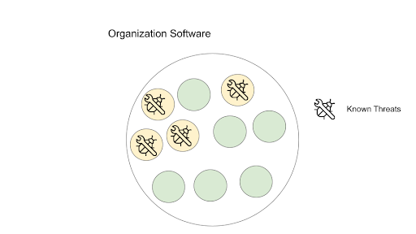
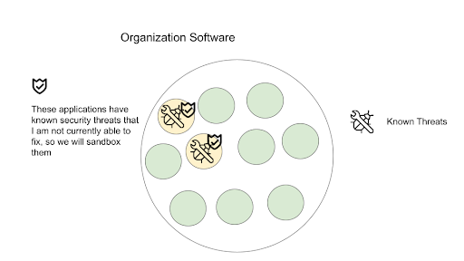
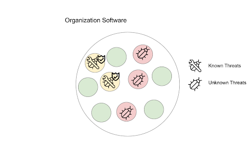
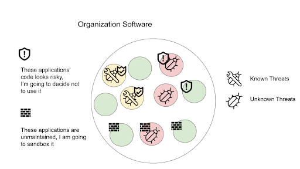

== Software Metadata and Attestations

This chapter covers:

* Understanding what information goes into making Secure Software Supply Chain decisions
* Navigating limitations and challenges of software metadata
* Exploring examples of useful software metadata and how to understand them

Chapter 6 introduced software metadata and attestations as the second layer of the framework for scaling software supply chain security.
The previous chapter covered the trust foundation layer, which set a base of the framework.
Now this chapter will go through what goes into establishing good software metadata and attestations. 

=== What is Metadata For?

When making a decision on whether a piece of software should be run on your production servers, how do you come to that decision?
You need to be able to reason about the risk of software in the SDLC.
For example, does the software you’re about to deploy contain a known vulnerability (e.g. log4shell), and will running that put your user data at risk?
Has the software been verified and built by a trusted entity?

In order to answer these questions, you need metadata about the software you use — both internal and ingested software (e.g. open source software and third-party vendors) — across multiple facets of security (vulnerabilities, supply chain, code quality, etc.).
To be able to make important security decisions, you need to have this metadata available and ensure you can trust them through verifying their attestations.

=== Known Security Threats

The example above of checking for known vulnerabilities in software is one of the most common and usually the lowest hanging fruit of managing software risk.
This is made easy through availability of vulnerability metadata made available through vulnerability databases and database aggregators.
Examples of public databases include the MITRE CVE Vulnerability database, Open Source Vulnerabilities (OSV.dev), and GitHub Security Advisories.
These services expose a wealth of information of known and reported vulnerabilities that you can check against the software that you develop in order to ensure services run do not have known weaknesses in them.

However, publicly available vulnerability metadata is a double-edged sword.
The information can be used by practitioners to check for vulnerabilities in their software, but can just as easily be used by attackers who want to find and exploit vulnerable systems.
Therefore, checking for known vulnerabilities becomes a critical aspect of risk management.

Known security threats, such as the aforementioned public vulnerabilities, are threats that:
are known, can be triaged, and can be managed.
Most of the time, known security threats are public and therefore have a level of urgency to be addressed due to the higher likelihood of exploitation.
However, known security threats can also be shared through security embargo programs or through external threat intelligence.
This buys teams some time to address the threats before they are made public.
It should always be assumed that if you know about a known issue, chances are an adversary does too.

Other types of known security threats include Supply Chain Security compromises (e.g. the Solarwinds compromise), malware (e.g. colors.js) and data breaches (e.g. haveibeenpwned.com).
Metadata about known security threats are important to address immediately due to their higher likelihood of exploitation.

==== Visualizing Known Threats in an Organization

The goal in handling known security threats is to identify software in your organization that expose risks and so that you can remediate the risk.
Figure 8.1 shows an organization with software assets (represented by circles), some of which contain known threats.
Some of these known threats may be easily removed (e.g. software is no longer needed and can be removed) or there’s an updated version that can be patched quickly.
In other cases, mechanisms such as sandboxing, network partitions, monitoring, etc. can be put in place to mitigate the risks.
And finally, in cases where there is no ability to handle the threat, the risk is accepted. 

.Figure 8.1. An organization's software with known threats.

Figure 8.2 shows one possible result of risk management.
In this case, two of the known threats are removed, and the remaining two had no immediate fixes.
Thus, they were mitigated via sandboxing.

.Figure 8.2. An organization's software with known threats removed and mitigated.

==== I Know the Issues, Now What?

Armed with a list of known security issues, what do you do now?
This is a question that many security practitioners had to ask about their organization when the high profile log4shell vulnerability was disclosed in 2021.
Log4shell had an astounding CVSS 3 score of 10/10, which indicated that ease, impact, and likelihood of exploitation was high on all scales.
This translates to “yes, this is an important security threat that needs to be addressed immediately”.

===== Is It a Problem for Me?

For some security practitioners at that time, this was a series of intensive weeks of triage and vulnerability remediation — some more than others!
For example, if an organization was a Java shop, chances are they had much more to do than a company with a pure golang stack since log4shell is a vulnerability in a Java library.
Once you know a problem exists, the next step of triage is knowing “is it a problem for me?”

Part of that is knowing what you’re running, and for that you need metadata to form a software catalog.
In order to know if your software contains the vulnerable component in question, you need to have metadata about the software you potentially have in your organization.
Software catalogs can be as simple as a spreadsheet of all software and the list of dependencies they use.
However, with the large amounts of software in both infrastructure and development used today, manual cataloging of software becomes an intractable problem.

One solution that has been gaining popularity to provide a software catalog is the concept of “Software Bill of Materials” or SBOM.
Very much like an ingredients list for food products, SBOMs provide a list of components that are included in software.
An SBOM document provides important metadata to software composition, providing the necessary information to match against known security threats.
For example, if provided a compiled C++ software binary, how do you know what libraries and versions it uses?
Compilation and software transformation is generally an intentionally-lossy process to reduce bloat and strip information not required at runtime.
Thus, it is hard or impossible to deduce an accurate and complete set of its component metadata with just the binary alone.
But using the metadata in the software catalog, you can match a binary against a vulnerability list.

Let’s look at an example of how an SBOM can be used within a software catalog to map to vulnerabilities.
Listing 8.1 shows a partial SBOM for a Java application that uses a vulnerable version of log4j.

.Listing 8.1. Snippet of an SPDX SBOM containing a vulnerable log4j-core component.
----
<TRUNCATED>
{
   "SPDXID": "SPDXRef-adecef25b87e830a",
   "name": "log4j-core",
   "licenseConcluded": "NONE",
   "downloadLocation": "NOASSERTION",
   "filesAnalyzed": false,
   "licenseDeclared": "NONE",
   "sourceInfo": "acquired package info from installed java archive: /log4jrce-1.0-SNAPSHOT-all.jar",
   "versionInfo": "2.8.1"

   "externalRefs": [

    {
     #A
     "referenceCategory": "PACKAGE_MANAGER",
     "referenceLocator": "pkg:maven/org.apache.logging.log4j/log4j-core@2.8.1",
     "referenceType": "purl"
    }
   ],
#A This is the PURL identifier for the log4j-core pkg
----

Listing 8.2 shows how the OSV-Scanner tool can be used to scan an SBOM, which finds any identifier it contains and outputs a set of matched vulnerabilities.
You can see here that OSV is able to match against the log4shell vulnerability due to the match between the package URL `pkg:maven/org.apache.logging.log4j/log4j-core` against its affected versions including 2.8.1.

.Listing 8.2. OSV Scanner tool matching against SBOM identifiers.
----
{
  "id": "GHSA-jfh8-c2jp-5v3q",
  "summary": "Remote code injection in Log4j",
  "details": "# Summary\n\nLog4j versions prior to 2.16.0 are subject to a remote code execution <TRUNCATED>"
  "aliases": [
    "CVE-2021-44228"
  ],
  "modified": "2023-03-28T05:42:47.368299Z",
  "published": "2021-12-10T00:40:56Z",
  "database_specific": {
    "cwe_ids": [
      "CWE-20",
      "CWE-400",
      "CWE-502",
      "CWE-917"
    ],
    "severity": "CRITICAL",
    "github_reviewed": true,
    "github_reviewed_at": "2021-12-10T00:40:41Z",
    "nvd_published_at": "2021-12-10T10:15:00Z"
  },
  "references": [
<TRUNCATED>
    {
      "type": "WEB",
      "url": "http://www.openwall.com/lists/oss-security/2021/12/15/3"
    }
  ],
  "affected": [
<TRUNCATED>
    {
      "package": {
        "name": "org.apache.logging.log4j:log4j-core",
        "ecosystem": "Maven",
        "purl": "pkg:maven/org.apache.logging.log4j/log4j-core"
      },
      "ranges": [
        {
          "type": "ECOSYSTEM",
          "events": [
            {
              "introduced": "2.4"
            },
            {
              "fixed": "2.12.2"
            }
          ]
        }
      ],
      "versions": [
        "2.10.0",
        "2.11.0",
        "2.11.1",
        "2.11.2",
        "2.12.0",
        "2.12.1",
        "2.4",
        "2.4.1",
        "2.5",
        "2.6",
        "2.6.1",
        "2.6.2",
        "2.7",
        "2.8",
        "2.8.1",
        "2.8.2",
        "2.9.0",
        "2.9.1"
      ],
      "database_specific": {
        "source": "https://github.com/github/advisory-database/blob/main/advisories/github-reviewed/2021/12/GHSA-jfh8-c2jp-5v3q/GHSA-jfh8-c2jp-5v3q.json"
      }
    }
  ],
  "schema_version": "1.4.0",
  "severity": [
    {
      "type": "CVSS_V3",
      "score": "CVSS:3.1/AV:N/AC:L/PR:N/UI:N/S:C/C:H/I:H/A:H"
    }
  ]
}
----

===== Understanding the Threat

After identifying where in your software catalog a vulnerable component is included, you need to understand the extent of the effect of the vulnerability.
For example, in log4shell, if an application was using the `formatMsgNoLookups=true` configuration in certain versions, then the vulnerable routine would not be able to be exercised, thus mitigating the threat.
Note that this does not mean that the vulnerable component shouldn’t be updated, but that it is not of immediate urgency.

Such scenarios happen more often than one might imagine, and it has led to a common practice where customers of software do a vulnerability scan of software and request vendors provide metadata on the state of vulnerabilities found.
This metadata is sometimes called “exploitability/affected” metadata and provides information about how a software is affected by a security vulnerability.

Recently, this has taken the form of a machine-readable metadata format for representing exploitability metadata called Vulnerability Exploitability eXchange (VEX).
For example, through VEX, one is able to communicate that the use of log4j is not affected by the log4shell vulnerability as it uses the appropriate mitigations.

Listing 8.3 shows a VEX document in the OpenVEX format created by a user “Brandon Lum” that states that project `pkg:maven/com.bank.secure.javaapp/myapp@1.0.0` is “not_affected” by the vulnerability log4shell (CVE-2021-44228). This is explained by the justification that “inline_mitigations_already_exists”, as well as a note about the mitigation that exists.

.Listing 8.3. Example of a OpenVEX document.
----
{
  "@context": "https://openvex.dev/ns",
  "@id": "https://openvex.dev/docs/example/java-sw-938aef93",
  "author": "Brandon Lum",
  "role": "Document Creator",
  "timestamp": "2023-01-08T18:02:03.647787998-06:00",
  "version": "1",
  "statements": [
    {
      "vulnerability": "CVE-2021-44228",
      "products": [
        "pkg:maven/com.bank.secure.javaapp/myapp@1.0.0"
],
      "status": "not_affected",
"justification": "inline_mitigations_already_exists",
"status_notes": "formatMsgNoLookups=true mitigation in place",
    }
  ]
}
The example shows a manual creation of a VEX document. However, another way to generate VEX statements is through automated tooling. An example of automation can be seen in the golang ecosystem. Golang maintains a database of vulnerabilities and their affected function. Thus the go vulncheck tool performs static analysis and emits a VEX document for vulnerabilities that cannot be exercised. 
----

===== How About Running Software?

If you have affected software, how do you go about remediating it?
On top of patching the vulnerable components in the source, how do you ensure that you do not have older vulnerable copies of the software running?

To tackle this, you need metadata about the inventory of software - not just what software there is, but also where it is running.
For example, you have a banking service — how do you know where it is currently running so you can migrate running instances to the newer patched version?

This can be done via the use of an inventory system.
An example of a cloud native way to do this is via GitOps, where a git repository is used to keep track of the state of what is being run in an organization’s environment.
Otherwise, workload orchestration systems like Kubernetes, identity systems like SPIFFE/SPIRE and other third-party systems can help to take stock of inventory.

Another consideration of risk in a scenario like this is to perform forensics or additional remediation in the event of a compromise.
For this, metadata which can provide scans for indicators of compromise can be useful to identify if particular environments may be compromised.
Having an inventory is useful here as you will be able to find out if there are other services that may be affected by compromise to better understand the blast radius of an attack.

==== Supply Chain Compromise

Another consideration of known security threats is software supply chain compromises.
Unlike vulnerability databases, there is not as mature an infrastructure and measures around software supply chain compromises.
An example of one catalog today is the CNCF Security TAG Supply Chain Security Compromises Catalog.footnote:[https://github.com/cncf/tag-security/tree/main/supply-chain-security/compromises]
The catalog provides a list of known compromises as well as more information about them, classifying into categories of compromises.

One example of a supply chain compromise is the CircleCI compromise.footnote:[https://circleci.com/blog/jan-4-2023-incident-report/]
In this case, attackers compromised one of the builders.
Thus, the natural response to this is to see if any of the software that was built had been using the CircleCI builder during that time.
In order to do this, you need information about how, by whom, and when a software artifact was built.
This is also known as build provenance.
Examples of build provenance are Software Levels for Software Artifacts (SLSA) provenance or SPDX 3.0 Build Profiles.
Listing 8.4 shows a truncated example of SLSA provenance and goes through what some of the fields express.

.Listing 8.4. Example SLSA Provenance.
----
{
    "_type": "https://in-toto.io/Statement/v1 ",
    "predicateType": "https://slsa.dev/provenance/v1 ",
    "predicate": {
        "buildDefinition": {

...
            "resolvedDependencies": [
                {
                    "uri": "git+https://github.com/octocat/hello-world@refs/heads/main",
                    "digest": {
                        "gitCommit": "c27d339ee6075c1f744c5d4b200f7901aad2c369"
                    }
                },
                {
                    "uri": "https://github.com/actions/virtual-environments/releases/tag/ubuntu20/20220515.1"
                }
            ]
        },
        "runDetails": {
            "builder": {
                "id": "https://github.com/slsa-framework/slsa-github-generator/.github/workflows/builder_go_slsa3.yml@refs/tags/v0.0.1"
            },
            "metadata": {
                "invocationId": "https://github.com/octocat/hello-world/actions/runs/1536140711/attempts/1",
                "startedOn": "2023-01-01T12:34:56Z"
            }
        }
    },
    "subject": [
        {
            "name": "_",
            "digest": {
                "sha256": "fe4fe40ac7250263c5dbe1cf3138912f3f416140aa248637a60d65fe22c47da4"
            }
        }
    ]
}
----

In Listing 8.4, there are several fields that can be used to remediate supply chain attacks.

For example:

* RunDetails:
Through the builder ID and metadata, you can determine when the build was triggered (and by which system).
This allows you to trace back in the case where a compromise of a build system was compromised to identify potentially compromised software builds.
* ResolvedDependencies:
This is a list of materials that goes into the build.
This is useful for example if it is determined that a particular source repository or binary dependency has been compromised or has been trojanized.
By comparing known compromised URIs and hashes, you can determine if the particular software build has been compromised.

In this case, you can use the RunDetails of the build together with the builder identifiers (comparing to the information from the reported compromise) to figure out which artifacts may potentially be affected by the compromise.
And as usual, this information should be cross-referenced with the software catalog and inventory metadata for remediation next steps.

==== Metadata Information Must Be Actionable

From the examples of working with known security threats, you can see that metadata plays a critical role in ensuring that you have the necessary information to make supply chain security decisions.
However, not all metadata is created equal.
In order for metadata to be valuable, it needs to be able to provide actionable information.

In the case of vulnerabilities, you see that the score of a vulnerability (like the 10/10 score for log4shell) provides an indication to security practitioners that the vulnerability is worth investigating and may have widespread significant impact on the organization.

In order to know if a threat is affecting you, you need to have a way to figure out if software you use is affected by it.
There needs to be a way to link from the security threat to the entities within the software supply chain ecosystem.
For example, with vulnerabilities, package identifiers such as names, versions, package URLs (PURLs), or Common Platform Enumerations (CPEs) are used.
For supply chain compromises, you are able to use the hashes of materials to map to malicious packages or use builder URIs to map onto compromised builders.
Having good and common software identifiers are important in security and software metadata to ensure that we can link security threats to our software catalog and inventory.

These are the qualities of metadata that should be strived for and should be used to evaluate quality of metadata produced and provided.

.Exercise 8.1
****
. What are the steps required to respond to a known security threats?
. What are examples of metadata required to respond to a known security threats?
****

=== Unknown Security Threats

We’ve talked through what metadata is required in the event of known security threats such as vulnerabilities or supply chain compromises.
However, software is an ever-evolving ecosystem where new security threats are introduced or found each day.

“When a tree falls and no one is around, does it make a sound?”
This philosophical question is relevant in the context of security checks.
The fact of the matter is that before log4shell was discovered and reported, it still existed in many production services for months.
Very much like Schrödinger's cat, a piece of software can be vulnerable and not vulnerable (according to security checks) at the same time until it is exploited.

The same paradox can be seen in the number of vulnerabilities in software.
In 2022, the Linux kernel had 310 vulnerabilities reported, and my personal project on GitHub had 0.
Does that mean that my project that only I use is more secure?
Most likely not.
After all, the Linux kernel has had many eyes on it, and has had adversaries actively targeting it.
Adversarial organizations, like any organizations, have budgets and economics determine target priorities and amount of effort put into finding bugs.
Therefore, it may not be worth it for them to find bugs in a project that only I use, but if Microsoft decides to use my software in all its embedded devices, chances are CVEs will appear overnight.

==== Visualizing Unknown Threats

Continuing with the visualization of known threats in an organization from before, let’s add in some unknown threats, illustrated in Figure 8.3.
As mentioned, the existence of some unknown threats can be assumed, so although they show up in the following figure, they are unknown to the organization.

.Figure 8.3. An organization's software with unknown threats.

Figure 8.3 shows 3 unknown threats in the organization software assets (represented by circles).
Unlike known threats, we do not know that these threats exist, or where they reside.

However, there is still something we can do to reduce the risk!
Based on available metadata, we want to identify potential problematic assets (e.g. unmaintained code, code with many other vulnerabilities) and remove or mitigate them, as shown in Figure 8.4.

.Figure 8.4. An organization's software with unknown threats mitigated and removed.

Figure 8.4 shows that the organization decided that certain software’s code was too risky – e.g. bad development practices and security hygiene — and chose to not use it.
In addition to that, it found some applications that were not maintained and decided to sandbox them.
Note the removed and sandboxed code that did not include any unknown threats, and at the same time the organization did not manage to catch all unknown threats.
This is the nature of protecting against unknown threats.
Since you do not have information on where the threats are, you can’t be over-focused on addressing them.
Instead, take broad strokes in risk mitigation.
The hope is that with good metrics and measures, you can cost-effectively mitigate against higher risks and unknown threats.

==== Protecting the Source

There are unknown security threats that you must consider.
In order to manage the risk of unknown threats, you can do your best to identify them before they happen.
This can be done by evaluating the security posture of the project, very much like how organizations apply CIS Security hardening practices to servers, secure software developer practices can be applied and evaluated to ensure that the risk of unknown security threats can be mitigated.

In the SDLC, this can be applied to multiple aspects, from the way code is being developed, to the way it is being built.
An example of this is the OpenSSF Scorecard projectfootnote:[https://scorecard.dev], which evaluates the quality of code repositories across multiple dimensions such as tests, maintainership, security policy, access control, fuzzing controls and dependency health.
These are indicators that can help make a more secure code project and can ensure that code used has good security practices to prevent potential vulnerabilities and supply chain compromise.

OpenSSF Scorecard gives a score on a scale from 0-10, with higher scores giving  a general indication of good security posture.
Individual components of the score detail additional information like:

* Binary-Artifacts: No binaries are found in the repo
* CI-Tests: Ensures that the project runs tests before code is merged
* Code-Review: Determines if the project requires code review before code is merged
* Dangerous-Workflow: Determines if the project’s GitHub Action workflows avoid dangerous patterns
* License: Determines if the project has a license file
* Pinned-Depedencies: Determines if the project has declared and pinned its dependencies
* Security-Policy: Determines if the project has a published security policy
* Token-Permissions: Determines if the project’s workflows follow the principle of least privilege
* Vulnerabilities: Determines if the project has open, known unfixed vulnerabilities

The above checks provide an indicator of the general hygiene the project takes towards aspects of code security and can be used to get a sense of the risk of security threats and the speed of response towards new security threats.

==== Protecting the Build

Another aspect of the supply chain that can be hardened against potential threats is building and packaging of code.
This is where you can look back to SLSA.
SLSA, besides providing a way to express build provenance, also has a set of best practices that can be adhered to, called SLSA levels, as part of the broader SLSA framework.
These SLSA levels are a set of practices that can be adopted to incrementally improve software supply chain security.
Within the SLSA framework, there are build levels which signify the SLSA level of which an artifact is built.
An artifact can be built with Build level 0, and have no guarantees at all, or be built with Build level 3 and have the benefits of strong tamper protection.

Builders are certified to a certain level.
For example, using a builder, like GitHub actions with a specific task, may provide a SLSA build level 3.
This information can then be used in conjunction with the builder ID of the SLSA provenance (as shown in snippet 8.4) to show that a piece of software was built securely, inheriting security properties which the build provides.

The adherence to these practices will also be encoded in the SLSA provenance metadata (in future versions), which can then be used to provide more granular detail of the build guarantees (for example, if the build was reproducible, isolated, or hermetic).

The NIST Secure Software Development Framework (SSDF) provides some guidance around how to secure the SDLC, and Executive Order 14028 requires organizations producing software to federal agencies to provide an attestation of how the NIST SSDF has been met.
This is another form of metadata that can be used to help evaluate software supply chain security.

==== Unknown Threats Are Still Threats

It is important to keep in mind that because you are dealing with unknown security threats, evaluating the scores of the metadata is a proxy to the measure of the threats present in a software’s supply chain.
There have been many studies to determine metrics that predict bug density, and there are many differing opinions – some of which are contradictory based on research methodology.
Remember that having a good score doesn’t mean a project is free from vulnerabilities. 

.Exercise 8.2
****
. Unknown threats don’t serve any immediate risk, so my organization doesn’t need to worry about them until they become known threats. (True/False)
. Besides those mentioned, what are some other ways that we can better handle unknown threats?
****

=== Attesting the Metadata

Great, you now have a list of metadata that you can use to make security decisions. Are you ready to go ahead and create that admission control policy to gate the deployed software?
Not so fast!

When it comes to metadata there is more than meets the eye.
Let’s say someone provides you an SBOM for an artifact that you downloaded off the Internet, how do you know that the SBOM is in fact describing the software you downloaded, and not a different version, or worse, a totally different piece of software?

If you rely on software metadata to make security decisions, then you must hold the same standard of security you take with your software to the software metadata that you use!
If you don’t trust the software metadata, you should not be making security critical decisions with it.

Imagine for instance, an adversary creates a fake SBOM for a vendor software that omits all vulnerable dependencies.
In this case, the software that you want to run may indeed contain a critical vulnerability (log4shell).
However, because the SBOM omits this dependency, you make a security decision that your software is safe to run on a production server with access to sensitive user data.

Making a security decision based on falsifiable metadata is equivalent to emitting malicious software.
This is why authenticating the integrity and provenance of software metadata is equally important to that of the software itself.
This is why software metadata must be attested.

==== Attesting Software Metadata

Attestation of software metadata is done by utilizing the trust foundation covered in chapter 7, Trust foundations.
This usually comes in the form of signing metadata, through the use of attestation formats such as in-toto.
One way of doing this is through signature from a key from a trusted authority.
For example, very much like how Microsoft signs software it produces, it would also sign the metadata it produces, which provides provenance of the software metadata.

When dealing with vendors, often contractual agreements are a mechanism to ascertain a level of trust around the metadata generated.
However, this is not always possible — and is hard to enforce — in open source software.
Another way to trust the provenance of metadata is through being able to trust the process.
This is where build provenance can also be (re-)used:
metadata, after all, is just another artifact produced by a build process.
The following chapter goes into more details on how a secure software factory does that.

==== Caveats Around Attestation

It is important to keep in mind that besides the malicious case, metadata is sometimes imperfect and evaluation of metadata is a nuanced topic.
For example, you may have an SBOM, but for some reason the tool failed and creates an empty SBOM due to a tool error.
In one instance, one of the tools we used in our CI to generate SBOMs failed when run on a large-sized container image, producing an empty SBOM.
Another example is the case of “Build SBOMs” vs “Analysis SBOMs”.
The former is produced during the build time and preferably by a build tool, whereas the latter is based on software composition analysis of the artifact produced by the build.
As mentioned earlier in the chapter, a build is usually a lossy process, and thus “Analysis SBOMs” in most cases will not be as complete as a “Build SBOM”.
We will discuss managing this risk in more detail in the next chapter.

=== Metadata for AI

How about your AI supply chains?
Generative AI, or AI/ML models in general, are still software, and thus can be treated similarly!
However, they generally take a different shape.
For example, threats usually manifest themselves in data rather than code, or the fact that the integrity of a model is difficult to reason about.

==== Data Is King

In AI, issues and threats usually manifest themselves in data rather than code.
AI code generally is quite static.
However, the parameters that end up encoding these models are what ultimately determines the behavior of the model, and they are largely determined by the input data (and a pinch of randomness).
Therefore, an AI model that “behaves badly” usually is attributed to bad data.
For example, an AI model famously suggested putting glue into a pizza.
This was attributed to training data sets from Reddit. 

Data lineage thus is a critical aspect of AI model supply chains.
Which data did this model train on?
Both directly used datasets or indirectly through building on top of other foundational models.
With AI modeling building iteratively like software, it is important to know the lineage of the data.
This is where SLSA plays a role in encoding the provenance of these models, which can then be assembled to trace data lineage and surface bad data usage (e.g. data poisoning, non-compliant licenses, etc.).

==== AI Model Integrity is Tricky Business

One aspect of AI models that is tricky is inventory, for multiple reasons.
One is that models are HUGE.
Models are now getting into terabyte size range, unlike binaries which are usually in megabytes.
This means that a core part of how we identify software — content hashing algorithms — becomes expensive to compute.
This is hard to scale when considering the continuous training and frequent checkpointing that AI models go through.

Another tricky component with how many generative AI models are used today is that they also train on user input data.
Therefore, the models are changing as they run.
This makes it difficult to account for software drift and reason about what’s running.

=== Summary

* When making a decision on whether or not to use a piece of software, you need metadata about both internal and ingested software (e.g. Open Source Software, 3rd party vendors), and across multiple facets of security (vulnerabilities, supply chain, code quality, etc.).
* Checking for known vulnerabilities in software is one of the most common and usually the lowest hanging fruit of managing software risk, since known security threats are public and therefore have a level of urgency to be addressed due to the higher likelihood of exploitation.
* Public databases include the MITRE CVE Vulnerability database, Open Source Vulnerabilities (OSV.dev), and GitHub Security Advisories.
* Known security threats also include Supply Chain Security compromises (e.g. the Solarwinds compromise), malware (e.g. colors.js) and data breaches (e.g. haveibeenpwned.com).
* In triaging known threats, you need to be able to evaluate the criticality of the threat through metrics such as a CVSS score or evaluating the description of the compromise.
* The next step is identifying if the threat concerns the organization, which is done by comparing against a software catalog (list of software used by an organization).
* Software Bill of Materials (SBOM) is a tool to help establish a software catalog.
* Sometimes, an inclusion of a vulnerable component doesn’t mean that a software is exploitable.
This depends on the use of the vulnerable component or if mitigations are in place.
A way to communicate this is through a Vulnerability Exploitability eXchange (VEX) document.
* The final step once it is determined what threats exist in an organization’s software is to patch and remediate software in use.
Having an inventory of running software is critical for this.
* Build provenance such as SLSA can be useful in remediating known supply chain compromises.
* Metadata varies in quality, and useful metadata is actionable through the inclusion of metrics and scores as well as software identifiers (e.g. PURLs) that allow matching against security databases.
* If a vulnerability is not known, that doesn’t mean it doesn’t exist.
Unknown security threats must also be addressed in an organization’s risk profile.
* A proxy for handling unknown risk is through the incorporation of best practices within the SDLC, and providing a mechanism to score them.
* OpenSSF Scorecard is an example of scoring the security posture of source repositories.
* Builders with SLSA certifications is an example of evaluating the security posture of software builds.
* Since metadata is used to make critical security decisions, metadata must be trusted and a way to do that is through attestations (via methods of signing).
This leverages the strong trust foundation of having a secure software supply chain architecture.

==== Answer Key

* Exercise 8.1 — 1) Identify known threats, find out if they affect your organization, find out where they exists in your organization, remove or mitigate the risks. 2) SBOMs, SLSA, VEX
* Exercise 8.2
[arabic]
.. False
.. Check for compliance to best practices for hardening, configuration and deployment, looking for unmaintained code, looking for software assets with unknown provenance, turning down unused services
