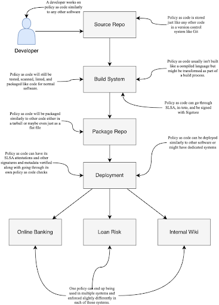
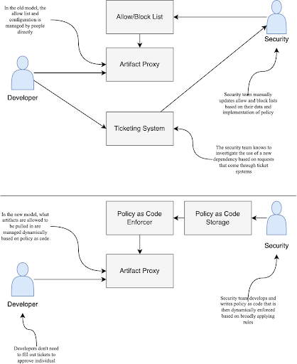
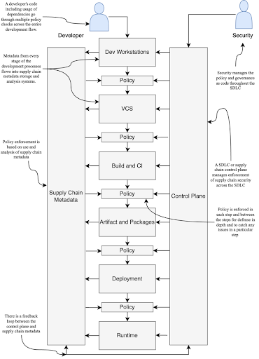
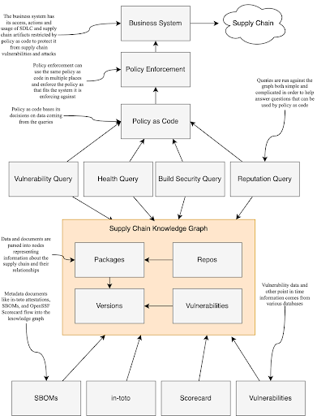

== Policy and Insight

This chapter covers:

* Understanding how policy as code and governance as code enable consistent and scalable enforcement of supply chain security practices
* Exploring the benefits and challenges of automating policy enforcement across the SDLC
* Applying policy as code to secure ingestion, ensuring only approved and trusted dependencies are used
* Enforcing best practices within the secure software factory through codified policies
* Leveraging policy as code to ensure compliant deployments and runtime security
* Discussing the tools and technologies available for implementing policy as code, such as Open Policy Agent (OPA) and SLSA
* Tying together all the elements of software supply chain security discussed throughout the book using policy as code and automation

Throughout this book, we have explored various aspects of software supply chain security, from threat modeling and secure ingestion to building a secure software factory and leveraging software metadata.
You have seen how each of these elements contributes to a comprehensive strategy for mitigating the risks associated with modern software development.
However, implementing these practices consistently and at scale requires a unified approach that ties everything together.
This is where policy as code and automation come into play.

This final chapter will explore how policy as code and governance as code can help organizations enforce supply chain security practices across the entire software development lifecycle (SDLC).
You will learn the benefits of codifying policies and automating their enforcement, ensuring that security is built into every stage of the development process.

=== What are Policy as Code and Governance as Code?

This book has explored the various facets of software supply chain security, from understanding the risks and challenges to implementing specific practices and tools to mitigate those risks.
You’ve seen how a comprehensive approach to supply chain security requires addressing multiple aspects of the software development lifecycle, including:

* Secure coding practices and developer education
* Secure build and deployment processes
* Artifact signing and verification
* Dependency management and SBOMs
* Metadata aggregation and analysis

However, implementing these practices consistently and at scale across a large organization like Secure Bank can be challenging.
Each development team within the bank may have its own workflows, tools, and processes, making it difficult to enforce security policies uniformly.
Moreover, as the threat landscape evolves and new vulnerabilities emerge, the bank needs to be able to quickly update and propagate its security policies to all relevant projects and systems.

This is where policy as code and governance as code come into play.
By codifying security policies and governance processes, the bank can automate the enforcement of its security requirements across the entire software development lifecycle.
This not only helps to ensure consistency and reduce the risk of human error, but also enables the bank to respond more quickly and effectively to new threats and compliance requirements.

.On Policy and Governance as Code
****
Policy as code and governance as code are relatively new concepts in the world of software development;
their adoption, especially governance as code, is still in the early stages. While there has been significant progress in the development of tools and frameworks to support policy as code, governance as code is still an emerging practice with limited tooling support.
In addition to this, tools and integrations focused on software supply chain security in the policy as code and governance as code spaces are even less mature in their progress.

Policy as code vs. governance as code can get confusing, especially when you look at how policy and governance are used outside of the IT space.
A policy within an organization usually applies to something generic like a hiring policy — the high-level guidelines for how an organization handles employees.
Policy as code is software automation to enforce specific technical rules like automated blocking of internet access to all production environments that don’t need it.

An organization’s governance is often the rules by which the organization is structured, e.g. how the board of directors is elected.
Governance as code, while still evolving, has come to mean the automated enforcement of high-level IT practices and associated accountability like enforcing all cloud resources within the organization have an associated policy as code network automation that applies to its risk level.

In other words, policy as code tends to be specific, whereas governance tends to be general.

It can all get very confusing so keep an eye out and throughout this chapter we’ll make it explicit by using “policy as code” and “governance as code” to make it clear.
****

==== The Benefits of Policy as Code and Governance as Code

The bank cares about policy as code and governance as code because it enables them to apply automated enforcement to things like:

* Regulatory and compliance requirements
** The bank needs to comply with Payment Card Industry Data Security Standard (PCI DSS), a standard for data privacy and security that is intended to protect customers from fraud or personal data leaking.
** Policy as code and governance as code allows the bank to codify these regulatory requirements into enforceable automation, ensuring that their software development and supply chain security practices remain compliant.
** A requirement of PCI DSS is that all relevant payment card data is encrypted.
The bank can write policy as code automation to ensure that only software with attestations that prove they have been scanned or audited to show they use relevant encryption is allowed to be used in conjunction with payment card data.
* Consistency and standardization requirements
** The bank wastes a lot of money dealing with multiple versions of the same software dependency, e.g. Spring or log4j, across their IT environments.
When a vulnerability is discovered, they don’t know which systems are impacted.
** Policy as code enables the bank in enforcing both specific and broad rules to ensure that software development is handled consistently reducing security risk.
** The bank can enforce that only the most recent versions of approved dependencies with no known vulnerabilities are allowed to go through the build process successfully.
* Rapid response to threats
** The bank struggles with responding to incidents like the log4shell vulnerability.
They spend a ton of security engineer effort in trying to discover what is impacted and have no way to prevent new systems being deployed with a vulnerable version of log4j.
** Policy as code can be used by the bank for rules in monitoring runtime systems and be used to prevent deployment tools from deploying software with known vulnerabilities.
** Given the critical nature of the log4shell vulnerability they could write policy to ensure that no new deployments are allowed of software with the log4shell vulnerability while applying the same check in monitoring systems to help detect production systems where the vulnerability still exists.

.Exercise 10.1
****
What is the primary benefit of using policy as code for supply chain security?

[loweralpha]
. Reduces the need for security expertise
. Eliminates the need for manual reviews
. Enables consistent and scalable enforcement
. Completely eliminates all security risks
****

=== Challenges and Considerations in Adopting Policy as Code and Governance as Code

While policy as code and governance as code offer significant benefits for automating and scaling the enforcement of security requirements and governance processes, there are also several challenges and considerations that organizations like the bank must consider when adopting these new technologies and approaches.

==== Complexity and Learning Curve

The bank is an enormous organization with tens of thousands of employees, several thousand of which are directly involved in IT.
Codifying human written policy like IT security policy or governance into policy as code and governance as code can be quite difficult.
Taking these requirements and transforming them into code requires both a deep understanding of the human written policy and governance as well as the technical implementation of those requirements.

Listing 10.1 shows an example snippet of a common encryption policy that would be used in an organization like the bank.
It is broad in its description, not getting into details on what an “industry-standard, security encryption algorithm” is other than describing an example (AES) and a requirement (minimum key length of 256 bits).
It leaves a lot up to interpretation to the implementer without additional context on what industry-standard encryption algorithms have been approved by someone or some group within the organization.

.Listing 10.1. Example encryption policy.
----
Encryption Algorithms and Key Lengths

All encryption must use industry-standard, secure encryption algorithms such as AES (Advanced Encryption Standard) with a minimum key length of 256 bits. 
 
Weak or deprecated encryption algorithms, such as DES (Data Encryption Standard) or RC4, must not be used.
----

Listing 10.2 shows an example Kyverno policy that enforces all encryption to be AES-GCM.
We won’t go too deep into how Kyverno works, however let’s explain the basics quickly.
The policy matches on EncryptionConfiguration Kubernetes resources.
These are the resources for how Kubernetes handles encryption at rest for various other Kubernetes resources and checks if any of its encryption providers are anything other than AES-GCM based ones.
Kyverno uses JMESPath, a way to query data in JSON and YAML, to automate checking of data like Kubernetes configuration to enforce policy.

.Listing 10.2. Example Kyverno policy that enforces all encryption to be AES-GCM.
----
apiVersion: kyverno.io/v1
kind: ClusterPolicy
metadata:
  name: require-aesgcm-encryption
spec:
  validationFailureAction: Enforce
  rules:
  - name: require-aesgcm=encryption
    match:
      any:
      - resources:
          kinds:
          - EncryptionConfiguration #A
    validate:
      message: "All encryption must be aesgcm"
      deny: #B
        conditions:
          all: #C
          - key: "{{ not_null(request.object.resources[].providers[?!'aesgcm'][]) | length(@) }}" #D
            operator: "GreaterThanOrEquals"
            value: 1 
#A The type of Kubernetes resource to apply the rules to.
#B Deny if the following rules are met
#C All conditions must be met to trigger this rule.
#D This is a JMESPath rule that checks if there are any encryption providers that are not aesgcm.
----

Listing 10.3 shows an example EncryptionConfiguration Kubernetes resource.
This resource configures how encryption at rest works for the bank.
This resource would pass the Kyverno in Listing 10.2.
You can use “aescbc” which is an AES-CBC encryption provider, or any other Kubernetes encryption provider to test out what it will look like if it fails.
If someone at the bank purposefully or inadvertently includes a different provider, the policy check will trigger and this EncryptionConfiguration will fail to deploy thus complying with bank policy requirements.

.Listing 10.3. Example EncryptionConfiguration Kubernetes resource.
----
---
apiVersion: apiserver.config.k8s.io/v1
kind: EncryptionConfiguration
resources:
  - resources: #A
      - secrets
      - configmaps
    providers:
      - aesgcm: #B
          keys:
            - name: fakeKeyX
              secret: notarealkey
  - resources:
      - '*.apps'
    providers:
      - aesgcm: #B
          keys:
          - name: fakeKeyY
            secret: notarealkey
#A The types of Kubernetes resources this encryption provider applies to.
#B The encryption type for this provider.
----

If you use kyverno to test the configuration in Listing 10.3 against the policy specified in Listing 10.2. it should pass.
If you were to change the encryption providers, it would fail.
This example showing off enforcement of encryption requirements shows a piece of how policy as code would be applied to the bank example.
In the context of software supply chain security, this could be used to ensure various secrets and configuration values related to SDLC systems like the build and source repos are encrypted and following bank encryption policy.

Policy as code is still evolving and there are a lot of new tools, techniques, languages, and frameworks to learn.
It’s not enough for Secure Bank to just adopt these things; they will need to build out training programs, hire experts, and build processes to manage the complexity of policy as code.

The situation is even more complicated with governance as code, which is less mature than policy as code.
The encryption example in a real-world situation would need to be expanded to also include policy as code for systems that don’t live in Kubernetes.
In addition, they want to enforce that policy as code, processes, or other automation also enables or verifies the use of encryption across all other systems in the organization.
This requires governance as code.
Governance as code is even newer than policy as code and there’s not a lot of resources or tools to help with this.
All of this requires regular education and training.

==== Policy Management and Versioning

Policies within the bank example will change over time.
The tools used to enforce organizational policy through policy as code need to account for this.
For example, within the bank they update policies once a year.
This means once a year all those policies as code will have to be checked against any changes to the existing policy.
Governance as code should help here but currently there’s not a lot of great tools around this.

As the number of policies and rules grows, managing and versioning these policies can become increasingly complex.
The bank must establish clear processes and tools for authoring, testing, and deploying policies, as well as for managing changes and updates to existing policies over time.

One approach to managing this complexity is to use a version control system (VCS) like Git to store and manage policy files, just like any other code artifact.
This allows for tracking changes, collaborating on policy development, and rolling back to previous versions if needed.

In addition, the policies should go through the same SDLC security processes we’ve described throughout this book like signing policies to establish provenance and authorization as well as testing these policies.
The bank will use tools that we’ve discussed earlier like Sigstore to verify signatures on the policy and use The Update Framework (TUF) to securely distribute policies and updates.

Figure 10.1 shows how the bank can separate the policy as code definitions from where they are enforced.
The policies as code become software artifacts just like configuration as code or traditional software and are distributed similarly.
A policy definition becomes akin to a software library or configuration template and can be used in multiple places.
Governance as code can then be used to audit and ensure policy as code happens in all the right places.

.Figure 10.1. How policy as code can be managed across an IT environment.

==== Integration with Existing Tools and Processes

Adopting policy as code requires integrating the policy engine and framework with the bank's existing development tools and processes.
This includes their CI/CD pipelines, version control systems, testing frameworks, and deployment platforms.

Integrating policy as code into these existing workflows can be challenging, as it may require changes to the way developers work and may introduce additional steps or gates in the development process.
The bank must carefully plan and test these integrations to ensure that they do not introduce unintended consequences or disrupt existing workflows.
The bank must transition from having human gatekeepers to automated gatekeepers through policy engines and enforcement points.
There are multiple legacy processes managed through tickets and manual human involvement.
This transition can be complicated and requires cultural transformation at the bank which we won’t go into.
However, let’s look a bit at the before and after.

Figure 10.2 shows a simplified example of moving from a mostly manual process for approving ingestion of external artifacts to the bank to a more policy as code driven process.
The bank starts with having a process that looks like:

. Developer discovers software they want to use.
. Developer checks if they can download it and it gets blocked if not already in the allow list.
. Developer opens ticket to have software approved for use.
. Sometime later Security team picks up the ticket.
. Security team looks at internal policy and practices for ensuring open source is safe.
. If software meets the requirements and policy, they add that to an allow list.

They then implement policy as code and the process ends up looking like:

. Developer discovers software they want to use.
. Developer attempts to download the software and if it is within the security requirements encoded in policy as code it is allowed, otherwise it is blocked.

.Figure 10.2. An organization transitions from manual enforcement of policy through human driven processes to policy as code.

Both the old manual process and the new policy as code driven process involves security teams determining what meets policy and security requirements of the bank.
This will include requirements covered later in this chapter, but you can imagine software with known critical vulnerabilities would probably be blocked.
In the case of the old process this is handled manually with a security team running scans and manually updating the allow list or other configuration inside of the artifact proxy.
In the case of the new process the bank still bases its decision on the same criteria but instead of a human running the scan the systems at the bank will check with existing scans, databases like the supply chain knowledge graph GUAC, attestation storage systems like Archivista, and other data to base its decision.
In both scenarios there could still be exceptions that are considered.
In the old process, records of these exceptions would need to be stored somewhere and regularly checked which is expensive for the bank.
In the new process these exceptions can also be encoded as policy as code and when something changes the policy as code would just be updated to reflect that.

In a more complete scenario, there would also be regular audits as well as updates to policy that would need to be considered.
In the old process this would be long and arduous since any issues that come up in audit or any changes to policy would require manual checks and changes against the entire allow list.
In the case of the newer policy as code driven approach this would be just a change to the policy as code.
This drastically lowers costs to the bank while also eliminating busy work for the security team.

The switch from complex human driven processes the bank does to policy as code and governance as code driven ones will be difficult.
They need to switch from tickets that track human enforcement of policy to log messages and events that provide a level of proof that enforcement is happening as expected.

==== Policy and Governance Testing and Validation

This bank example also highlights the challenges in scaling policy as code.
These policies as code must also be tested in similar ways to traditional software like the bank’s web applications to verify that the policy as code implements the policy requirements that are expected.
The bank will need to regularly audit the policy to ensure that the policy as code is operating as expected.
This shift from manual audits of policy compliance to policy as code enforced by automated tooling will require the bank to make strategic decisions on how to ensure the policy as code does what it’s expected and minimize the risk of applying incorrect policy.

There are multiple ways to test policy as code.
Most of them are similar to how you would test any other software.
You can have local unit tests that take fake data or mocked out systems.
You can also test out policy as code against generated data to help discover edge cases that break the policy as code.
This technique is called “fuzzing.”
Fuzzing helps the bank identify cases where an unexpected input can lead to unexpected behavior.
For example, the bank might have a policy to restrict access from certain IPv4 addresses.
What happens if the policy as code is given something that isn’t in the range of normal IPv4 addresses, i.e. between 0.0.0.0 and 255.255.255.255?
What happens if some random bytes are sent instead of a string at all?
Does it fail open or closed?
These are some conditions the bank wants to test for.
Finally, the bank wants to test the policy against systems in QA and other test environments that let them check how enforcement works in simulated but realistic conditions.

The bank is giving a lot of authority and power to policy as code.
Policy as code and all the software around it are among the most critical sets of code throughout the organization.
It acts as the control enforcement mechanism for organizational policy.
If the policy as code says an action should be allowed, there are no other checks to prevent that action.
The bank can audit and regularly check that policy as code is performing as intended, but if it isn’t it might be too late.

Policy as code acts as the gatekeeper.
With good policy as code, if any internal system tries to break out and reach out to the internet it would be prevented.
With bad policy as code that hasn’t been adequately tested, it could expose all internal systems to the internet inadvertently. 

.Exercise 10.2
****
What is NOT something the bank will do when updating and managing their policies as code?

[loweralpha]
. Sign the policies
. Securely distribute the policies to enforcement tools
. Automatically deploy policy changes to production without testing
. Establish a process for rolling back to previous policy versions if needed
****

=== Applying Policy as Code to the SDLC

Now that you have seen how the bank could start to adopt policy as code and governance as code and apply good practices to their adoption, you can look at their strategic approach to applying policy as code to address their software supply chain security concerns in the SDLC.

Figure 10.3 shows a lot going on but it’s not as complicated as it seems.
Every system within the SDLC from development workstations to build and CI systems like Tekton there has a need to enforce security at each stage and between the stages.
There is also a need to manage the configuration of all these systems as well as ensure policy and governance as code is applied consistently across the systems.
This set of systems that does this is called the SDLC control plane or supply chain control plane.
We’ll just call it the SDLC control plane for this book. 

.Figure 10.4. Policy enforcement across the development systems and processes in the SDLC.

This SDLC control plane is a new and emerging idea that applies control plane ideas made popular in networking and cloud and applies them to the SDLC.
A cloud control plane like Kubernetes for example is focused on managing resources like pods, secrets, configuration items, etc. within a set of configuration rules.
The SDLC control plane is focused on managing projects in the SDLC within a set of configuration rules.
Unfortunately, this is still an evolving idea that will probably take some time to come to fruition but something to consider emulating as you’re looking to secure your own SDLC and supply chain.

.A note on tools
****
Policy as code and governance as code tooling is not mature in a lot of places, especially outside of cutting-edge ecosystems like cloud native.
This doesn’t mean policy as code or governance as code is impossible to do inside of environments that involve legacy mainframes or other older technologies.
It just means there might be fewer tools available.
Policy as code and governance as code can still be done using various other tools but require additional processes, glue code, or scripts in place to use them as policy as code or governance as code.

Throughout this chapter we will mostly focus on the tools we’re familiar with, like Kyverno and Open Policy Agent, which are two of the more well-known policy as code tools.
We don’t go into implementation detail on governance as code and there are fewer tools in this space.
CNCF’s Cloud Custodian is one of the few tools built with governance in mind.

Some common software that is used in conjunction with other systems to implement policy as code includes:

* Infrastructure as code like Terraform or Cloud Formation
* Configuration as code like Ansible or Puppet
* CI/CD Systems like GitHub Actions or Tekton
****

==== Development Policies and Insights

Enforcing policy as code against the SDLC must start early.
Let’s start by looking at the development phase and go through how code and its dependencies makes its way from a developer workstation through to eventually into production and some of the most important places to enforce supply chain security requirements through policy as code.

The bank has multiple concerns when it comes to a developer starting development on a new project.
They worry about a developer:

* Ingesting malicious, vulnerable, end of life, etc. dependencies.
* Introducing new languages, frameworks, etc. that haven’t been approved.
* Downloading unknown software, e.g. code editors, command line tools, etc.
* Using software in violation of its license.

They can address this by enforcing policy on external software ingestion during the software development processes.
The bank might have some best practices around what they feel safe ingesting, but they will look to the community for best practices they should follow for securely ingesting external software.
An emerging standard around this is an OpenSSF open called Secure Supply Chain Consumption Framework (S2C2F).footnote:[https://github.com/ossf/s2c2f]
S2C2F is a set of practices and requirements for securely ingesting software into your supply chain.
As you learned earlier in the book, SLSA is a set of practices around securing the production of software.
S2C2F is mostly the inverse:
it is a set of practices for securely consuming software.

There are a ton of practices in S2C2F but let’s look at a couple that will help the bank address the risks described above:

* Use public package managers trusted by your organization.
* Mirror a copy of all open source software (OSS) source code to an internal location.
* Scan OSS for known vulnerabilities.
* Scan OSS for licenses.
* Have an OSS incident response plan.
* Enable OSS updates.
* Verify the provenance of your OSS.
* Audit that developers are consuming OSS through the approved ingestion method.

These are just a handful of the practices S2C2F suggests, but the most pertinent ones related to reducing the risks described above that the bank wants to mitigate.
By identifying open source package repositories the bank trusts, scanning software for vulnerabilities, and verifying the provenance of the software, the bank already does a lot to help protect themselves from risks.
Then by mirroring source code, auto-updating software, and performing audits the bank can protect themselves over time.
Finally, by having an incident response plan they can know what to do when something does go wrong.

Now let’s explore how they can implement and enforce these practices.
The bank looks through various stores of metrics and supply chain metadata like Grafana and GUAC and discover that they are mostly utilizing Java.
The bank for this example has decided on adopting the following things:

* Using Maven Central for its open source package repository.
* Using GitHub to mirror the repos for critical open-source dependencies.
* Using Open Source Vulnerability (OSV) tools to scan for known vulnerabilities.
* Using nexB scancode-toolkit for detecting licenses.
* Validating SLSA attestations to verify provenance.
* Working with stakeholders to build a plan if something malicious or vulnerable still makes its way through.

These policy examples are a bit contrived.
Policy as code involves a fairly mature IT environment and various tools for enforcement.
The setup and policies as code just for one of these examples could fill up an entire chapter.

The examples here do layout simplified versions of these policies that show specific enforcement rules but would need a lot more content to be considered a full-fledged policy as code.
In addition, these examples use some common supported tooling like Envoy proxy for example purposes but would most likely require a lot of custom code and plugins for a more realistic setup.

Listing 10.5 shows a Rego policy which is used by Open Policy Agent (OPA).
This example expects the http request to be proxied through Envoy, a cloud native web proxy.
This also uses the Envoy plugin for OPA that lets OPA’s enforcement system Gatekeeper to inspect Envoy proxy requests and approve or deny those requests based on policy as code.
This example makes sure that all requests are only GET requests to repo1.maven.org over https both to the proxy and to repo1.maven.org.
In a more realistic situation this policy would include a lot more as this would block all requests other than those to repo1.maven.org.

.Listing 10.5. Example Rego policy.
----
package artifactproxy

import input.attributes.request.http as http_request
import rego.v1

default allow := false

is_https if { #A
    http_request.headers["x-forwarded-proto"] == "https"
    http_request.scheme == "https" #B
}

allow if {
    http_request.method == "GET"
    http_request.host == "repo1.maven.org"   #C
    is_https
}
#A This section check if the connection to the proxy is https and the internet request is https
#B Check to ensure that a request is a GET request instead of a POST or other method
#C Check that the host is calling to the maven central host
----

Listing 10.6 shows what gets passed to OPA in Listing 10.5 when a request comes in.
This JSON is compared against the rules in the policy and if it violates the rules in the policy, it will be blocked by OPA Gatekeeper.
This is a simplified JSON.
In a real request, there would be a lot more information about server, port, and other important properties of the request.
You can test policy evaluation using OPA’s command line tool.
If you wanted to test out what a failure would look like you can change anything the policy looks for to an invalid value like change the host, scheme, or x-forwarded-proto values.

.Listing 10.6. Envoy request JSON.
----
{
    "attributes": {
        "request": {
            "http": {
                "id": "123",
                "method": "GET", #A
                "path": "/maven2/org/apache/commons/commons-collections4/4.5.0-M1/commons-collections4-4.5.0-M1.jar",
                "host": "repo1.maven.org", #B
                "headers": {
                    "user-agent": "Apache-Maven/3.9.6",
                    "x-forwarded-proto": "https", #C
                    "accept": "*/*"
                },
                "scheme": "https" #D
            }
        }
    }
}
#A The method that the policy looks for
#B The host that the policy looks for
#C The proxy forwarded header that the policy looks for
#D The http scheme that the policy checks for
----

In a real-world scenario, the bank most likely wouldn’t be using Envoy proxy for this purpose and would perhaps encode this logic into configuration inside of something like Sonatype or JFrog’s suite of artifact storage and proxying tools and use governance as code or policy as code to verify.
They also would have a much more complicated and robust policy to support various other programming languages and be able to discern between artifact download requests and other internet-facing requests.
These policy enforcements can then be used as a way of showing proof that you’re conforming with best practices like S2C2F.

.Exercise 10.3
****
What tool can be used to implement and enforce policies for secure ingestion of dependencies?

[loweralpha]
. SLSA
. GUAC
. Open Policy Agent (OPA)
. Maven
****

==== Source Policies and Insights

Now that you’ve seen some ways to protect software development using policy as code, let’s look at how you can protect committing and pushing the code that is being developed.
Previous chapters talked about the importance of signing artifacts and code, so let’s look at how the bank approaches this.

The bank knows it’s not particularly valuable to verify the signatures of individual developers of open source software.
This is because open source developers are often anonymous or pseudonymous.
Even if you can verify a signature, you don’t know if that person is trustworthy or should have been working on the project in the first place.
Similarly, it is common to have “sock puppet” accounts — when one person has multiple accounts to something like GitHub to make it look like there are multiple people working on something.

Though it isn’t important for the bank to verify signatures of open source developers, they do care about verifying the signatures of employees at the bank.
This makes it more difficult for an attacker to sneak a commit into a bank project without having stolen the credentials of an employee.
This also makes it easier to prevent internal bad actors since bad commits could be directly attributed to them, assuming their credentials weren’t compromised or stolen.

Let’s look at what the bank can do to develop policies around tasks like ensuring code is going through the right code review policy.
We’ve already looked at Gitsign in previous chapters so let’s look at what an in-toto attestation for code reviews might look like.
There are currently no common standards on this so we will take a look at what the bank might create for themselves.

A normal in-toto attestation will be wrapped up in a Dead Simple Signing Envelope (DSSE) which includes the base64-encoded contents of Listing 10.7 along with a signature.
For the sake of clarity, we are assuming the statement has already been decoded.
This JSON includes information indicating that three commits were reviewed across two repos.
The employee with the email reviewer1@example.com reviewed commits starting with hashes abcd and efgh.
The employee with email reviewer2@example.com reviewed commits starting with hashes abcd and ijkl.

.Listing 10.7. In-toto code-review attestation.
----
{
    "_type": "https://in-toto.io/Statement/v1", #A
    "subject": [
      {
        "name": "https://git.example.com/bank_library", #B
        "digest": {
          "sha1": "abcd1234..." #C
        }
      },
      {
        "name": "https://git.example.com/online_banking",
        "digest": {
          "sha1": "efgh5678..."
        }
      },
      {
        "name": "https://git.example.com/online_banking",
        "digest": {
          "sha1": "ijkl9012..."
        }
      }
    ],
    "predicateType": "https://example.com/CodeReviewPredicate/v1", #D
      "predicate": {
      "reviewers": [
        {
          "email": "reviewer1@bank.internal", #E
          "reviewed_commits": [
            {
              "project": "https://git.example.com/bank_library",
              "commit_hash": "abcd1234...", #F
              "signature": "fake_signature1" #G
            },
            {
              "project": "https://git.example.com/online_banking",
              "commit_hash": "efgh5678...",
              "signature": "fake_signature2"
            }
          ]
        },
        {
          "email": "reviewer2@example.com",
          "reviewed_commits": [
            {
              "project": "https://git.example.com/bank_library",
              "commit_hash": "abcd1234...",
              "signature": "fake_signature3"
            },
            {
              "project": "https://git.example.com/online_banking",
              "commit_hash": "ijkl9012...",
              "signature": "fake_signature4"
            }
        ]
      }
    ]
  }
}
#A This is the statement identifier for this in-toto attestation
#B This is the name of the git repo the commits being checked belong to
#C This is one of the git commit sha1 hashes that was code reviewed
#D This is the predicate identifier for this in-toto attestation
#E This is the email-based identity of one of the employees who did the review
#F This is one of the commits referenced also in the subject
#G This is a signature based on the email-based identity on the the git commit
----

Given that this is a custom attestation made by the bank, it is up to the bank on how they want to interpret it.
For them, they will use this as a way of taking multiple commits across several repos that are linked in this case against a library repository https://git.example.com/bank_library and an application that uses that library https://git.example.coml/online_banking.
They want to develop a policy that applies the following rules:

* At least 2 reviewers on every bank_library project commit
* At least 1 reviewer on every online_banking project commit
* The reviewer emails must be in the list of approved reviewers

Now let’s look at how the bank can encode this as policy.
Listing 10.8 shows what a Rego rule for enforcing code review could look like at the bank.
This policy as code does hit all the requirements the bank needed that we described previously.
It still isn’t enough though.
In a more realistic policy as code, the approved_reviewers list would come from the bank’s IAM systems like Active Directory (AD) or via something like OpenID Connect (OIDC).
The permissions might also come from AD, or zero-trust rule systems based on the Google Zanzibar project like OpenFGA.

.Listing 10.8. Rego policy for enforcing code review.
----
package codereview

import rego.v1

default allow := false

approved_reviewers := ["reviewer1@example.com", "reviewer2@example.com", "reviewer3@example.com"] #A

min_reviewers := { #B
  "https://git.example.com/bank_library": 2,
  "https://git.example.com/online_banking": 1
}

commit_reviewer_count(project, commit_hash) = counted if { #C
  reviewers := input.predicate.reviewers
  counted := count({r.email |
    r := reviewers[_]
    reviewed_commit := r.reviewed_commits[_]
    reviewed_commit.project == project
    reviewed_commit.commit_hash == commit_hash
  })
}

all_commits_reviewed if { #D
  every subject in input.subject {
    project := subject.name
    commit := subject.digest.sha1
    commit_reviewer_count(project, commit) >= min_reviewers[project]
  }
}

allow if { #E
  every reviewer in input.predicate.reviewers {
    some email in reviewer
    email in approved_reviewers
  }
  all_commits_reviewed
}
#A Here are the accounts that are approved to be reviewers
#B This is a map of the minimum number of reviewers by project
#C A helper function for counting the number of reviewers who reviewed a commit for a project
#D A rule that validates each commit has been reviewed by at least the minimum reviewers for that project
#E This is the main allow rule that would get enforced. It checks that all reviewers are approved and then runs the all_commits_reviewed rule
----

Additionally, the bank would include other things like the minimum reviewers not hardcoded in the policy as code but in something dynamic like a database, risk system, or other API.
The bank doesn’t want to have a lot of copied code.
By having this dynamic information be populated at enforcement time, they don’t need to constantly be changing the policy as code and can just either call out to data sources for the most up to date values or have that data passed in at enforcement time.

There is an emerging framework called Gittuffootnote:[https://gittuf.dev/] — an offshoot project of the Update Framework (TUF) discussed in earlier chapters.
Gittuf takes the principles of TUF which focuses on the secure distribution and updates of content — often software artifacts — to the world of Git and code repos.
Gittuf plans to allow users to define policies within their Git repos describing who is allowed to change what files inside of a repo, as well as signoffs like code review.
Using frameworks like Gittuf is a huge boon for the bank as it allows them to enforce code review processes and other mechanisms at scale.
In the future, the bank will look at using Gittuf or similar frameworks as they evolve to allow them to easily develop robust and automatically-enforced policies for code review and code ownership across all their projects.

==== Build Policies and Insights

In previous chapters, you saw the need for secure build systems like a secure software factory.
The bank wants to utilize policy as code to enforce that the build system is protected from attack while also enforcing that the build system only orchestrates builds that are safe to run.
You already saw in previous chapters how you can ensure that the build system is safe from attack, so let’s take a closer look at ensuring that the build system is only operating safe builds.

The bank will want to take the outputs from previous steps like publishing source code to VCS systems and enforce the policy at build orchestration time.
They will also want to ensure that the build is generating the data that downstream consumers will use to validate that the upstream build did all the right things from a security perspective.
Previous chapters covered utilizing in-toto layouts for similar operations, so let’s look at what some policies as code around running secure builds and generating new in-toto attestations might look like.

A policy for secure orchestration of builds for the bank will look like:

* Only accepting code that has gone through code review policy like described in section 10.3.2.
* Only ingesting dependencies from approved locations like described in section 10.3.1.
* Only running builds that use approved languages, tools, and build steps inside of it.

The bank will want to enforce that various security actions happen in the build steps.
It can use OpenSSF Scorecard, a project for checking if supply chain best practices are happening, to help with this as well.
Scorecard checks for lots of different things that are happening in a software repository like:

* No binary artifacts are kept in the source repo.
* There is evidence that fuzzing is being run against the project.
* Tests are run against the project.
* The project enforces code review.
* The source repo contains a security policy.
* The project utilizes a dependency update tool.

These are just a few of the checks that Scorecard performs.
Scorecard also has a scoring system that weights these various checks and includes partial scores for complying with some but not all of a rule.
Some of these rules are more valuable than others, and the bank can decide which one it cares about if it disagrees with Scorecard’s own scores.
In the Secure Bank example, the security team wants to make a policy as code that enforces a 10/10 score for the Dependency-Update-Tool check.
Let’s see what that would look like.

Listing 10.9 shows the public OpenSSF Scorecard result for the open source project GUAC.
These results are shortened for this example from the full results which are accessible from the public Scorecard API:
https://api.securityscorecards.dev/.
This listing shows that the Dependabot tool from GitHub is detected by Scorecard showing that GUAC in fact uses a tool for updating dependencies in its project.
Scorecard views that score as a 10.
The bank can then use a policy language Rego to validate this.

.Listing 10.9. Scorecard result for GUAC.
----
{
  "date": "2024-04-05T16:01:53Z", #A 
  "repo": { #B
    "name": "github.com/guacsec/guac",
    "commit": "218012337b2136ac58aa8cf1dd3839b25902fc68"
  },
  "scorecard": { #C
    "version": "v4.13.1", 
    "commit": "49c0eed3a423f00c872b5c3c9f1bbca9e8aae799"
  },
  "score": 7.4, #D
  "checks": [
    {
      "name": "Dependency-Update-Tool", #E
      "score": 10, #F
      "reason": "update tool detected", #G
      "details": [
        "Info: tool 'Dependabot' is used: .github/dependabot.yml:1" #H
      ],
      "documentation": {
        "short": "Determines if the project uses a dependency update tool.",
        "url": "https://github.com/ossf/scorecard/blob/49c0eed3a423f00c872b5c3c9f1bbca9e8aae799/docs/checks.md#dependency-update-tool"
      }
    }
  ]
}
#A Date that the Scorecard results were generated
#B Repo with commit that the checks were run against
#C Version of Scorecard that generated the results
#D Scorecard’s aggregate weighted score against all results.
#E Name of the check
#F Score for the check
#G Reason for this result
#H Additional details about the result
----

The policy as code in Listing 10.10 shows how easy it is for the bank to verify some of these checks.
The bank uses this policy as code to verify that Scorecard has been run on the project at some point within the last week and that the results include a score of 10 for the check that looks for a dependency update tool.
This policy as code can live on its own and be enforced against every project or the bank might decide to enforce this along with other checks in Scorecard or other best practices.
In the future, the bank will look to have OpenSSF Scorecard generate in-toto attestations so they can ensure that the Scorecard results are coming from a trusted party like an internal bank system or external system run by a trusted organization like the OpenSSF.

.Listing 10.10. Rego policy enforcing dependency update tool.
----
package dependencytool

import rego.v1

default allow := false

now := time.now_ns() #A
scorecard_date := time.parse_rfc3339_ns(input.date) #B

less_than_a_week_apart(timestamp1, timestamp2) if { #C
  diff := time.diff(timestamp1, timestamp2)
  diff[0] == 0
  diff[1] == 0
  diff[2] <= 6
}

allow if {
   less_than_a_week_apart(now, scorecard_date) #D
   some check in input.checks
   check.name == "Dependency-Update-Tool" #E
   check.score == 10 #F
}
#A Get the current date in nanoseconds
#B Get the date from the Scorecard results and convert to nanoseconds
#C Helper function comparing two timestamps and ensuring they’re less than a week apart
#D Main rule verifies that Scorecard results aren’t expired
#E One of the checks in the results must be the dependency update tool check
#F This dependency update check must have a score of 10
----

.Exercise 10.4
****
Which of the following is an example of a policy that should be enforced within the secure software factory?

[loweralpha]
. Requiring code reviews before merging
. Allowing unrestricted access to production environments
. Disabling vulnerability scanning for faster builds
. Permitting the use of any open-source dependencies
****

==== Packaging Policies and Insights

After software has been built the resulting artifacts or packages will be published to a package repository.
This can be something like JFrog’s Artifactory or Sonatype’s Nexus.
This can also be a SaaS like GitHub’s release functionality.
The bank wants to enforce that only artifacts that have SBOMs and SLSA attestations in in-toto format are allowed to be published to their package storage and distribution system.
If they use GitHub they can use some of Scorecard’s checks along with GitHub actions to detect whether or not SBOMs and SLSA have been published alongside an artifact.
The bank wants to go a step further and enforce that no artifacts can be published without a related SBOM and SLSA attestation.

For this example, there’s no tooling out yet that we’re aware of that can support this so we will assume that the bank has built a custom tool that integrates with OPA and Rego to act as a proxy to any publish request to their package registry.
An SBOM contains various things the bank would want to check and verify like:

* Is the tool used to generate the SBOM approved for use?
* Was the SBOM generated by an approved system or party?
* Was the SBOM generated around the time of the build?
* Does the SBOM include unapproved or known malicious/vulnerable dependencies?

In addition to the SBOM the bank will also want to take a SLSA statement to evaluate other information.
It can verify what builder is used.
Since this a GitHub SLSA builder coming from the official SLSA project, if the bank trusts GitHub and validates the signature — which will show that the attestation came from GitHub Actions — then the bank can have a level of trust that the data inside this attestation is accurate and base their policy decisions on it.

Listing 10.11 is policy as code that expects to be sent a JSON that includes both an SBOM and a SLSA statement stored in a single JSON with key/values for each.
In addition, package_checksum and package_name are sent along representing the actual package sent to the package registry system.
This example assumes the signatures on the SBOM and SLSA have already been verified.

.Listing 10.11. Package verification policy as code.
----
package verifypackage

import rego.v1

default allow := false

approved_developers := ["engineer@bank.internal"] #A 
trusted_builder = https://github.com/slsa-framework/slsa-github-generator/.github/workflows/generator_generic_slsa3.yml@refs/tags/v1.10.0 #B
trusted_buildtype = https://github.com/slsa-framework/slsa-github-generator/generic@v1 #C

check_trivy if { #D
    contains(input.sbom.documentNamespace, "trivy")
}

same_name if { #E 
    input.package_name == input.sbom.name
    some subject in input.slsa.subject
    subject.name == input.sbom.name
}

same_hash if { #F
    some subject in input.slsa.subject
    input.package_checksum == subject.digest.sha256
}

using_trusted_builder if { #G
     input.slsa.predicate.builder.id == trusted_builder
     input.slsa.predicate.buildType == trusted_buildtype
}

trusted_developer if { #H
    some approved_developer in approved_developers
    input.slsa.predicate.invocation.environment.github_actor == approved_developer
}

allow if {
    check_trivy
    same_name
    same_hash
    using_trusted_builder
    trusted_developer
}
#A List of approved developer accounts
#B URI of the trusted builder
#C URI of the trusted build type
#D Check that the SBOM was generated by Trivy
#E Check that the package, SBOM top level name, and SLSA have the same name
#F Check that the SLSA subject and package checksum are the same
#G Check that the SLSA builder and build type are trusted
#H Check that the build for the package was triggered by a trusted engineer
----

It is worth stressing that the data in these documents are only as trustworthy as where they came from.
It is up to the bank to determine what signatures it trusts.
The data could be inaccurate or purposefully misleading.
This is why the bank looks at well-known systems and providers to trust like GitHub and their own internal systems that have already been secured.
Some of the data like the Git commit author can’t be trusted without something like Gittuf since Git commits don’t require authorization and someone can put whatever author in there.

Listing 10.11 shows just some of the policy as code rules that the bank would want to enforce before letting the artifact be published to the package registry.
The policy would also be much more complicated in a real-world situation since different tools will populate SLSA and SBOM slightly differently.
If the bank receives an SBOM generated by a different tool the exact way they lay out dependencies might be different and require a different policy.

This inconsistency in how these seemingly standardized documents come in lead to the need for analysis tools that know how to better ingest and analyze these documents.
It’s often preferable to use GUAC or a similar tool to analyze SBOMs, SLSA, and other metadata beforehand and let complex queries with simple results run against that data than to encode complicated rules in the policy as code.

==== Deployment Policies and Insights

Now that you’ve looked at most of the lifecycle of code to software, one of the final steps is enforcing that everything across the SDLC has gone according to plan before deploying.
This process has multiple names depending on the organization or industry.
In the US government and many regulated industries, they refer to this gatekeeping operation as Authority to Operate (ATO).
This is also often referred to in some industries as Change Management or something similar.
For our purposes we’ll refer to it as ATO.

ATO in an organization like the bank will be a lot more complicated compared to a smaller less-regulated institution.
They will want to include evidence that everything followed processes and policies like:

* Development followed policy as code.
* Source publishing followed policy as code.
* Build followed policy as code.
* Package publishing followed policy as code.
* Signoffs from key business, operations, security and other stakeholders occurred.

The bank can use an emerging in-toto concept called the Verification Summary Attestation (VSA).
The VSA is essentially an in-toto attestation that just references all the attestations seen in the previous sections along with some summary metadata to make it easy to verify that everything happened as it should — instead of verifying each individual attestation.
This bank will generate the VSA itself with a system that keeps track of attestations and once it detects that a piece of software has all the attestations with data that shows it conforms to policy it needs for ATO it will generate that VSA generating a new final attestation.

The VSA shown in Listing 10.12 will be generated by the verifier service reference in the VSA:
https://verifier.example.com.
This service will use the policy listed at https://policies.example.com/ato.rego to verify that the attestations like those stored in https://attestations.example.com/guaccsub-linux-arm/slsa.jsonl meet all the policy requirements of ATO.

.Listing 10.12. Verification Summary Attestation for GUAC.
----
{
  "_type": "https://in-toto.io/Statement/v1",
  "subject": [
    {
      "name": "guaccsub-linux-arm" #A 
      "digest": {
        "sha256": "f6c320d1b2dd161afbeb28eebc7fd93ffb6ed2e226789a4a7e3abf6c32f458aa" #B
      }
    }
  ],
  "predicateType": "https://slsa.dev/verification_summary/v1", #C
  "predicate": {
    "verifier": {
      "id": "https://verifier.bank.internal" #D
    },
    "timeVerified": "2024-04-06T12:00:00Z", #E
    "resourceUri": "https://packages.bank.internal/guaccsub-linux-arm",
    "policy": {
      "uri": "https://policies.bank.internal/ato.rego", #F
      "digest": {
        "sha256": "0123456789abcdef..."
      }
    },
    "inputAttestations": [
      {
        "uri": "https://attestations.bank.internal/guaccsub-linux-arm/slsa.jsonl", #F
        "digest": {
          "sha256": "abcdef0123456789..."
        }
      },
      {
        "uri": "https://attestations.bank.internal/guaccsub-linux-arm/sbom.jsonl",
        "digest": {
          "sha256": "123456789abcdefg..."
        }
      }
    ],
    "verificationResult": "PASSED", #G
    "verifiedLevels": [
      "https://slsa.dev/spec/v0.2/levels/3" #H
    ],
    "slsaVersion": "0.2"
  }
}
#A Name of the artifact the VSA is for
#B Hash of the artifact the VSA is for
#C Verification summary predicate type
#D URI of the service that verified the attestation to make this VSA
#E Timestamp of the verification
#F The policy the attestations were verified against
#F URI of one of the attestations that were verified
#G Whether the verification suc
----

The policy for generating the VSA would be too long to list out here but here is a subset of the main things it would check for the bank:

* Verify signatures on in-toto attestations like SLSA are from trusted parties.
* Rerun policy as code from previous checks for both defense in depth and to ensure that nothing changed since the policy in a previous step was enforced. 
For example, the bank might no longer trust a particular code reviewer or SLSA builder anymore even though at the original time the policy was enforced it was trusted.
* Verify that there have been signoffs from all stakeholders in applicable change management systems.
* Analysis across the attestations to determine summary data like the verified SLSA level.

There are a lot of pieces that are still evolving.
In the future, stakeholder signoffs would happen in a cryptographically-verifiable way through in-toto attestations.
It should also be noted that the verifier system would not just generate a VSA once in preparation for deployment, but it would be an ongoing process.
This is important for the bank as things might change.
New data might arise that lead to a VSA’s summary data to change or it to no longer passing verification.
This is important for potentially revoking trust and access to a previously deployed artifact at the bank that has now been determined to be vulnerable, malicious, or no longer complying with evolving bank security requirements.

A deployment system like the cloud native deployment tools Argo or Flux can be used to integrate with the VSAs to verify that an approved VSA exists before deploying.
VSAs are also important for these systems as the bank can decouple the complicated validation logic from the deployment tool which is safer for the bank.

.Exercise 10.5
****
What role does policy as code play in ensuring compliant deployments? 

[loweralpha]
. Checking that all required attestations and metadata are present 
. Deploying applications without any checks 
. Enforcing policies only after deployment 
. Replacing the need for compliance audits
****

==== Runtime Policies and Insights

The previous section looked at how the bank could apply policies from across the SDLC to determine if an artifact should get ATO and be deployed through the creation and use of a VSA.
This is not where the story ends.
New vulnerabilities arise, supply chain attacks still happen, and changing security requirements can change how the bank views a piece of software.
One day a piece of software conforms with policy and the next it might not anymore.

Just because a piece of software has a new vulnerability or has been found to be compromised in some way might not lead the bank to need to take that software or system down immediately.
As we’ve seen with multiple major vulnerability incidents in the past like the Log4Shell incident, it can be impossible to take down an affected system immediately.
This is because that system might be hosting critical business applications that will cause more harm in taking it down than leaving it up.
Think online banking:
if that were to go down for multiple days or weeks, it would not just hurt the bank but potentially harm countless individuals who rely on it to pay the bills.

The bank would implement their runtime systems to give grace periods in most cases when a software or system no longer complies with the security requirements.
The runtime monitoring, authorization, and observability systems would have policy applied to them to verify that all VSAs for running software on systems haven’t expired, for example there is a passing VSA generated within the last 7 days.
This gives the engineering teams at the bank  time to take a few actions when some security issue has come up:

* Update the code or dependencies along and go through the SDLC, getting new attestations that would now pass policy as code and get a new passing VSA.
* Create a mitigating control like blocking network access to a vulnerable API endpoint and getting an exception attestation that itself would allow for the ATO VSA policy to pass.
* Work with security teams to get other temporary exceptions in the case of hard to fix security issues that stakeholders at the bank have determined should get a risk exception.
This exception would also get an attestation that would then allow it to pass ATO VSA policy and get a new VSA.

Regenerating VSAs on an ongoing basis as well as allowing for the generation of exception attestations lets the bank streamline a previously error-prone and expensive manual exception process.
The manual process also would let major security issues slip through the cracks because of the lack of trustworthy metadata available like the attestations described throughout this chapter.

=== Tying It All Together

It’s not enough for organizations like the bank to view each phase of the SDLC in a vacuum when applying policy as code.
They also want to govern how this policy as code is enforced across the SDLC.
They want to know that if a dependency is determined to be violating policy, e.g. it has a critical vulnerability, and should not be installed on a developer workstation, that same policy is also being enforced in a similar way in the build process.
This is only possible if the data is consistent at all the enforcement points.
This is where GUAC comes in!

==== Integrating the Supply Chain Knowledge Graph

Scaling policy as code — especially policy as code for implementing software supply chain security — is difficult for a large organization like the bank.
As discussed throughout this chapter, there are a ton of factors that the bank needs to consider when ensuring that policy is applied consistently across systems, environments, departments, and processes.
The bank will struggle to ensure there is available data and analysis for policy as code checks without utilizing supply chain metadata storage and analysis systems like a supply chain knowledge graph.
In Figure 10.4, you can see how the bank uses a supply chain knowledge graph like GUAC as a primary source of data that can then be used by policy as code for enforcement of security requirements.

.Figure 10.4. Policy checks using a centralized knowledge graph to enforce supply chain security.

What makes this approach work well, especially in organizations like the bank, is that it scales well across multiple projects.
It is important for the bank to still generate the attestations and other supply chain security metadata like static analysis scans, vulnerabilities scans, in-toto attestations like SLSA, etc.
However, now they can ingest all this data into a data store and analysis engine.
This lets them run policy enforcement across their entire environment based on not just data related to a project but across multiple projects or their entire IT environment.

The bank can now enforce complex policy that considers analysis across all this data. What might have been multiple checks with exceptions like:

* No vulnerabilities with a criticality score greater than 4.0 in production.
* Only external artifacts from Maven Central can be used unless there is an in-toto attestation with a valid manager signature.
* All source code must be reviewed by the minimum number of reviewers assigned to the project.
* All builds must have a valid in-toto layout that includes steps to check the scorecard results of the project and those results must show that a dependency update tool is being used.
* All packages built by the bank must have a SLSA in-toto Attestation associated with them.
* All deployments must check that the deployed software has a VSA that meets all requirements.

Utilizing GUAC as the supply chain knowledge graph, the bank can analyze all of this to also drastically reduce the noise that security must deal with.
Security must deal with not just the rules we described in previous sections but complicated exceptions to the general rules or rules that only get triggered based on complicated sets of conditions like what we described above.
All this data can be stored in GUAC for easy access and analysis.
Utilizing GUAC lets the bank keep their enforcement as simple or as complex as they need while only needing to utilize one or a handful of systems at most to make the policy enforcement decisions.
This is compared to previously where they would need to pull multiple attestations, query multiple external systems, etc. to make an enforcement decision.

==== One Policy, Multiple Enforcement Points

We discussed this in a few places throughout the chapter, but it is good practice to utilize the same policy as code in multiple places throughout your environment.
This helps you scale policy as code.
Having bespoke policies as code that differ only slightly everywhere they are used is not good practice.

The bank might have previously had multiple configuration-based network proxy rules to make sure that they download all artifacts through the artifact proxy.
This might have included multiple copied rules, as well as rules that only differed slightly between Development, QA, Staging, and Production environments.
Using policy as code they can define the rules once and have them enforced programmatically across the entire IT environment of the bank.
This greatly simplifies the bank’s security requirements implementation process as well as simplifies audit as well.
Governance as code also helps here in ensuring that policy as code is enforced in all the places it should be.
The bank can go from having hundreds or even thousands of individual network proxy rules to having a handful or even just one policy that defines the rules as code.

==== The Feedback Loop

Supply chain security is not static.
When the bank applies security rules to its network it will always be good practice to prevent systems that don’t need access to the internet or be accessible from the internet to have that access restricted.
The same can’t be said for supply chain security.
A package that had no vulnerabilities yesterday could have a new vulnerability reported today and the bank will need to respond.
Policies will have to be broad and be able to respond to changes across the environment.
This means a policy that the bank enforces will rarely have a single check like “no vulnerabilities.”
A more powerful set of properties the bank would look at and build policies out of that combination of properties looks like: 

* Number of vulnerabilities
* Criticality of vulnerabilities
* Deployed environment
* Ownership of project
* Attestations across lifecycle
* Exceptions

Policies transform from “no vulnerabilities” into something more complete like:
No vulnerabilities with a criticality score greater than 4.0 deployed to production without an exception.
Utilizing systems like the supply chain knowledge graph let the bank also have a feedback loop.
As new information comes in about the supply chain, you can continue to run analysis.
In the past, security teams would need to regularly check vulnerability feeds and reports to figure out if some new vulnerability or security event impacted the bank.
In many cases, the bank would have to send these reports to all system owners asking if they were aware if they were using some newly vulnerable piece of software.

Utilizing a feedback loop with the supply chain knowledge graph and other supply chain security metadata lets the bank detect, prevent, and — in some cases — remediate against this automatically.
No longer do security teams have to look at what’s happening and guess. They can have the supply chain knowledge graph subscribe to vulnerability feeds, ingest updated security scans, etc.
They can have alerts that run queries against the graph and trigger when something new arises.
As the bank evolves its supply chain security program, they can even automatically open pull requests with fixes and trigger new builds against the fixes.

.Exercise 10.6
****
Why is a feedback loop between policy enforcement and the supply chain knowledge graph important?

[loweralpha]
. To slow down the response to new threats
. To make policies more complex and harder to understand
. To allow for continuous improvement and rapid response to new threats
. To eliminate the need for human oversight
****

=== Summary

* Policy as code and governance as code enable consistent and scalable enforcement of supply chain security practices across the SDLC.
* Automating policy enforcement helps ensure security is built into every stage of the development process, but comes with challenges like complexity, policy management, integration with existing tools, and testing.
* Policy as code can be applied to secure ingestion, ensuring only approved and trusted dependencies are used.
Tools like Open Policy Agent (OPA) can help implement and enforce these policies.
* Codified policies can enforce best practices within the secure software factory, such as requiring code reviews, vulnerability scans, and SBOM generation.
* Policy as code helps ensure compliant deployments by checking that all required attestations and metadata are present before allowing a deployment.
* Runtime policies and monitoring are crucial for detecting and responding to issues that may arise after deployment, such as newly discovered vulnerabilities.
* Integrating a supply chain knowledge graph like GUAC provides a centralized source of data for policy enforcement, simplifying the implementation of complex policies across multiple projects.
* Reusing policies across enforcement points helps maintain consistency and reduces the burden of managing many slight variations of policies.
* A feedback loop between policy enforcement and the supply chain knowledge graph allows for continuous improvement and rapid response to new threats.

==== Answer Key

* Exercise 10.1 — C — Enables consistent and scalable enforcement
* Exercise 10.2 — C — Automatically deploy policy changes to production without testing
* Exercise 10.3 — C — Open Policy Agent (OPA)
* Exercise 10.4 — A — Requiring code reviews before merging
* Exercise 10.5 — A — Checking that all required attestations and metadata are present
* Exercise 10.6 — C — To allow for continuous improvement and rapid response to new threats