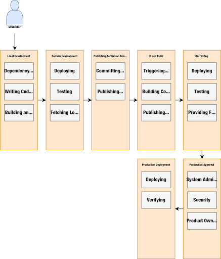
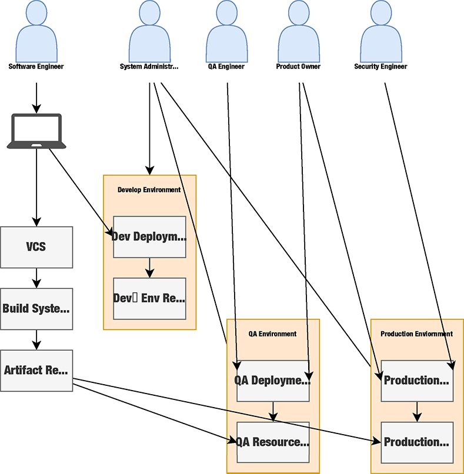
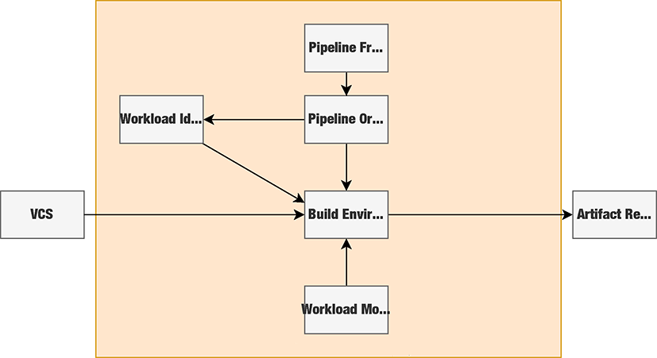

== Secure Software Factory

This chapter covers:

* Understanding the implementation phase of the SDLC and its critical importance in supply chain security
* Identifying the multiple threats against the major systems in the implementation phase
* Understanding the need for the creation of a secure software factory to protect against these major threats
* Building the secure software factory

In the previous chapters, you learned how to threat model and develop some designs for the systems in your system development lifecycle to mitigate common attacks.
You looked at some common systems used throughout the SDLC like project management, development environments, workspaces, workstations, and third-party package and code ingestion.
You also saw how to apply zero-trust architectures and other techniques to protect against common supply chain attacks.
Now you’ll take that a step further and look at how to apply techniques like zero trust to the implementation phase of the SDLC.

=== Overview

The implementation phase of the SDLC is the most critical phase for producer-side supply chain security and is still of importance when it comes to consumer-side supply chain security.
The implementation phase is when the proofs of concept, research, and design work done in previous phases are turned into code intended for release as software and/or systems.
This phase is also where library dependencies are brought into the build. In addition, build time dependencies like compilers, linters, continuous integration (CI) systems, and other tools are also used heavily in the build and related tasks.
In projects and organizations that use an Agile methodology, the implementation phase for an iteration might just last a week or two.
In the case of projects and organizations operating in a waterfall or similar model, this phase might last several months.
Regardless of how long the phase lasts, your approach to protecting the implementation phase will be similar.

We will continue with the Secure Bank example and base your new work on the work you did previously in designing and building controls for the systems inside the bank’s SDLC.
A common set of tasks that happen during the implementation phase are:

* Writing code intended for production release
* Committing and pushing code to Version Control Systems (VCS)
* Running CI/CD pipelines
* Provisioning and configuring environments and infrastructure for running software
* Deploying code to QA and other pre-prod environments
* Running automated and manual tests
* Deploying code to production environments

These tasks are among the most important when considering supply chain security.
We will go into them in more detail later, but a key factor that ties them all together is they are involved in escalating privileges.
This includes taking unprivileged code written by a software engineer and building it and authorizing it for use in more privileged systems like production servers.
This is a core reason why supply chain compromises are both so impactful and difficult to remediate.
The implementation phase is where unprivileged code and its dependencies are promoted throughout environments and end up touching multiple systems and crossing security boundaries.
This includes the boundary between lower environments like dev or QA and the highest privileged environments of production.
The software also consists of, or depends on, other software whose provenance can be hard to determine.
This software is often given a wide range of permissions and authority throughout an organization’s IT environment.

The various activities outlined in Figure 5.1 are critically important for security because they are the areas most prone to introducing vulnerabilities.
These activities are also the ones attackers are most interested in exploiting since there’s a direct path throughout the workflow into production systems.
An organization’s production systems are the targets most rich in data for stealing.
They also are usually highly-privileged and can be further leveraged for lateral movement into other high-value systems.

Figure 5.1 doesn’t show the in-depth interactions between various actors and systems as it would be too complicated to show on a single diagram, but it does highlight a common workflow in the implementation phase.
This common flow is for a developer to write software in a language like Java, based on various requirements like those outlined in user stories.
They commit and push that code into a version control system (VCS) like Git.
This is followed by a CI/CD pipeline like what you might see in Jenkins, Github Actions, or Tekton, which will download dependencies, scan the code, build the code into a deployable software artifact, scan the output artifact, run unit tests, etc.
The CI/CD pipeline will then publish that artifact to a repository for later use and potentially trigger deployment into an upper-level environment like QA.
Various automated and manual integration, acceptance, and other tests will be run with various actors like QA, product owners, and others making decisions based on the results of the tests, for example, the various tests passing can indicate that the software is now good for deployment into production.
Finally, that software, assuming it passes all gatekeeping checks, like approvals and tests passing, can be deployed into production.

.Figure 5.1. A common flow of new code being written by software engineers and going through the various implementation phase activities through to eventual production.

We will go more in-depth later in the chapter about what the system interactions and possible exploits look like in each of these tasks, but you can probably already see various ways that the tasks can be exploited as well as how vulnerable the handoffs between the tasks can be.
For example:

* Malicious dependency requirements can be pushed into VCS and then that goes undetected throughout the CI/CD and other security and testing processes.
* Malicious code can be pushed into VCS either by an external actor who has gained access to systems or an internal bad actor.
* CI/CD systems might pull in malicious build tools, malicious code, or otherwise get compromised leading to vulnerable or exploited software being published and deployed. 
* QA and other environments might have vulnerable or malicious software installed in them leading to invalid results with tests or leading to further compromise in other systems.
* Artifact repositories could have malicious software published to them, leading to malicious deployments to development, QA, and production environments.
* Deployment systems or processes could be exploited to deploy software to various environments to not use approved artifact repositories.

.Exercise 5.1
****
Why is the implementation phase considered the most critical phase for software supply chain security?

[loweralpha]
. It's when the security engineering team is hired
. It's when unprivileged code is promoted to privileged environments
. It's when the project budget is finalized
. It's when external vendors are chosen
****

=== Implementation Phase

The implementation phase is the phase of the SDLC where the bulk of the engineering intended for eventual production deployment happens.
As stated in this chapter's overview, there are a lot of places here that can be exploited.
To better protect against supply chain security attacks, you must deeply understand the actors and systems involved in this phase.
Then you take this understanding and identify the problem areas most ripe for costly attack. You can then build mitigations against these attacks.
As you will see throughout the rest of this chapter, a prime target is the various interactions with the build systems like CI pipelines and upstream/downstream dependencies like artifact repositories and version control systems.
This will highlight the need for a more secure way of developing, building, and publishing code through what we will flesh out called a Secure Software Factory.

The implementation phase is also one of the phases most rife with enterprise bureaucracy.
We will explore how this bureaucracy, if taken too far, can end up hindering security efforts like supply chain security programs.

==== Understanding the Implementation Phase

As in previous chapters, you will look at the various assets, systems, and actors and their interactions to help better understand what you’re trying to protect.
Using the bank example, there will be a combination of both technology-focused and manual process-focused interactions.
These manual processes will spotlight the problems that occur when bureaucracy runs rampant and can cause significant security challenges for an organization.
An example of this would be the manual processes to keep up with data network documentation, like IP addresses, on a system, even if that system is dynamic, like services deployed to Kubernetes.
For many readers who operate in smaller organizations, or whose work mostly happens in small open source projects, some of what is about to be discussed might seem ridiculous due to the overwhelming bureaucratic processes involved, but it is important to still explore how to identify when the manual processes impact supply chain security.
When you understand the process, you can transform risky, insecure, manual processes into something automated, safer, and more secure.

Figure 5.2 shows what the bank has before transforming its technology systems into something more efficient and more secure.
To help highlight some of the biggest risks and challenges affecting the development-to-production flow, it doesn't include many of the improvements you made in previous chapters.
It also stresses why certain changes, especially those related to the build and CI pipelines, are a huge bang for the buck improvement when looking at improving your supply chain security posture.

.Figure 5.2. An inefficient bank IT setup of actors and systems involved in code going from developer workstation, through the build, and then deployed into a production environment.

Between what you saw in Figure 5.1 and what you see in Figure 5.2, you start to get an idea of a day in the life of code intended for production environments. 
A simplified step-by-step description of this is something like this:

. The software engineer gets a story or task describing what they should be working on.
. The software engineer does software development on their workstation
.. The software engineer pulls down updated code written by his colleagues from the VCS.
.. The software engineer installs any dependencies they need based on updated code or work they are performing.
This is often libraries but can also include additional tools or newer versions of existing tools.
.. The software engineer writes code.
.. The software engineer runs builds, tests, and linting locally.
.. The software engineer commits the code and pushes it to the VCS
. The software engineer coordinates with the system sdministration team to deploy a local version of the code to a development environment. 
.. The software engineer submits the locally built artifact to a system administration intake system.
.. The system administrator works with the software engineer to deploy the artifact.
.. The software engineer gets limited access to the development environment resources.
This will include the ability to start/stop the service as well as see limited application logs.
.. This stage gets repeated as often as is required for the software engineer to be confident that their code is good enough to go to the next stage.
. Tech Lead manually triggers the CI pipeline after coordinating with their Software Engineers.
.. CI system sets up a temporary workspace for a new build that includes a templated set of tools for building, testing, linting, etc.
.. CI job triggers project build script.
.. Build script downloads dependencies.
.. Build script runs linting steps.
.. Build script runs compilation or other packaging steps.
.. Build script runs unit and other local tests
.. CI system will take the built artifact and publish it to the artifact repository
. The product owner coordinates with the QA team on deploying and testing the built artifact in a QA environment.
.. This involves the QA team and product owner following a similar process to step 3 to have the system administration team deploy the software built by the CI and the build system into the QA environment.
.. The QA team runs various integration and other tests.
For the sake of simplicity in this example we can assume the QA team also runs acceptance testing, UX testing, stress tests, and anything else that falls under testing but in many organizations might fall under multiple teams or departments.
.. The QA team provides feedback to the product owner.
.. All IT teams coordinate and follow gating processes to prepare for a production deployment.
.. This includes previously mentioned items like system administrators signing off that they can deploy & run the infrastructure for the software and QA signing off that QA tests passed.
.. After all the signoffs happen a deployment can occur.
. Software is deployed by the system administration team to a production environment.
.. System Administration follows established procedures and practices for the software and deploys the software.
.. The product owner signs off on the deployment if it is a success.

You might already notice multiple bad practices happening which end up creating extraordinary risk to the organization, but we will look at threats in greater detail in the next section.
Even though the above system can seem quite comprehensive, it is still simplified compared to the intricate and complex systems, processes, and interactions that happen within a large enterprise like a multinational bank.

==== Identify Threats in the Implementation Phase

Our model for the implementation phase is incomplete for a real bank, but it is useful as a representative example of the sorts of things you would see in a real bank's dev-to-production flow.
You will look at a piece of the implementation phase in a bit more detail and help understand the vast number of supply chain threats against the systems utilized in the implementation phase, in particular workstations, CI and build systems, and deployment systems.
Before looking in detail at threats to the implementation phase, let’s explore a few of the broader issues as highlighted by the simplified model.

The feedback loops are too long.
Requiring a system administration team to deploy and manage software even in non-production environments might seem like a good idea:
only a small set of individuals get privileged access to resources.
It is also common to require segregation of duties ensuring that those who write the software can't approve and deploy their software and vice versa.
However, implementing it this way leads to everyone cutting corners since the system administrators don't understand the software and have limited knowledge of how it's supposed to be deployed and run.
Software engineers on the other hand must deal with large turnaround times every time they make an update to the code.
A single-line fix might take a week or longer to test in a development environment in a situation like this.

The same goes for QA, this time with a longer feedback loop.
If QA discovers an issue, it will go back to the software engineers and those engineers will need to write fixes which then need to be tested in development environments and then flow back through to QA again.
A simple issue that could take a few minutes to fix can take weeks or longer to make it back through the QA testing phase.
This means that deploying a security fix takes a long time, leaving the bank or its customers vulnerable unnecessarily.

Manual processes are prone to error.
Processes that involve qualitative and fuzzy assessments like final usability signoffs, architectural signoffs, and exceptions need to be human-driven and flexible.
However, it is bad practice to operate manual processes that involve repetitive activities like deploying software to resources like Linux servers or container orchestration systems like Kubernetes.
A system administrator can make mistakes and many tools exist to automate the deployment of software, access & security policies, and other requirements.
Many of the signoffs that happen before a production deployment are also quantitative. Did the tests pass?
If yes, why does the QA team need to sign off that the tests did indeed pass instead of having some way to assert that in a machine-driven automated fashion?

Siloing roles and responsibilities across the teams make it difficult for folks to do their job.
Segregation of duties makes sense to ensure that no one actor has enough authority to do major damage, but not implementing it efficiently results in a situation where it’s ineffective anyway.
A system administrator who manually deploys a locally-built artifact will not be able to perform due diligence on the security of the artifact in the first place.
If malicious software was handed to a system administrator for deployment, you will have a hard time knowing what has been affected.
It could be everything up to and including the system administrator's workstation, the jump box (a shared machine used to access resources across multiple environments), the development environment, and anything else accessed from one of the compromised resources.
A system administration team should be more focused on building a platform that enables software engineers to deploy artifacts to development environments with a high level of security and minimal blast radius in the case of deploying a malicious artifact.

The bank has few automated security controls or security-focused systems in place.
You saw in previous chapters how even having a handful of key machine-driven security controls and systems in place can greatly reduce the incidence — or entirely eliminate classes — of attack.

Some of the above-highlighted issues are clearly security-focused.
Others might seem like inefficiencies or other non-security-related challenges.
As you learned in previous chapters, these inefficiencies can have knock-on effects on the risks and security of systems and the enterprise.
You will see in this upcoming end-to-end example why the challenges posed by inefficiencies can open the bank to increased risk of supply chain security attack as well as make remediation from a successful attack more difficult.

It is worthwhile to look at an actual example of what can happen as code flows from a software engineer’s workstation through VCS to CI and build systems, is published to artifact storage systems, and finally deployed into production systems.
For this example, assume you are writing a very simple Golang application.
This code is being written, and then will flow through the various systems throughout the phase and then end up being deployed into a production environment.

Listing 5.1 shows a trivial Golang hello world application using a hypothetical internally-developed “printhelper” library.
The application’s only feature is to print the string “Hello World!”
What could go wrong?
A lot, it turns out.

.Listing 5.1. Writing a "hello world" application in Go.
----
package hello

import "path/to/printhelper"

func main() {
    printhelper.Println("Hello World!") #A
}

#A The only functionality of the application should be to print "Hello World!"
----

Imagine you write this application, have it go through the CI and build systems, through the various other gating mechanisms, and then it makes its way into production.
You expect the program to be deployed into a production environment and to do what it’s supposed to:
print “Hello World!”.
However when you deploy it into production, you see that it prints out “Goodbye World!”
A supply chain attack has occurred!

You might begin to see the challenge with analyzing the implementation phase for supply chain attacks.
If you look at all of the things that could have happened to lead to this compromise, the list is long and hard to keep track of.
For example, here an incomplete list of the most common attacks that could have led to this compromise:

* An internal software engineer goes rogue and pushes the bad code.
* An external bad actor gets access to an authorized workstation and pushes the bad code from there.
* Malicious tools or other dependencies on the software engineer's workstation modify code before being pushed to the VCS.
* A malicious build tool or other dependency compromises the build pipeline for the project in the CI and build system.
* The VCS gets compromised and code is modified before it makes its way into the CI and build systems.
* The CI and build systems are compromised.
* Artifact repositories are compromised allowing the publishing of malicious code directly to them.
* Systems and tools involved in the deployment process are compromised.
* Existing vendor or open-source software running in production is compromised.

Some of the above attacks might be caught by the bank’s existing systems and processes, but let’s see why that might prove to be difficult.
In previous chapters, you explored how inadequacies in the technology developed and implemented by the bank could increase supply chain security risk.
Now let’s also look at some of the manual processes and how inefficient bureaucracy and lack of automation can also lead to an attack.

The above attacks are dangerous but the one that is the scariest is a compromise to the CI or build system itself.
This is what we saw happen in the SUNBURST attack against SolarWinds.
Someone accidentally using a bad dependency is still dangerous for all releases related to that project and any other project that uses the bad dependency.
A compromised CI system means all builds for all projects that happen are suspect at best and compromised at worst.

Now, let’s look in more detail at how the above attacks could have led to the compromise.
Some of these attacks would be easier or harder to pull off in the real world depending on how an actual enterprise's IT environment is set up.

The software engineer writing the code could have been told to write the software to display "Hello World!", and they might have maliciously put "Goodbye World!" into the code.
Inadequate code and security reviews on the software didn’t catch it, tests and QA didn’t catch it, system administrators didn’t catch it, and final approvals didn’t catch it.
This might seem farfetched, but as discussed above, when you have a ton of manual processes, a lot of things can slip through the cracks.
An external bad actor getting access to the workstation and pushing out the bad code is a similar sort of attack that would also require things not being caught for it to go off without a hitch.

The same sort of thing could also happen if the VCS or artifact repository is compromised, and the bad actor uses that as the vector to get in and inject malicious code or a malicious artifact.
In this contrived example, it should be easy to catch, but you can imagine if it’s a single line of code, or even a few lines of code in a large million+ line codebase it would be a different story.
We see this thing happen with SQL injection attacks.
It's a very common vulnerability, but often gets missed at every stage from the software engineer writing code to the QA engineers not having adequate tests, etc.

Malicious tools and code dependencies have been known to change the underlying functionality of the application.
Any piece of software on the software engineer’s workstation with access to the source code or built artifact on the workstation can modify it in any way they choose.
Build tools more specifically can also be hard to detect when they’re malicious.
It is easier to detect if a random application on the workstation modifies the source or artifact, because most applications, like messaging client, or presentation software, shouldn’t need to access source code or artifacts.
It is harder when the build tool is supposed to access the source code and artifact — that’s the job of the build tool.
The build tool can change source code or swap out good dependencies with bad dependencies.
It can also inject whatever it wants into the output artifact while still in memory before the output artifact has even been written out to disk.

A malicious dependency can often have similar behavior as a malicious tool.
In many languages and ecosystems, like npm for Javascript, installing a dependency can run arbitrary commands against the system it’s installing to.
A dependency in many of these ecosystems can install malicious tools on the workstation or do something malicious at download and installation time.

In addition to this, a dependency can itself have malicious behavior.
In the Listing 5.1 example, you are using an internal library called printhelper.
That library could be malicious and when told to print "Hello World!" the printhelper dependency has it print "Goodbye World!"
All the things that have been shown to happen to a workstation could also happen in the CI and build systems.

Software that has already been compromised and is running in the production system can be used to compromise other production systems to which that software might have access.
In addition to this, it is still common for monitoring, alerting, and even security software with high levels of privilege to be compromised and therefore can compromise other software deployed to them.
For example, there's a known attack vector where a malicious or compromised piece of software uses `LD_PRELOAD` which can swap out shared libraries before running a piece of software.
Most programs in Golang are statically compiled and not susceptible to this attack, but if the “printhelper” library links to some other upstream C library that library could be replaced by a malicious one using a vector like `LD_PRELOAD`.
Similarly, if systems or tools used in production deployments are compromised, they can either deploy artifacts from non-standard locations or modify artifacts during the deployment process.

Now, it’s time to talk about the big set of attack vectors that is the CI and build systems.
If the CI and build systems are compromised, all source code that goes through it can be manipulated and all artifacts that are built from it can be manipulated.
There are usually only a handful of CI and build systems for an enterprise, with many centralizing to a single service.
This means that a CI system compromise has the knock-on effect of potentially compromising every piece of software that is built by the enterprise.
This has the further knock-on effect of that software compromising anything else it’s deployed to.
Very quickly it becomes difficult to know if anything hasn’t been compromised.
In addition to how bad a compromise of the CI system is, this system is vulnerable to many of the same kinds of compromises detailed above.
It can have software on its servers compromised, it can have its dependencies compromised.
The CI and build systems also tend to be highly privileged with access to many of the secrets required to sign software and access various other APIs and services.
In addition to this, in some enterprises the CI system also is utilized with CD allowing for a seamless delivery process, but if the CI system is compromised it means the CI system would have access to not only compromise any software it wants but to also deploy that compromised software.

The CI and build systems are potentially the most important systems to protect.
They are at the heart of the SDLC.
To reiterate what was stated at the beginning of this chapter, you are taking untrusted software and dependencies and transforming it into software with access to run in privileged production systems.

The individual lessons you took from previous chapters to help secure different systems and processes like signing software helps ensure that only approved software is deployed to privileged environments.
However, as you’ll see in the next section, you need to take a more end-to-end approach to the solution.

==== Determining Mitigations for Implementation Phase Attacks

You saw in previous chapters that using systems like identity-aware proxies (IAP) and remote development environments, as well as following best practices like signing software and verifying the signatures on signed software can help mitigate various software supply chain attacks.
However, as you see highlighted in the implementation phase, following any one or even a set of practices might help but doesn't fully solve the problem.
This is further exacerbated when you look at how many things can go wrong with some of the systems and processes within the implementation phase.
The CI and build systems have a multitude of attack vectors to protect against as well as being of critical importance to the enterprise.

Though there are various systems, processes, etc. to protect in the implementation phase, most of this section will focus on the CI and build systems.
This is for two reasons.
First is that we already discussed many of the potential mitigations in previous chapters that fit in here as well.
The other is that many of the risks are mitigated just by securing the CI and build systems.
Securing these systems is potentially the most critical piece of securing the supply chain.

Before approaching the enormous task of securing the CI and build systems, let’s look at some other simpler things that could be done to help minimize risk and secure the systems and interactions in the implementation phase.
Many of these are discussed in more detail in other sections of the book:

* Using zero-trust architectures and practices to ensure that it is harder to gain high levels of access based on a single compromise.
* Verifying software and dependencies come from trusted parties through verifying signatures against known associated keys and certificates.
* Verifying attestations made about software like how it’s built and what dependencies help make up the software.
* Signing and verifying internally-written code to ensure only code from authorized actors is allowed to push code even if a VCS or other system is compromised.
* Using remote IDEs with isolated development environments to minimize the blast radius of any compromise.
* Creating QA and Dev platforms to reduce the need for heavily manual and error-prone processes.
* Have an automated policy system in place to verify that signatures, attestations, access, etc. meet high-level security requirements defined as code.

Any of the above changes would improve the security posture of the bank’s implementation phase.
The combination of all of them would be a greater increase than any of the individual improvements on their own.
A combination of the above practices is required to develop something like a secure software factory, as you’ll see.

“Secure software factory” has multiple definitions depending on the source, but the two most common definitions are:

. A secure approach to the SDLC along with people involved in it.
. A secure system for turning source code and its dependencies into trustworthy artifacts.

The two definitions are closely related.
The goal of software supply chain security is to protect production systems from running vulnerable or malicious software, whether internally or externally developed.
This is achieved by architecting and implementing a secure SDLC, and a core piece of the secure SDLC is a secure build system.
For the sake of clarification, we will continue to use the term “secure SDLC” for what is generally required to have good supply chain security and we will use “secure software factory” to refer to the secure CI, build, and associated systems for transforming source code into trustworthy artifacts.

Entire books could be written on the secure software factory itself.
This section will focus on some key principles and general elements of the secure software factory.
Future sections will also look at how to be able to use various tools and frameworks to implement a secure software factory at a high level.
We recommend looking at other resources on the topic like the CNCF Secure Software Factory Reference Architecturefootnote:[https://github.com/cncf/tag-security/blob/dd42b376956732374765c66d52865c5e8023845c/supply-chain-security/secure-software-factory/Secure_Software_Factory_Whitepaper.pdf] for a deep dive into the topic.

The Secure Software Factory as shown in Figure 5.3 tries to secure the code to artifact build process through 3 primary practices:

* Enforcing security best practices and policy against the orchestration of build pipelines.
* Enforcing workload identities against the build pipelines to protect workload orchestration from tampering.
* Monitoring the workloads themselves to ensure the build workload itself isn’t being tampered with.

.Figure 5.3. The components that make up a Secure Software Factory.

Enforcing security on the orchestration of build pipelines ensures that build pipelines follow common rules, many of them security related, like ensuring a software composition analysis (SCA) scan runs on all builds.
It is common in many CI and build systems to either enforce security rules by forcing all builds of a particular type, e.g., Golang build, to use a singular template that includes all required steps or to enforce security steps through manual checks and audits.

Both approaches are bad.
Pushing all jobs of a particular type through a build template often doesn’t provide the flexibility that is required in a large enterprises.
Templates will work for most cases but begin to fall apart for some teams when the complexity of an application makes templates hard to build.
In addition, the DevOps/DevSecOps teams building the templates usually aren't the domain experts in the best practices for security.
Similarly, letting projects own their build pipeline definitions and enforcing the run of security tasks like the generation of SBOMs through manual audits or gating processes is not scalable and leads to a lot of one-off situations.

The above reasons are why it is important to have a build pipeline orchestration framework that enforces automated gating through policy as well as automated generation of security tasks.
Using tools and languages like CUEfootnote:[https://cuelang.org/] you can enforce rules on a pipeline like:

* All pipelines must have SBOM generation, SLSA generation, security linting, and other security tasks
* Naming schemes
* Default tasks
* Allowed/disallowed parameters

Having a framework by which to encode rules on what is allowed and not allowed to run, including security steps, lets an organization, department, team, etc. encode the policy and accepted standards of how the CI pipelines are allowed to operate.
When designing the rules encoded in a pipeline framework for securing the supply chain, it would look something like this:

* Pipelines must start with fetching of source code using an approved source code fetching step.
This prevents pipelines from being told to fetch source code from anywhere but the approved VCS.
* Pipelines must include approved security linting, scanning, etc. steps for the project’s programming language(s).
This prevents pipelines from maliciously or inadvertently skipping security critical steps.
* Pipelines must generate SBOMs, SLSA attestations, SCA reports, and other supply chain security metadata.This enforces that metadata that would be useful for determining the trustworthiness of a build is generated.
* Pipeline output like artifacts and metadata must be signed and associated with an identity for a given step.
This enforces that the output from the pipelines can be cryptographically tied back to not just the build system’s cryptographic keys or certificates, but also to what specific pipeline run and step that ran.
* The dependency downloading step cannot include the ability to run anything but downloading of dependencies.
This prevents a malicious dependency from modifying the source or generating artifacts secretly before the appropriate build step.
* The compilation/packaging step cannot include network access.
This prevents a malicious build tool from exfiltrating source code or downloading additional malicious content.
* The artifact/package publishing step must have read-only access to the artifact that is built.
This prevents a malicious publishing tool from modifying the output artifact or package before pushing it to the artifact repository.

Any of the above rules encoded in a pipeline framework makes the pipeline more secure.
The set of rules together makes for a robust pipeline that prevents many types of attacks that would exploit a missing security step or inadequate security in the orchestration of a given step.
It is not enough, however.
Someone with privileged access to the resources that orchestrate the pipeline would potentially still be able to modify the orchestration of a step’s workload. 

For example, assume the build pipelines are run within a Kubernetes cluster.
An administrator on that Kubernetes cluster could modify a pod to run a different image inside the build container. This would be difficult to detect normally.
The administrator could also modify parameters to the build pod.
This could be resolved by giving workload identities to the pipeline steps that run in the cluster and enforcing those modifications to the pods would invalidate those identities making the pipeline orchestrator terminate those workloads.
Even if the workloads continued running the pipeline observation systems that would sign the output would no longer do so having seen invalid identities.
The most popular framework for generating workload identities is called SPIFFEfootnote:[https://spiffe.io/], and a common implementation for managing it is called SPIRE.

A common flow for generating and validating these identities looks something like this:

. The pipeline orchestrator registers a new workload with the SPIRE server.
. The pipeline orchestrator spins up the pod for the task it's about to run.
It adds a signature to the pod as an annotation based on the content of the status of the pod.
. The SPIRE agent on the node running the tasks gives a workload identity called an SVID to this pod.
This identity can be used by the pod to authenticate with systems it needs to like secrets APIs, test databases, etc.
. The pipeline orchestrator will continuously check that the signature on the pod matches the content of the status.
It will also re-sign the pod as needed.

For a more in-depth look at this using SPIRE and the Tekton CI system see the TEP-0089footnote:[https://github.com/tektoncd/community/blob/f36c6fd47cb5b2b96b797c59844bfa4d6958b3f9/teps/0089-nonfalsifiable-provenance-support.md] document.
By protecting against workload orchestration tampering, you can now reduce the risk of a malicious administrator manipulating pipelines as they run.
You can also make it harder for an attacker to compromise the whole build system. This still isn’t enough, however.
Someone with adequate access can exec or shell into a running workload and modify the build’s workspace.
The same can happen if a malicious build tool or dependency is running inside the build’s workload.

You can detect and prevent this sort of attack by continuously monitoring what is happening inside the workload to ensure it’s not trying to do something malicious.
A common way to detect this behavior and prevent some of it from happening in the first place is to use eBPFfootnote:[https://ebpf.io] to detect what system calls and other low-level activity is happening in the workload.
eBPF allows for the execution of certain types of programs directly within the Linux kernel, instead of in userspace.
These programs monitor activity happening in other running processes like a build workload, but they can also intercept and manipulate the behavior of those running processes.
For example, eBPF can be used to both monitor a build to ensure that it doesn’t open suspicious files as well as prevent those suspicious files from actually being opened.
For your build system, this eBPF monitoring can be used in conjunction with frameworks like the in-toto attestation frameworkfootnote:[https://in-toto.io] to create signed metadata for use in future forensics.

As you’ve seen with the secure software factory, many of the attacks that were highlighted in the previous section would be eliminated or their likelihood reduced.
It is now much harder for the output artifact from a build to have been compromised.
This is because you enforce standardization in the pipelines and required security steps through the pipeline framework.
You then prevent tampering with the workload orchestration by utilizing workload identities.
This prevents container images and builds parameters from being changed to something malicious.
Finally, you monitor and have security controls on the running workload using technology like eBPF which detect and prevent malicious activity in the running step of the build.

.Exercise 5.2
****
Which of the following is NOT a common supply chain attack vector during the Implementation Phase?

[loweralpha]
. Compromise of the Continuous Integration (CI) system
. Malicious dependencies introduced during the build process
. Unauthorized modifications to the version control system (VCS)
. Social engineering attacks on the project stakeholders
****

==== AI and the Secure Software Factory

As artificial intelligence continues to evolve and mature, it presents both opportunities and challenges for secure software development.
Let’s explore how AI could potentially be integrated into the secure software factory, as well as how the principles of the secure software factory could be applied to AI development itself.
A word of caution though:
the AI space is still quite immature.
There are a lot of evolving techniques that enable AI to help with software supply chain security use cases as well as evolving patterns for securing the AI supply chain, but as of writing this book these techniques aren’t mature yet and tooling support is sparse.

Let’s start with how AI could help:

* Enhanced code analysis.
AI models could be trained to identify potential security vulnerabilities in code more effectively than traditional static analysis tools.
These AI-powered tools could potentially catch subtle patterns that human reviewers or rule-based systems might miss.
But there’s no guarantee: some studies show that the same AI doesn’t find a vulnerability every time it's prompted.footnote:[https://openssf.org/blog/2024/07/10/ai-cyber-challenge-aixcc-and-the-needle-linux-kernel-vulnerability-part-1/]
We expect this to change as AI models get better.
* Anomaly detection:
Machine learning algorithms could be employed to detect unusual patterns in build processes, potentially identifying supply chain attacks or compromised systems more quickly than traditional monitoring methods.
* Automated dependency management.
AI systems could assist in evaluating and selecting dependencies, potentially identifying safer alternatives or flagging dependencies with suspicious behavior or known vulnerabilities.
* Intelligent access control.
AI could be used to enhance access control systems, analyzing patterns of behavior to identify potential insider threats or compromised credentials.
* Predictive Maintenance.
Machine learning models could predict potential system failures or security risks before they occur, allowing for proactive maintenance and security measures.

At the bank, you would most likely look at anomaly detection as the first step.
AI, because it is focused heavily on statistics, is well-suited for this because anomaly detection is basically looking at data and finding statistical outliers.
You could use this anomaly detection to help with other things like automated dependency management and code analysis.
Of course, you would be cautious and avoid letting the AI make the final decision on failing or succeeding a build just on its own analysis.
AI, especially large language models (LLMs), can give differing inputs based on some randomness in how they generate their output.
This randomness makes AI appear creative, but for security use cases where determinism is important, it can create issues.

Now let’s look at how you can help secure the AI models the bank might use in securing the software factory or any other purpose like detecting anomalous and potentially fraudulent transactions.
You can do this by applying the secure software factory systems and practices to the AI you train.
Here are some practices:

* Versioning and provenance.
Just as with traditional software, AI models and training data should be version-controlled, with clear provenance information maintained throughout the lifecycle.
The bank can train its AI and generate SLSA provenance and also record their dependencies like the training set in SBOMs.
For this purpose, SBOMs are often referred to as “AI BOMs.”
* Reproducible builds.
The process of training AI models should be made reproducible, allowing for verification of the model's integrity and behavior.
This is often difficult to do given the nature of AI training, but there are techniques that are evolving to attempt to make the training process more deterministic.
* Secure data handling.
Training data, which can be sensitive, should be protected using the same rigorous security measures applied to other critical assets in the secure software factory.
The bank would want to ensure that the training data is in no way tampered with during the training process.
This is an attack vector that has been growing in popularity.
* Model validation.
Rigorous testing and validation processes should be implemented to ensure AI models behave as expected and don't introduce new vulnerabilities or biases.
These same processes should also be done through the secure software factory and have signed attestations on what tests have been performed so the bank can know they have adequately tested their AI models.

AI has the potential to be hugely impactful as a tool in the secure software factory, but you need to use it with caution.
AI that you want to use should also go through the practices described throughout this chapter.
Since the secure software factory is one of the most critical systems for supply chain security, you should ensure any AI that is used in it goes through the same rigorous practices.

.Exercise 5.3
****
Which of the following is NOT mentioned as a potential application of AI in the Secure Software Factory?

[loweralpha]
. Enhanced code analysis for identifying security vulnerabilities
. Automated generation of secure code
. Anomaly detection in build processes
. Intelligent access control for identifying potential insider threats
****

=== Maintenance Phase

The maintenance phase is the stage in the SDLC where you keep things running as planned as well as provide the final stage of the feedback loop back into the next iteration of the SDLC’s planning phase.
The maintenance phase doesn't bring to light any new risks or attacks, but does call attention to the need to remain diligent to protect running systems and make sure data from all systems flows into security monitoring, alerting, and management systems.

This feedback loop is the final piece of the picture that helps any organization like the bank achieve multiple security goals:

* Understanding potential threats by highlighting security gaps
* Understanding both successful and thwarted attacks
* Having a knowledgebase of security metrics and metadata

That last point — having a knowledge base of security metrics and metadata — can't be overstated.
Having this knowledgebase isn’t an end unto itself, but almost everything in security will rely on it.
All the threat mitigation systems, processes, procedures, etc. are only as good as the data that feeds into them.
Without trustworthy and reliable data backing the decisions, controls are borderline useless.
Enforcing rules for ingesting software without known vulnerabilities isn’t valuable if you don’t have access to data about known vulnerabilities.
Verifying that software is signed isn't valuable if you don't store the cryptographic key and certificate information related to the identities doing the signing.
It would be very easy to verify that a signature is valid but the signature could easily be associated with an unknown or untrusted party.

There are emerging patterns in this space that we will explore further in future chapters but be aware that a lot of work on building out this knowledgebase is still early on.
There are a few mature tools out there like Grafeasfootnote:[https://grafeas.io/] that help here along with some emerging tools like GUACfootnote:[https://guac.sh].
In addition to tools specifically designed to help with storing supply chain and artifact metadata, a lot of organizations utilize common data warehousing, and data lake tools to build solutions that work for their specific needs.

=== Summary

* The implementation phase is the most important phase of the SDLC to protect due to it being involved in taking unprivileged source code and dependencies and turning it into privileged packages and artifacts intended to run in privileged production environments.
* The implementation phase has many of the same concerns as previous phases and you can take similar approaches to protect it.
* Inefficient manual processes are dangerous and error-prone. They might help with compliance, but often diminish security posture.
* An automated policy helps turn manual error-prone gatekeeping into machine-driven and more reliable systems.
* Protecting artifact builds through architecting and implementing a secure software factory is one of the most important things you can do in protecting against supply chain compromise.
* There needs to be a feedback loop to take metadata about supply chain security, like what has been installed and where it has been installed, back through the SDLC to be used in future iterations.

==== Answer Key

* 5.1 — B — It's when unprivileged code is promoted to privileged environments
* 5.2 — D — Social engineering attacks on the project stakeholders
* 5.3 — B — Automated generation of secure code

