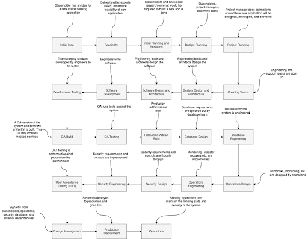
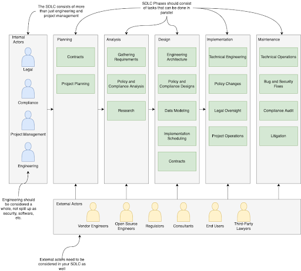
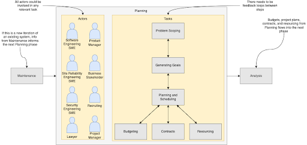
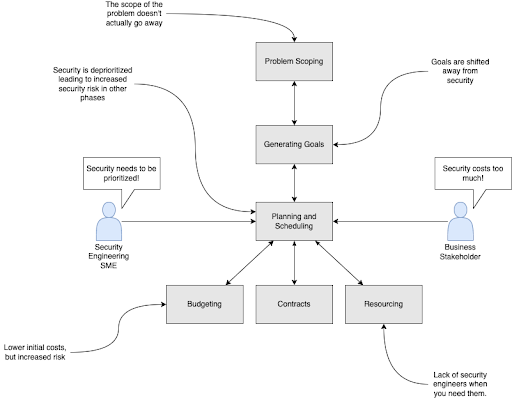
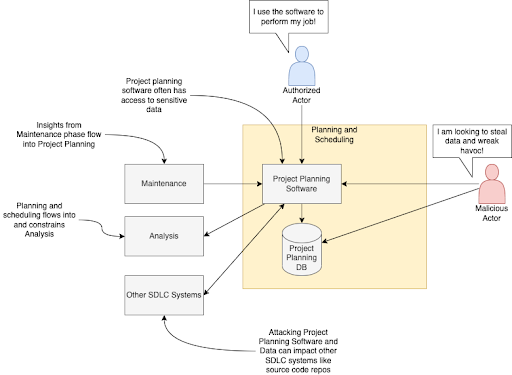
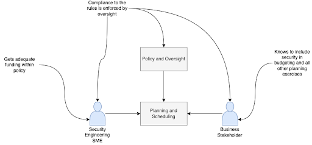
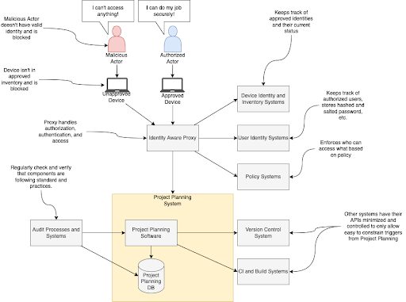

== Think Like an Attacker: Protecting the SDLC

This chapter covers:

* Understanding the who and what of the SDLC
* Learning how a threat actor might attack the first phase of the SDLC
* Approaches to transforming the SDLC into something easier to protect.

In the previous chapter you learned the basics of the system delivery lifecycle and how to create a threat model for the example online banking application.
You can now apply what you learned to the hypothetical bank that is developing systems like the online banking application, or to other systems like commercial banking applications, loan risk models, etc.

=== Overview

There are many ways to develop a System Delivery Lifecycle for a bank.
To cover a reasonable amount of use cases and examples, let’s assume that this is a bank in the middle of a digital transformation.
They have some legacy systems built around mainframe technologies that use older programming languages like COBOL and FORTRAN.
They also have other systems built on newer, but still not modern, tech stacks like Java Enterprise running on web application servers like WebSphere and WebLogic.
They are modernizing their stack and going through a cloud transformation where they are beginning to build out new systems that run on cloud native platforms like Kubernetes and utilize modern technologies, languages, and frameworks like Go, Rust, Knative, and Quarkus.

The tools and technologies they are adopting are not being adopted just because it’s cutting edge and cool to use.
It is because the organization recognizes they need to go through a cultural transformation to hit business goals like reducing technology costs, releasing products to market quicker, and reducing risks.
This transformation requires adopting newer technology models that in turn requires the adoption of new technologies themselves.
You need to consider this when threat modeling the SDLC.

Figure 3.1 shows what the bank’s old SDLC looks like.
It’s inefficient in many ways.
Its design also introduces a ton of security risk, especially supply chain security risk.
This is true both from the perspective of the way the flow itself is structured as well as how individual steps in the flow are run.
You can see that the highly linear flow through the process makes feedback loops difficult.
If security is just a step at the end, what happens if a supply chain security vulnerability was introduced in a step like the QA build?
It would be harder to catch, as well as more expensive to remediate;
you would potentially have to redo all the steps between QA build and security design/engineering.

.Figure 3.1. An inefficient banking organization SDLC flow. This flow is very linear with long feedback loops leading to inefficient communication.

The bank wants to achieve their goals, including reducing supply chain security risk.
To adequately reduce supply chain security risk, they can’t keep performing the same technology practices they have done in the past.
Like many large organizations with a computing history dating back at least half a century, they have had a siloed development process where software engineers are purely responsible for the development of application code.
This means there are separate roles for:

* Software engineering
* Database engineer and administration
* System administration and operations
* Security engineering
* Quality assurance and testing

This is a problem when it comes to addressing supply chain security.
The siloed situation has software engineers handing banking software like the online banking application over to security engineers who might not have context on how the software was designed or developed.
If they aren’t aware of what dependencies are being used and how, it can lead to supply chain vulnerabilities slipping through the cracks.
If these roles are not communicating with each other with a tight feedback loop, it is difficult to get the full picture of the supply chain.
You need the various roles to be more communicative with each other and a better organizational model where everyone is responsible for some level of security.
Most software engineers don’t need to be expert hackers.
They do need enough knowledge in their domain to both prevent common supply chain attacks in their area of expertise and to communicate with security engineers who are thinking about the problem in an end-to-end fashion.
These practices align with what is usually referred to as DevSecOps.
DevSecOps is the practice by which security and operations considerations shift left in the SDLC to make it more aligned with the normal development practices like software engineering.
Without introducing newer engineering practices and cultures like DevSecOps, you will be hamstrung when trying to apply security practices to your technology supply chain.

As a reminder, the SDLC flow should be largely independent of the project management methodology.
It should not matter whether a banking project is being run Agile, waterfall or anything else, the SDLC process should remain the same.
The only thing that really changes is just how often you go through the flow.
If you tie project management methodology to the SDLC, then — if you need to run different projects using different methodologies — you will also need to build SDLCs for each of those methodologies.
This doesn’t scale and is generally expensive.

Waterfall means over the lifetime of something like an online banking application, which could be multiple months or years, you go through each phase once.
The same banking application being run through an Agile methodology would go through the various phases of the SDLC multiple times.
In particularly efficient Agile approaches where you are able to deploy at the end of each of your sprints, you go through the entire SDLC flow in each sprint.
In waterfall, the bank might deploy an application only once, which means that protecting against discovered supply chain vulnerabilities will take a different approach than Agile where you might be updating and deploying the application every few weeks or even quicker.
This is important to consider while threat modeling the SDLC process because you shouldn’t make assumptions on various project management methodologies.
You need to consider both long and short time frames for systems being built out in your organization’s SDLC.

Figure 3.2 is a simplified example of how the bank’s SDLC would look after applying some newer technology cultures and practices to the organization.
You can see that tasks within a phase don’t need to happen in a linear sequence.
Tasks can happen in parallel and share information back and forth between them.
You might perform research to inform how you gather requirements and the gathering of your requirements might inform how you do research.
The actors involved have been simplified to allow for ease of reading.
In the real world, many more people are likely involved.

.Figure 3.2. A simplified SDLC for Secure Bank.

In the online banking application, you can include security engineering throughout the steps where it makes sense, like research.
Including most types of engineers in the research process helps to preempt challenges that might arise later in the SDLC.
Security engineers can both research areas of the problem space for the online banking application that might introduce security challenges, for example common libraries that might be used and potential supply chain issues with them, as well as educate other engineers on important areas to consider for security in their domain.
Though there might still be a separation between software engineers, security engineers, database engineers, etc., any tasks that relate to engineering should include all engineers that matter to the task.
Applying practices and cultures like DevSecOps to the SDLC helps the bank better prepare itself for the supply chain security risks.

It is also important to consider all the authorized external actors that operate in or interact with the bank’s SDLC.
These authorized external actors are folks who at some level would be involved in the delivery or consumption of the systems the bank creates.
At first glance it might not be clear how these external actors might be involved and why they’re important to supply chain security.

Here are a few key examples:

* Vendor engineers:
They provide software and systems that the bank uses as well as develop software and systems that use the bank’s software and systems.
If dependent software has vulnerabilities this introduces supply chain risk.
The bank might also be held liable if systems they provide for use have been compromised and further expose vendor systems.
* Open source engineers:
They develop many of the tools, libraries, and other software dependencies that the bank uses both while developing systems as well as integrated with the systems themselves.
Since open source is available for free, most technology projects make heavy use of it, which makes it easy for malicious actors to attack multiple unsuspecting victims at once utilizing a single compromised piece of software.
* Regulators:
A common supply chain risk for the bank would be using something in their technology supply chain like an encryption library that doesn’t follow the rules they need to comply with regulations.
Regulators are both people at governmental regulatory agencies as well as self-regulatory agencies that are responsible for enforcing compliance to governmental and industry rules around how banking operates.
This is important for system delivery as the systems being developed by a bank, like online banking, need to comply with both generic regulations around banking itself as well as regulations specific to technology in banking.
* Third-party lawyers:
Another common supply chain risk for the bank is inadvertently using software in its supply chain that doesn’t follow the licensing requirements of that software.
This could get the bank sued, required to pay unwanted license costs, or force the bank to release their source code to comply with the requirements of the license.
This is usually litigated through third-party lawyers.

As you read in Chapter 2, external actors can be people external to your organization or just be external to the project, team, or department responsible for the system.
In the case of the bank’s SDLC, at some level most employees would be considered at some level internal actors, whereas people who aren't employees — like vendor employees, regulators, and end user customers — would be considered external actors.
Large organizations may have multiple SDLCs for different parts of the organization, however a single SDLC reduces various security risks, like supply chain security risk, as you don’t have to secure multiple SDLCs.

By both adopting newer technology cultures and practices, you can create an SDLC for your project or organization that makes it easier to address supply chain security risks.
Once you have built an SDLC that adopts newer modes of operating like DevSecOps, you can begin to threat model how attackers might attack the various phases of the SDLC as if they were each individual systems.
Once you threat model those systems and determine what controls and mitigation measures you need to take, you can start building out the security tools and systems that satisfy those controls in efficient ways.

The rest of this chapter will highlight places where technology can help implement supply chain security controls as well as areas where other approaches should be taken.
For example, no amount of technology will fix supply chain security if addressing supply chain security isn’t funded.
Beyond this chapter, most of this book will focus on the implementation phase of the SDLC, as it’s the area where most supply chain vulnerabilities are and the most likely phase where the supply chain gets attacked.
It is also the phase where current supply chain security tools are most effective. 

.Exercise 3.1
****
Imagine you are listing out what actors are involved in the bank’s SDLC.
Which of the following actors would be considered an internal actor?

[loweralpha]
. Engineering recruiter employed at the bank
. Digital marketing agency designer
. Cloud service provider engineer
. Auditor contracted through accounting firm
****

=== Planning

The Planning phase of the SDLC tends to not be an engineering-heavy phase of development but it still has a critical impact on supply chain security.
The planning phase is where key goals for a project or for an iteration of a project are decided on.
This is also the phase where high level prioritization of those goals is established.

Since we have been thinking about what this might look like in the context of the bank’s SDLC, it is worthwhile to consider two cases.
The first case is what planning might look like for a whole new system.
The second case is what planning might look like for an iteration for an existing system.
Since the SDLC shouldn’t be based on the project management methodology, the planning phase of the bank’s SDLC must support both cases.

==== Understanding the Planning Phase

Like in Chapter 2, you need to build an understanding of the Planning phase.
For the bank, there are many things to consider.
A real system model of the planning phase for a large bank would potentially be dozens of diagrams with multiple pages of supporting documentation.
For the case of showing major supply chain security attacks and vulnerabilities in the planning phase, this model has been simplified.

The model of the Planning Phase in Figure 3.3 shows an example of the new way the bank will run the planning phase.
The bank has adopted DevSecOps and newer models of running an SDLC, making the entire process more efficient.
This transitively helps make the security of the SDLC both more efficient and less expensive.
You can go through each task step by step and see how.

.Figure 3.3. A model of the Planning phase of the SDLC, including the actors, tasks, and inputs/outputs.

Security Engineering now gets a seat at the table earlier in the SDLC.
They potentially have a role in all tasks, which allows them to collaborate with the rest of the actors in the SDLC on what makes sense for security, like supply chain security.
To provide a few examples:

* Problem scoping:
Security engineering subject matter experts (SMEs) can work with other actors like business stakeholders on ensuring the scope of the problem includes any security-related challenges.
In the case of developing an online banking application this could be highlighting that online banking exposes an application to the internet introducing a large attack surface or potential areas of attack for exploit including supply chain attacks.
* Generating goals:
Security engineering SMEs will work to define key security goals for the system being built, whether it’s a new system, new components, or new features.
For the online banking example, this goal could be defined as managing security risk to the system within some appetite.
* Planning and scheduling:
Security engineering SMEs will work with other actors to prioritize security engineering work throughout the rest of the SDLC.
For the online banking application, they will ensure security, especially around key components like the internet-facing application are prioritized.
* Budgeting, contacts, and resourcing:
From the prioritization during planning and scheduling, security engineering SMEs will inform what high-level security engineering needs.
For the online banking application, they will estimate how much it might cost in external vendor and licensing costs as well as actual additional engineers.
If additional security engineers are required, they will work with human resources and recruiting to develop roles.
Without adequate funding and resources, security is dead in the water.

[NOTE]
.A note on attack surface
====
The attack surface refers to the total sum of vulnerabilities and potential entry points that could be exploited by an attacker to gain unauthorized access to a system, network, or application.
It encompasses all the ways an attacker might interact with or attempt to penetrate a system.

In a cybersecurity context, the attack surface refers to the total sum of vulnerabilities and potential entry points that could be exploited by an attacker to gain unauthorized access to a system, network, or application.
It encompasses all the ways an attacker might interact with or attempt to penetrate a system.

The attack surface includes:

* Network interfaces:
Open ports, protocols, and services accessible from the internet or internal network.
* Software:
Applications, operating systems, and their components, including APIs and libraries.
* User interfaces:
Web applications, mobile apps, and command-line interfaces.
* Physical access points:
USB ports, terminals, or other physical connections to systems.
* Human factors:
Employees, contractors, or other individuals who might be targeted through social engineering.
* Configuration settings:
Misconfigurations or weak settings that could be exploited.
* Third-party integrations:
Connections to external services or vendors that might introduce vulnerabilities.

The more variables involved in the system you’re protecting, usually the larger the attack surface.
For software supply chain security this usually means, the more things your software depends on the larger the attack surface.
====

Earlier in the chapter you read about the inefficient SDLC where security engineering as a role and function within an organization or project would not be brought in until late in the SDLC.
They previously acted as a gating function.
Security engineering had little integration with the rest of engineering, so they had to keep security, especially supply chain security, generic.
They had rules on what level of CVEs are allowed to be in the supply chain, but lacked the context to make security efficient and prevent supply chain and other attacks.

Through the new SDLC, you can see how the various teams are all collaborating and communicating more efficiently allowing for supply chain security to be prioritized based on high level risks identified by securing engineering SMEs.
This will have further effects down in later phases of the SDLC since engineering work is generally cheaper the further left in the SDLC it starts.
If you discover you need to hire or assign more security engineers right before a major deployment, it will impact timelines and costs.
This leads to either security being dropped or the cost of security increasing.

Now that you have built out your understanding of the more efficient planning phase of the SDLC, you can threat model it further to understand how supply chain vulnerabilities can pop up in an early phase like planning, as well as how actors can attack the planning phase and compromise the rest of the SDLC.

==== Identify Threats in the Planning Phase

You now have a reasonable model for how the planning phase is supposed to work.
You understand how various actors should be working together to plan the delivery of valuable and secure software for the bank and its customers.
However, even an early phase like this can have vulnerabilities that can lead to compromises further in the SDLC.
Vulnerabilities in this phase can be attacked by malicious actors as well.

.Figure 3.4. A people- and process-based threat to the Planning phase. A stakeholder deprioritizes security leading to issues in other phases.

Figure 3.4 might seem silly at first glance.
How is a business stakeholder deprioritizing something a threat?
The greatest threat to supply chain security is supply chain security not being a priority.
You can’t adequately protect against threats like supply chain attacks and vulnerabilities when it hasn’t been adequately funded and prioritized.
This is especially true in large enterprises like banks.
It can seem like a good idea initially to deprioritize non-functional requirements like security or stability of an online banking to better fund functional requirements, like money transfer service integration in the online banking application, that help drive business.
This is shortsighted.
In this threat, the business stakeholder would most likely be a non-malicious actor.
Even so, this still increases risk.

.Figure 3.5. A cyberattack against the bank's project planning software and the data stored in its database.

The example shown in Figure 3.5 might also seem farfetched, however vulnerabilities and attacks like this do happen.
One was occurring to the Atlassian suite of project management tools as we were writing this section of the book.footnote:[https://www.cisa.gov/news-events/cybersecurity-advisories/aa23-289a]
Access to the project planning software might not seem like a huge risk, but let’s look at what that access can be used to do in the context of building the online banking application:

* Organizational intelligence.
The project planning software contains information, like emails, names, etc. about the people and teams building the online banking software.
This also includes details about other teams they depend on.
It probably also includes code names of projects, components, etc.
This data can be utilized to further attack systems through phishing and other social engineering attacks.
They now know who is working on the online banking application.
* Network intelligence.
Most likely the project planning software will include the names of servers and hardware.
It might also include DNS names or IP addresses of important systems and services.
This data can be used to determine new targets for attack like the servers running the online banking application.
* Disrupting operations.
With enough access to the project planning software, an attacker could delete or manipulate project plans, tickets, etc.
This would have further impacts downstream.
* Stealing system secrets.
It should go without saying that storing any sort of password or secret for a system, especially an online banking application, should only be kept in secure storage.
However, people make mistakes.
Sometimes development environment secrets are stored as they might not be considered sensitive.
This is a terrible idea though — an attacker could easily compromise the online banking application’s development environment with those secrets and potentially use them to escalate privileges and cross security boundaries.
* Impacting dependent systems.
It is common to integrate project planning software like Atlassian JIRA with version control systems like Git.
It is also common to link between the two using ticket IDs and commit IDs.
This integration could be used to gain additional insight into downstream systems and depending on how closely the systems are integrated.
An attack against the project planning software could trigger downstream systems to run builds, deploy code, and other unintended actions.

The deprioritizing security example and the project planning software attack example are just two of the many kinds of attacks that could happen against the planning phase of the SDLC.
As we saw with other attacks an attack against any system or process could impact other systems and processes down the line.
This is what causes so many supply chain problems.
You can probably imagine that an attack against the planning phase without adequate controls can have downstream effects that impacts the software being ingested, designed, written, built, and deployed.

.Exercise 3.2
****
You have been tasked with helping hire new security engineers for a project. Which of the following is a risk if you either hire the wrong person or can’t hire anyone at all?

[loweralpha]
. Reduced costs due to lower headcount
. Faster time to market for the project
. Increased likelihood of security bugs making their way to production
****

==== Determining Mitigations for Planning Phase Attacks

You now have an understanding for how the planning phase works, some potential attack vectors, and example attacks.
If this were a real threat model, you would also have attack trees and dozens of pages of documentation.
We could make an entire book just on the threat models for the SDLC.
Just be aware as we go through this:
it’s not complete, but this helps give you the tools and knowledge you need to build the threat models you need for your own SDLC.

There are two examples of attacks and vulnerabilities outlined in Figure 3.4 and Figure 3.5.
First, there was the situation with security being deprioritized for the system going through the SDLC.
Second, there was a cyberattack against the project planning software.
Let’s look at how to develop controls and eventual implementations of those controls that help protect from these vulnerabilities and attacks.

To protect against the first example, you could state a control that enforces some level of governance for security budgeting and prioritization.
Here are a few different ways of wording that control:

. Ensure cybersecurity budget adheres to organization’s IT policy
. All projects must follow budgetary oversight process
. Organization ensures that all capital planning and investment requests include the resources needed to implement the information security program and documents all exceptions to this requirement.footnote:[This control is from https://doi.org/10.6028/NIST.SP.800-53r5[NIST 800-53r5]. Specifically, PM-3 on page 336]

Remember, controls only state what should happen and not how it is implemented.
In other words, controls are usually descriptive as opposed to prescriptive.
The above three controls could be implemented in various ways but stating them descriptively allows you to be flexible in how you follow them.

Taking control #3 from above, you see that it can be implemented various ways.
It states that the budget should ensure that security is adequately funded.
It doesn’t state how this needs to be done.
At an organization like Secure Bank, they would most likely develop policy and oversight to ensure that there are guidelines for how security engineering should be funded.
The bank would also probably establish rules for escalation if anyone felt the rules weren’t being followed.
Another organization might have a different approach like establishing a committee to provide oversight.

Figure 3.6 is a simplified implementation of a control like #3 described above.
Neither the security rngineer SME nor the business stakeholder can get approvals for their projects and systems without abiding by the policy.
This means the security engineer SME can’t ask for too much without providing a good case that falls under policy and the business stakeholder can’t deprioritize or defund security engineering without providing a case that falls under policy and oversight.
To go a step further, most likely this control implementation would be described as a process and would include various project management, service management, and other technology systems to codify.
The bank would probably use tools like ServiceNow to enforce approvals and do some validation against policy.

.Figure 3.6. Control implementation for ensuring adequate security funding.

For the cyberattack against the project planning software and data described in Figure 3.5, there are multiple controls that would probably need to be developed and various implementations of those controls to protect against the attacks.
We won’t describe all the controls, but we can go through several associated by category:

* Identity and access management
** Ensure that only those who need access to a system get authorization.
** Ensure that user authentication follows established policies and standards around passwords, multifactor authorization (MFA), etc.
* Secrets management
** Ensure that secrets like passwords and secret keys are stored only in approved locations following encryption standards and policies.
** Ensure systems are audited regularly to check for secrets stored in unapproved locations.
* Systems development
** Ensure that API attack surface is minimized to standard defined threshold.
* Device management
** Ensure only approved devices, including virtual devices like VMs, are allowed access to a system.
** Ensure approved devices following policies and standards around security
* Data management
** Establish policies and standards around data classification.
** Ensure data at rest follows standards and policies on encryption and security for its data classification.
** Ensure data in transit follows standards and policies on encryption and security for its data classification.
* Network
** Ensure internal use only systems are only accessible from approved devices on approved networks.

The above controls are a reasonable start for protecting systems like the project planning system from attack.
Remember, if the project planning system is compromised, both the data in the system as well as downstream access it provides would allow for supply chain attacks against version control systems like Git, as well as potentially allow for triggering downstream builds or deployments.

.Figure 3.7. Secure Bank's control implementations to protect their project planning software against cyberattack.

The bank has adopted newer cultures and practices like DevSecOps, and zero-trust architectures allowing them to build out systems that make implementing the controls in Figure 3.7 easy, efficient, and cost-effective.
Let’s look at each of the systems and processes in more detail and how they more easily follow policies and standards:

* Identity-aware proxy
** Acts as the one entry-point into the bank network.
This allows you to rely less on network controls which can be brittle.
Zero-trust architectures enforce authorization based on identity to all systems.
Even if you get access to one system, it is harder to leverage that access to get unauthorized access to another system.
** Integrates with device inventory and identity systems, user identity systems, and policy systems to ensure only approved users using approved devices constrained by policy are allowed to access any functionality on a bank-managed system.
* Device identity and inventory systems
** This system keeps track of valid devices like workstations to ensure only devices that are approved are allowed access to systems.
** The system also enforces best standards and policies around OS updates, approved software, etc. and can deny access if a device isn’t up-to-date on things like security patches.
** Can provide different levels of access to different devices.
For example, a locked-down, in-office workstation could get more access than a laptop that is used outside of the secured office.
* User identity systems
** These are systems like Microsoft Active Directory, Okta, etc. that integrate to act as a data store for user, group, and other organizational information. 
** The systems usually include salted and hashed passwords.
** These systems include ways to link and register multifactor authenticators (MFAs) to users.
In the case of the bank, it would be good practice to use hardware security keys following standards like Fast Identity Online (FIDO).
These include YubiKeys and Titan keys.
* Policy systems
** These are systems that use policy-as-code to help enforce complex access policy to systems.
User identity systems and device identity & inventory systems enforce that only approved users on approved devices are allowed access.
What additional policy gives you is the ability to include all sorts of other context like, time of day, location, and other useful data in determining whether a user should have access.
** This system allows you to enforce sophisticated rules such as:
an approved user on an approved device is allowed to log into normal projects but can only access build triggers for secret projects during normal office hours and when the login is coming from a normal location.
* Audit processes and systems
** A combination of people and technology systems.
This includes people running through established processes to regularly verify that technical systems and processes are following applicable processes, standards, and abiding by policies.
It also includes various software, tools, etc. that can make some of these determinations automatically. 
** In the case of the bank, they will build tests to check that data in databases are encrypted at rest.
They will have tools that will attempt to check access from unapproved devices.
* Other systems
** Following good security engineering in the SDLCs generally will mean that systems that integrate with each other like project planning, version control, and build, will minimize their attack surface.
** Imagine the CI and Build Systems not following security practices established in the SDLC.
This would probably lead to situations where malicious execution inside of builds jobs could be triggered via input into the project planning software.
This attack vector is mitigated by using good software development practices and doing things like sanitizing input as well as only allowing specific approved build inputs to go through the API.
** All systems should also go through the identity-aware proxy and follow zero-trust and DevSecOps patterns, architectures, and practices.
This means that all systems get secured through similar mechanisms both lowering the overall cost of securing everything.
It also makes it easier to spend most of your security engineering effort on securing the key systems like the identity-aware proxy and its dependencies.

Often, you don’t have to develop these controls yourself.
There are multiple organizations like the National Institute of Standards and Technology (NIST) and Cloud Security Alliance (CSA) that have sets of controls like NIST 800-53footnote:[https://doi.org/10.6028/NIST.SP.800-53r5] and Cloud Controls Matrix (CCM).footnote:[https://cloudsecurityalliance.org/research/cloud-controls-matrix/]
These provide a good set of controls that fit a lot of common use cases across an entire organization’s technology program.
There are also frameworks like the NIST Secure Software Development Framework (SSDF).footnote:[https://doi.org/10.6028/NIST.SP.800-218]
Since these controls and frameworks are usually descriptive, an organization or project has flexbility on how to implement the controls.
This combined with newer patterns, architectures, and practices like DevSecOps and zero trust means you can more easily secure the planning phase and other phases of the SDLC.

=== Summary

* Threat modeling the SDLC is the process by which you can begin to protect your supply chain.
* Supply chain security should start early in the SDLC to minimize costs and impacts of only addressing it later in the SDLC.
* Security needs to be adequately funded and made a priority in the project and organization, otherwise supply chain security will take a back seat to other concerns.
* Supply chain security is more than just protecting against malicious software, but also needs to consider good actors making mistakes.
* Supply chain security is more than engineering.
It also needs to consider legal, procurement, and many other facets of delivering software and systems.
This is especially true at larger enterprises.
* Information and credentials acquired from social engineering and cyberattacks can be used in future supply chain security attacks.
* Supply chain attacks don’t just come in via libraries and engineering specific tools, but also can come in via attacks on other software involved in the SDLC.

==== Answer Key

* Exercise 3.1 – A – Engineering recruiter employed at the bank
* Exercise 3.2 – C – Increased likelihood of security bugs making their way to production
* Exercise 3.3 – B – Zero trust
