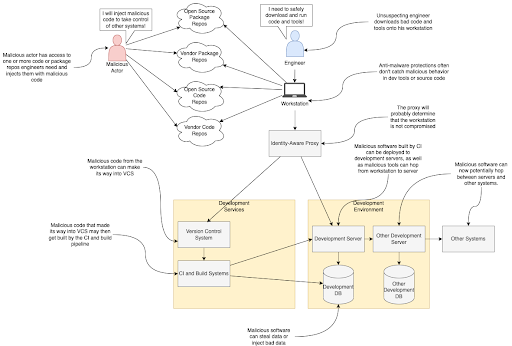
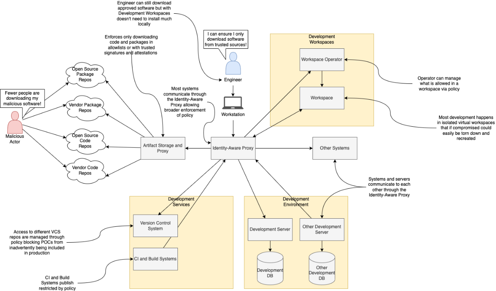
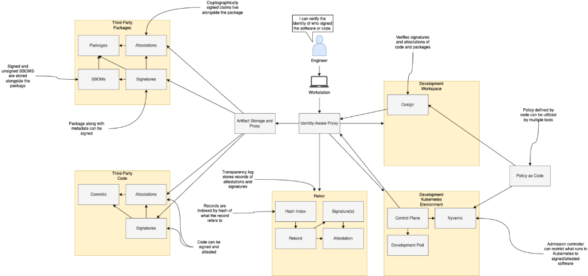
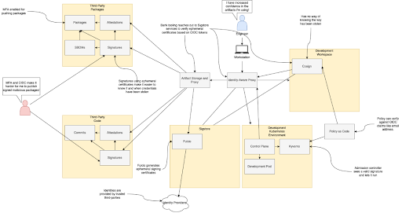
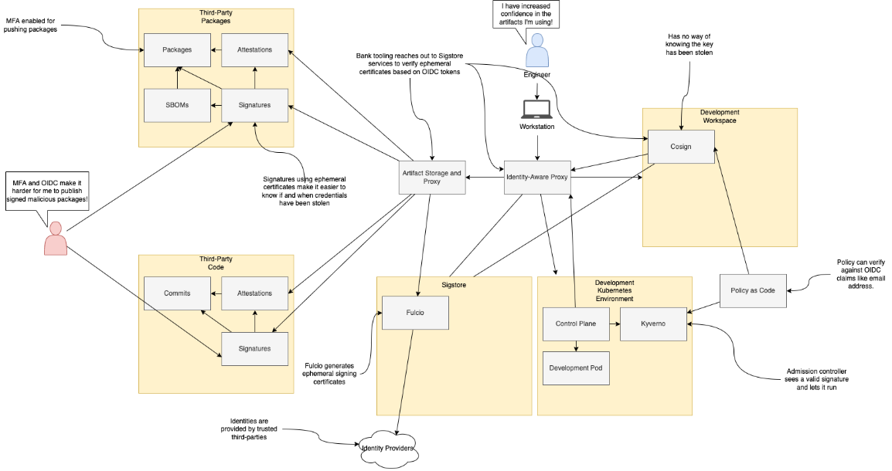

== Third-Party Risk: Protecting the SDLC

This chapter covers:

* Understanding how third-party dependencies make their way into the SDLC
* Learning how malicious actors attack open source and vendor software and exploit it
* Approaches to protecting systems from ingesting bad third-party dependencies

In the previous chapter, you learned how to protect some early tasks in an SDLC cycle by instituting policies that ensure security is prioritized and ensuring only approved devices can access internal systems involved in the SDLC whether they are development systems or project planning software.
You can now go a step further and look at what happens once you start to pull in third-party source code, artifacts, and other dependencies.

=== Overview

Third-party risk is one of the most common categories of risk when it comes to supply chain security.
As you saw already throughout previous examples, without applying Zero Trust to all aspects of your environment, an attacker who gets access through a compromise can leverage it to compromise other parts of your network.
This remains true for third-party code and packages, whether they are provided through open source projects or commercial vendors.
What can be done to prevent untrustworthy, malicious, or known vulnerable packages from being ingested into the network?
If a bad package is ingested, what can you do to minimize the impact, recover quickly, and have enough information to ensure you have recovered?

Protecting from this third-party risk is difficult as there are a few classes of attack and vulnerabilities:

* _Typosquatting._
One real-world supply chain attack involved publishing a Python package called “request” to PyPI, the primary Python package registry.
Attackers removed the s at the end of “requests” which led to unsuspecting software engineers, with a simple typo, to install and include a malicious package instead of the popular HTTP library named “requests”.
This type of attack is becoming increasingly frequent as it is very simple to fork an existing package, inject malicious code into it, and then publish it with a similar name to the original package.
Typosquatting attacks mostly affect open source software as vendor software typically comes from private package repositories that aren’t prone to this sort of attack.
* _Malicious or vulnerable update to existing package._
Existing trusted packages can have vulnerable code submitted to them.
This can be either inadvertent due to a mistake made by a developer or it could be due to a malicious actor with access to the code repo for the project purposefully injecting malicious code.
For example, there was a vulnerability in log4j that had existed for years.
No developer had done this on purpose, but the vulnerability was still there.
On the other end, the maintainer of the node-ipc NPM package went rogue and changed the code to have malicious behavior.
* _Spoofing._
Spoofing, in the context of third-party risk, is any attack that tricks a person or system into pulling down a package they believed to be from the right location.
This is different from typosquatting where the user has a typo and pulls down a bad package.
Spoofing can involve DNS spoofing where something like your maven manifest, or go.mod dependencies file points to real packages, but your network is tricked into pulling down packages from a fake repository.

Now that you know some of the categories for these third-party risks, you can start to protect against them.

=== Analysis Phase

Using your threat model for the planning phase in the previous chapter, you can look at what planning leads into: the analysis phase.
This phase of the SDLC is the one where you start to look more closely at the requirements of what you are building.
It is also often the first phase where engineers get hands-on-keyboard.
They start doing research to build out the requirements and explore proofs of concept (POCs.)
While conducting research and building the POCs, the engineers will consume other software.
If the software they consume is vulnerable or malicious, this could be an entry point to a supply chain security attack.
The devices engineers use to write code for their research and POC work will most likely be the devices they use to eventually write code for the production implementation of the system.

==== Understanding the Analysis Phase

Like in the planning phase, you need to also build an understanding of the analysis phase.
Since this diagram will look quite like the work in Chapter 3, we will instead focus on diving in deep to what a research task will look like as a system within the analysis phase.

There are a lot of systems involved in research and building POCs.
This example still uses the Identity-Aware Proxy to help you follow Zero Trust Architecture and practices.
However, let’s take a closer look at some of the other systems and environments:

* Package and code repos
** There are numerous open source and vendor based package repos as well as source code repos.
For packages, these include Maven repos, PyPI, NPM, APT, Choco, Homebrew, and many others depending on the language, OS distribution, and ecosystem choice.
For source code, this can include self-hosted repos for the project, or could include Software as a Service (SaaS) providers like GitHub and GitLab.
** There are going to be different levels of trust based on if it’s a trusted vendor or an open source project.
Even among different open source package projects, the bank will have varying levels of trust.
For example:
the bank will have more trust in a large, foundation-backed project with good security practices than a small project by a single pseudonymous developer.
* Workstation
** The workstation used during research and building POCs will be also used in other contexts like utilizing the Planning and Scheduling Software, writing the source code for the system later in the Implementation phase, etc.
** This workstation will consume libraries, frameworks, IDEs, and other external software and code.
* Development Services
** It is usually cost-prohibitive to have separate CI and Build Systems for the various stages of the SDLC, so most likely a single set of these systems will be available.
** Source code for the POC will live alongside the source code for systems in other phases of development.
** Often, some of the source code written during POC will be kept for use in later phases.
* Development Environment
** The environment is shared among multiple systems, projects, etc. at various stages in their SDLC.
** The servers inside the environment are connected to by both workstations and Development Services

Now that you have a better understanding of how engineers do research and build POCs, you can start to see where there might be vulnerable areas and what attacks might look like.

.Exercise 4.1
****
An authorized engineer works with the various systems to do their research and POC work.
Lawyers are also involved during the research phase determining areas of legal concern.
Which of the below are they most concerned with?

[loweralpha]
. Development server uptime
. Software licensing terms
. User password length
. CI pipeline cost
. Binaries stored in git
****

==== Identify Threats in the Analysis Phase

You now have a model for how an engineer does research and all the systems and components they interact with.
For the sake of this example, you can assume that all engineers — whether they are software, site reliability, security, or any other engineer — perform research similarly.
They download tools, libraries, and other dependencies to their local workstations.
They interact with various systems like VCS and the development environment.

Figure 4.1 looks like what many consider to be a common supply chain security attack.
You can see a malicious actor either writing bad code for something like an open source library or publishing a malicious package somewhere.
This then gets downloaded by an engineer to their workstation.
This compromises the workstation and can begin to potentially hop across security boundaries.
The engineer could then inadvertently push the malicious library code to the version control systems (VCS).
That code could get built by CI and build systems.
This could deploy that malicious software to the development environment.
Their compromised workstation could begin to copy over malicious tools or other software to systems and servers within the development environment.
Compromised systems and servers in the development environment could then hop security boundaries into other environments and systems if there aren’t adequate security controls.

.Figure 4.1. A threat against research and POC work. A malicious dependency could have a broad impact.

This shows why third-party attacks can be so nasty.
Something simple like downloading a package from NPM could lead to significant compromise of an organization’s IT systems.
It is also why these sorts of attacks can be hard to thwart.
This isn’t as simple as a singular attack against a singular system;
it’s an attack that, if you don’t utilize Zero Trust Architectures and models, you potentially leave yourself exposed to significant compromise. 

Legacy cybersecurity might look at things like firewall rules to prevent a system from being accessed by a malicious actor.
You can imagine this is the case with the online banking application.
You block off internal systems that don’t need to be accessed externally from the outside world or even other projects or systems within the organization.
However, something like a monitoring agent would get deployed to all components of the online banking application, not just public- or private-facing components.
It would cross your network security boundary, so you can’t trust that boundary to protect your assets, especially from this sort of attack.

Now let’s take a deeper dive into some important characteristics of the components involved in this attack to help you think through how you might defend your SDLC.
There are many key concerns highlighted below.
The most important one is how a compromised third-party dependency can be used to compromise and attack multiple systems and assets.
These attacks are hard to track down once they’ve happened.
Normal network controls won’t fix the problem.
Once a compromise is in your network perimeter it can be difficult to know what it has or hasn’t affected.

===== Open Source and Vendor Code and Package Repos

These external systems are not under the bank’s control.
You have no ability to enforce rules on these external systems directly.

In the case of open source code and package repositories, the public at large usually has access to publish packages.
There might be some controls in place for publishing to prevent known malicious actors from publishing or requirements like MFA to prevent impersonating another user and publishing packages under their identity.
Even though you don’t have control over the package manager, these open source code and package repos are able to be easily audited and monitored due to their open nature.

Vendor code and package repos have some key differences from their open source counterparts.
Packages and source code provided by vendors typically have fewer people involved in the systems connected.
In the open source world, you’re dealing with VCS systems like GitHub with over 100 million public reposfootnote:[https://towardsdatascience.com/githubs-path-to-128m-public-repositories-f6f656ab56b1] and package repos like NPM with over 1 million packagesfootnote:[https://snyk.io/blog/npm-passes-the-1-millionth-package-milestone-what-can-we-learn/].
In the vendor world, you’re dealing with a fraction of that in vendor-owned VCS systems and package repos. In the open source world, potentially any person out there could write code and even create multiple personas for themselves.
A vendor is, in most cases, only giving access to the code and package systems to employees, contractors, vendors, and customers.
There are thousands of actors involved instead of potentially millions or tens of millions.
Vendors also have a major financial incentive to protect themselves and their customers.

A malicious actor doesn’t need to have elevated permissions to compromise source code or a package repository.
They just need to get malicious code merged in by an authorized actor, whether that authorized actor is malicious or good.
For source code, that’s enough to now make that code vulnerable.
In the case of the package repo, if the source code for the software in the package is compromised, nothing else needs to be compromised — a build process would just build it regularly.

Linting and security steps in a build, audit, or other process might or might not catch vulnerabilities or attacks to these third-party code and packages.
Any given package or code repo most likely has dependencies that could have vulnerabilities as well.
It’s not enough to just look at the third-party code or package you’re downloading, but also the third-party code and packages that those direct dependencies rely on.

===== Engineer

Most engineers are just trying to do their job.
They want to do engineering and go home.
No good actor wants to purposefully compromise their workstation.
It is important to understand this as you build out controls that still enable engineers, not punish them for trying to do their job.

Putting too many restrictions on what engineers can and can’t do when downloading code and installing tools on their workstation to do their job can lead to them trying to work around controls and security measures.
They don’t intend to break the rules;
they just want to download that tool that helps them.
Often, they have the organization’s best interests at heart and see inefficient controls as hurting security and productivity not helping it.
This is often true.

Engineers, especially non-security engineers, often aren’t thinking about security 24/7.
They might understand some security in their domain, e.g. a software engineer focused on web applications like online banking might understand and have the muscle memory to look for and prevent SQL injection attacks, but they might be ignorant about how to protect their workstation from attack through malicious third party code and software.

One of the most common third-party supply chain attacks is what is referred to as typosquatting, described earlier in this chapter.
It is easy for an engineer to inadvertently mistype or otherwise not realize that they are not installing or downloading what they expect.
Training alone doesn’t fix this issue.
Engineers are people, and people make mistakes.

===== Workstation

Workstations can be locked down and only allow installation of software from specific allowlists, but this makes work inefficient and incentivizes engineers to work around it.
Alternatively, workstations can be left wide open as far as what’s allowed to be downloaded and installed and allow engineers to download whatever they need.
The downside is this allows for engineers to make mistakes and pull-down code or software that has been compromised.

Sometimes the third-party code and software is vulnerable due to oversight, not malicious actors.
The log4j remote execution vulnerability was not injected maliciously, but was a vulnerability that happened due to mistakes and inadequate controls.
A piece of software that uses a vulnerable version of log4j could expose a developer workstation to remote execution attacks.

===== Identity-Aware Proxy

The identity-aware proxy will work with its dependent systems to determine whether an engineer’s workstation should be allowed to access other systems within the bank network like the VCS or development servers.
In most cases, the proxy will not be able to know that the engineer downloaded anything malicious or vulnerable unless it violates some policy and makes their device non-compliant.

===== Version Control System

An engineer could push malicious code that they downloaded to the VCS.
It is a legitimate use case for an engineer to fork open source or vendor code and push it into a local, organization-run private repository.

Code that is pushed to the VCS could easily be used by other developers if there are not adequate access controls as well as repo classification controls.
Other Engineers could download this compromised code, thinking it’s legitimate code for use if they have access.

This code which should also only be used for research at this point.
If there are no adequate controls for classifying use, it is easy for code, regardless of whether it’s malicious or not, to be used in places and systems it’s not supposed to be.
For example, some vendor source code that is being explored by the bank for usage in the online banking application might be dropped but other engineers might use that code and potentially break licensing or use out of date and vulnerable code.

===== CI and Build Systems

It is common practice to use CI and build systems to build software when doing POCs and research. Malicious code that ends up being built by the CI and build systems has the potential to compromise those systems.
If the same systems are shared for both production build use cases as well as development and POC, a compromise of the systems being POC and research phases could have second-order consequences against builds intended for production environments.

===== Development Environment

Systems and servers within a development environment usually don’t have as rigorous controls as production systems and servers.
This makes them prime targets for crossing security boundaries.
If a development server is compromised for a POC for the online banking application, it can then be potentially leveraged to hop into other systems and servers in the development environment.

===== Other Systems

Without adequate zero trust practices employed in the development and delivery of your systems, third-party attacks can compromise more than just the original system.
The most serious risk is that a singular supply chain attack ends up compromising more than a single system and it becomes difficult to ever truly be sure you’ve fixed it.

.Exercise 4.2
****
In which of the following scenarios would normal network security controls like access control lists (ACLs), firewalls, etc. not be suitable?

[loweralpha]
. Compromised software without adequate system level controls
. User trying to cross network boundary
. System trying to make disallowed network connections
****

==== Determining Mitigations

You know how a simple download of third-party software even in a POC and research context can end up affecting an organization like the bank in ways that can be hard to track down and eliminate.
Let’s now look at what you can do to both prevent these attack as well as implement systems to better enforce policy and reduce blast radius — what is affected — in the event of an attack.

You now see what steps the bank can take to design and implement controls that help protect against third party dependency-based supply chain attacks and vulnerabilities.
Let’s go through the important systems and components, and any additions or changes that have been made to them to better mitigate the risks.
Let’s first list a few controls and then show how these controls are implemented across the various systems and components.

* Ensure only approved devices, including virtual devices like VMs, are allowed access to a system.
* Ensure software and systems development happens only on approved systems and in approved environments.
* Establish policies and standards around trust of third-party software and systems.
* Ensure devices follow policies and standards around trust when consuming third-party systems.

.Figure 4.2. Controls implemented across the IT environment to both enable secure research and POCs, as well as prevent vulnerabilities flowing downstream into other systems and environments.

This set of controls can then be implemented throughout the environment on the individual systems and components in the ways described below.
This design for how development happens across the various systems and environments is highly aspirational.
As we continue to explore securing the SDLC, we can look at the utopian vision of what might be achievable in the future while understanding what can be done today to prepare for achieving the longer-term goals. 

Given the state of tooling in the space today, it would take a lot of time and effort to build out all the features and functionality to enable this all.
Some tools exist that can help enable this, though their capabilities differ between them and might not hit all your requirements.
The table below gives a few examples.
Many are built to serve cloud native environments like Kubernetes and might not work or be suited for other sorts of environments like VMs.
This is a highly evolving space so some new tools or features for existing tools might be out already by the time you read this.

.Tools for implementing systems
[cols="1,1"]
|===
| System | Tools

| Identity-aware proxy
| Teleportfootnote:[https://goteleport.com/], Pomeriumfootnote:[https://www.pomerium.com/]

| Artifact storage and proxy
| Artifactoryfootnote:[https://jfrog.com/artifactory/], Sonatype Nexusfootnote:[https://www.sonatype.com/products/sonatype-nexus-oss]

| Policy
| Kyvernofootnote:[https://kyverno.io/], OPA Gatekeeperfootnote:[https://open-policy-agent.github.io/gatekeeper/website/]

| Development workspaces
| Eclipse Chefootnote:[https://eclipse.dev/che/], Visual Studio Code Remote Developmentfootnote:[https://code.visualstudio.com/docs/remote/remote-overview], Coderfootnote:[https://coder.com/]

| Signing and verifying
| Sigstorefootnote:[https://www.sigstore.dev/]

|===

===== Workstation

Software and systems development doesn’t always happen directly on a workstation anymore.
It happens in the development workspaces system.
This includes quick access to resources such as containers to run code, databases, web applications, etc.
For now, assume there are no requirements for specialized resources like mobile devices.

Workstations can still consume approved software like IDEs with remote development support.
This includes tools like Visual Studio Code (VS Code) with the Remote Development extension packs. Engineers would no longer download code or most development tools directly to their workstation.

===== Identity-Aware Proxy

All communication between systems and components goes through the identity-aware proxy where possible.
This means that any communication that doesn’t abide by policy would be blocked.

The policy extends through to downloading third-party code software through the artifact storage and proxy system.
This ensures only authorized systems like the development workspaces download various third-party code and software.
Different policies can be established at different levels, allowing closely monitored and isolated development workspaces to download less trusted code during the research phase compared to eventual production systems that will require due diligence to be performed and signed off.

The identity-aware proxy also allows you to audit every action that happens in your systems.
This makes it easier to trace in the event a vulnerability or attack is discovered.

===== Development Workspaces

This system is implemented to help mitigate the risk of running development on a workstation directly.
Workspaces are ephemeral, in other words:
not long-lasting.
They can be spun up and down as needed using VMs or containers.
Code and data can be persisted to Version Control Systems like Git and network storage.

In the case of malicious or vulnerable software making it to the development workspace, these workspaces would be isolated so that the software can’t connect to most other systems, lowering the blast radius.
A Development Workspace that is detected to have vulnerable software can be deleted and recreated using a container or VM image with non-vulnerable software.
This information could also prove valuable to flow back into the policies the various systems use to prevent future cases of that software being downloaded into a workspace or other component through the IT environment.

This restricts engineers to writing code remotely through remote development IDEs, or via web-based IDEs that connect to the VMs and containers.
The code and software never end up on their local machines to compromise them.
Development workspaces still can only download software that is allowed by policy.

===== Artifact Storage and Proxy

Proxying and storing third-party code and software helps you filter out known bad code and software, as well as help you record information about what software is coming into the IT environment.
The proxy, in conjunction with policy, can enforce that only software that matches various policies can make its way into the bank.

Common policies include verifying that the software is signed by trusted third-parties or containing attestations from trusted third parties.
Attestations are signed metadata, often in JSON format, with values that make a particular claim.
A common claim might be that the software was built a certain way, or that software includes no known vulnerabilities at the time it was built.
We will explore attestations in detail further on. // TODO Add xref

===== Development Services

Systems like VCS and CI/CD are not directly accessible through other systems.
They are accessed through the identity-aware proxy which prevents most components or systems, even if compromised, from accessing them directly.
Anomalous behavior could be prevented at a policy level.

Since policy for the VCS is now managed, you can begin to build policies about how the VCS is accessed, and what is allowed during normal operation.
This helps prevent cases where unvetted code can make its way on sensitive servers.

Since CI/CD and Build Systems are communicated through the identity-aware proxy, you can enforce policies for how jobs are submitted to the build systems.
You can also have increased confidence that policy prevents software built for POC purposes from making its way to sandboxed development environments.
The builds themselves could be sandboxed as well.
More on this later as we explore how to protect the SDLC. // TODO add xref?

===== Development Environment

The servers in the development environment also communicate through the identity-aware proxy.
This means you can better control access to individual systems and isolate POCs from everything else.

Software installation policy enforcement is established to ensure only attested software that also matches policy is allowed to be installed on servers.
This can be implemented both through policy and rules in access for the artifact proxy and storage system as well as the identity-aware proxy not giving access to routes storing unapproved software.

===== Other Systems

The identity-aware proxy will block access between systems like the development workspaces or development environment from hitting other systems, especially ones that might be a higher environment like production.
This can be implemented through simple tagging and enforcing that, for example, resources tagged as development can’t hit production without an approved exception.

.Exercise 4.3
****
Figure 4.2 shows designs for a more secure way to do software and systems development.
It uses development workspaces that are separate from the engineer’s workstation.
What benefit does this system have?

[loweralpha]
. Prevents network access to other systems
. Stop malicious software from being downloaded
. Compromised software never ends up on the workstation itself
****

=== Design Phase

The design phase is where the planning and analysis phases, along with the outcomes of other tasks, feed into creating the actual designs that you will implement.
A lot of key decisions for how a piece of software or a system might look when it’s ready to be consumed happen in this phase.
The bank might look at this phase as the one where they begin to make choices for what tools, libraries, and other packaged software or code to use for the project.
In the analysis phase, you saw how research and POC tasks happened.
Now you can take that knowledge and use it in the design phase to choose what makes sense for later use in the implementation phase.

==== Understanding the Design Phase

For the design phase, let’s take a closer look at how to refine the systems from the analysis phase, like the one in Figure 4.2 to enforce policy decisions about third-party dependencies.

Figure 4.3 is a level deeper than what you’ve seen so far.
You can now take a closer look at how bank engineers verify that the code and packages they are downloading are written by trusted identities.
You can validate that something was signed by a trusted identity by verifying the signatures through cryptographic material like keys and certificates.
You can also verify the signatures through keyless mechanisms which allow you to take OpenID Connect (OIDC) tokens like those you might get from GitHub or Google Cloud and use them with a root Certificate Authority like Fulcio that supports exchanging an OIDC token for a single use signing certificate.

.Figure 4.3. Engineer downloading packages and code while verifying signatures and attestations. This also shows the development environment enforcing policy through an admission controller.

If you have signed emails, code commits, or packages in the past, you have likely used GPG/PGP.
The GPG mechanisms for signing, though useful for the time they were made, require a ton of infrastructure for distribution of keys, among other issues.
There are newer approaches to signing that use public-private key pairs like GPG does.

[NOTE]
.A quick explanation of asymmetric cryptography
====
If you're not familiar with public-private key pair tools like GPG, they use what's known as _asymmetric cryptography_.footnote:[https://en.wikipedia.org/wiki/Public-key_cryptography]
In asymmetric cryptography, the sender uses a private key to sign a message.
Anyone can then use the public key to verify that the signature was created by the associated private key.
Alternatively, anyone can use the public key in a pair to encrypt data that only the holder of the private key can decrypt.
So long as the private key is well-guarded, this allows the secure exchange of information without having to share a secret.
====

For now, assume that third-party code and packages in examples have been signed through the Sigstore ecosystem.
This could be a build system that supports Sigstore’s signing mechanisms, or this could be command line tools like Cosign.
Let’s look at how an engineer can sign and then verify the signature on a container image stored in an Open Container Initiative (OCI) registry they have access to.
This assumes you have the Cosign tool installed on Linux, are using the bash shell, and have logged in to the container registry with `cosign login`.
All listings in this book use cosign version 2.4.1.

Listing 4.1 shows how to generate a key pair and sign an image.
It assumes you have already built an image and pushed it to a repository.
The ttl.shfootnote:[https://ttl.sh] service offers an anonymous registry that you can use for experimentation.

.Listing 4.1. Signing a container image with Cosign.
----
$ cosign generate-key-pair #A
Enter password for private key: fake_password #B
Enter password for private key again: fake_password
Private key written to cosign.key
Public key written to cosign.pub

$ cosign sign --key cosign.key example.com/fake/some_image@sha256:abc123 #C
Enter password for private key: fake_password
Pushing signature to: example.com/fake/some_image@sha256:abc123
#A Generates a private/public key pair. You can use a different signing secret
#B Replace with a password for your key
#C Signs the image with the supplied key. Replace example.com/fake/some_image@sha256:abc123 with a container image you have access to.
----

The signature you just made for the image lives alongside the image in the container repo.
This makes it easy for you to now go and verify the signature on that image.

.Listing 4.2. Verifying a container image signature with Cosign.
----
$ cosign verify --key cosign.pub example.com/fake/some_image@sha256:abc123 #A

Verification for example.com/fake/some_image@sha256:abc123 --
The following checks were performed on each of these signatures:
  - The cosign claims were validated #B
  - The signatures were verified against the specified public key #C

[{"critical":{"identity":{"docker-reference":"example.com/fake/some_image"},"image":{"docker-manifest-digest":"example.com/fake/some_image@sha256:abc123ddbbd8554117bac3ad638e6f665ece8f3ae041c7f4e3f463688c63552
"},"type":"cosign container image signature"},"optional":null}] #D
#A Note that we are using the public key to verify the signature
#B Cosign verifies the digest under docker-manifest digest matches the container image digest
#C Cosign verifies the signature was validated by the public key
#D Note your signature payload will look different depending on your image and key you use to sign it.
----

Verifying the Sigstore signature through cosign allows an engineer to confirm a few things:

* The signature is attached to the image it belongs to, instead of just a random signature.
* The signature was signed by the private key partner to the public key.

This is enormously valuable to the bank as it begins to institute better policy around third-party trust.
In Listing 4.1, you signed the image yourself.
In the case of third-party packages, the images would be signed by keys owned by the package maintainers, a build system, or other trusted third party.
The engineers at the bank don’t need to store the public keys for all the package maintainers as files in their development workspaces;
they can use a Key Management Service (KMS) like Hashicorp Vault or AWS KMS to store trusted public keys for signature verification. 

There are still challenges with using Cosign.
You still need to know what public key(s) can be used to verify the signature(s).
Depending on the signing mechanism, there are different ways to determine what key can verify the signature.
Some signatures, or signature envelopes, contain a hash or other identifier that can be used as a lookup for the public key.
This still requires you to have additional tooling to do that lookup if it isn’t already in a KMS you have access to.

Now that you understand the basics of signatures, you  can generate an attestation, or a signed set of claims about some sort of subject, usually an artifact like a package.
An attestation’s content is usually in a structured, text-based format like JSON.
The attestation is then signed and that signature, along with the attestation, is  wrapped up in an envelope.

As of the time of this writing, Cosign only supports storing signatures or attestations alongside a limited number of artifacts.
Cosign supports container images, NPM bundles, GitHub Artifact Attestations, and Homebrew bottles.
The project is working to expand support to other packages and ecosystems.
However, there is another supported storage mechanism that eases signature distribution:
storing the signatures in the Sigstore transparency log called Rekor.
A _transparency log_ is a tamper-evident data store that uses Merkle trees, a type of data structure used in things like Git and blockchains, to store data.
The log is append-only, with no functionality to modify the data.
If the data is modified through tampering, the log’s Merkle tree would no longer be consistent and therefore you would know where it was tampered.
Rekor is not intended to be the primary distribution mechanism but is useful for cases where you need non-repudiation of metadata.
For the bank, this would be useful if a build system generated metadata for an artifact and uploaded it to Rekor.
If that build system later generated new metadata for the artifact, it couldn’t deny it made the original metadata.

Now that you understand both how Cosign signs objects using keys and have an idea of what Rekor is useful for, let’s see how you can use Rekor, Cosign, and Fulcio to use OIDC to sign and verify code.
The Sigstore project produces a tool called Gitsignfootnote:[https://github.com/sigstore/gitsign] that ties these together for you.
Assuming you have Gitsign installed and configuredfootnote:[https://docs.sigstore.dev/cosign/signing/gitsign/#configuring-git-to-use-gitsign] you might sign your commits like in Listing 4.3.

.Listing 4.3. Signing a git commit with Gitsign.
----
$ git commit #A
Your browser will now be opened to:
https://oauth2.sigstore.dev/auth/auth?access_type=online&client_id=sigstore&code_challenge=... #B
[test-commit bf2b913] Test
 1 file changed, 0 insertions(+), 0 deletions(-)
 create mode 100644 foo
#A Gitsign overrides the default gpg.x509.program for git
#B By default, Gitsign uses the sigstore OIDC provider
----

Listing 4.3 shows how Gitsign is used by the engineer writing code.
The flow is:

. Git commit calls Gitsign application
. Gitsign sets up OIDC challenge with localhost redirect
. User is given link to Sigstore OIDC web challenge
. User logs into Google, GitHub, etc. identity provider
. Sigstore OIDC infrastructure responds back with the token to localhost
. Gitsign sends token over to Fulcio
. Fulcio generates x509 certificate based on OIDC token and hands back to Gitsign
. Gitsign generates signature for commit using x509 certificate
. Gitsign includes the signature and public certificate in the commit itself as well as uploads signature along with public certificate to Rekor transparency log.

Gitsign makes signing git commits simple and straightforward.
You don’t need to manage keys and can use your existing OIDC provider like GitHub or Google.
You now have signatures stored both in Git itself as well in Rekor, a tamper-evident log, that you can use to provide the identity — whether it’s a person or software — of the one that committed the code.
The signature that Gitsign created can now be validated against the Fulcio certificate based on the OIDC token associated with your identity as shown in Listing 4.4.
This still assumes that you’ve configured Gitsign to be the default signing software in Git.

.Listing 4.4. Verifying a git commit signature with Gitsign.
----
$ git verify-commit HEAD #A
tlog index: 3524277 #B
gitsign: Signature made using certificate ID 0xa8f11133dd172a69ecc2e66b4a1f6ac312b35aa5 | CN=sigstore-intermediate,O=sigstore.dev #C
gitsign: Good signature from [foo@bar.baz] #D
Validated Git signature: true
Validated Rekor entry: true
#A You can replace HEAD with any signed commit id.
#B This is the tamper-evident transaction log index
#C The certificate is stored alongside the commit and backed by Fulcio’s root certificate.
#D The signature is based on the user’s email from a supported OIDC provider
----

You have seen how to sign and verify signatures for both container images as well as Git commits.
This helps you associate identities with the code and artifacts you create.
Later sections will show how to establish a set of policies for what identities to trust and how much.
You can then automate that policy to help secure your end-to-end supply chain.

.Exercise 4.4
****
Which of the following is a valid takeaway from an artifact signature?

[loweralpha]
. The artifact has no vulnerabilities
. The artifact is associated with an identity
. The artifact dependencies can be determined
. The artifact has been created securely
****

==== Identify Threats in the Design Phase

You’ve begun to look at how to use signing as a way of cryptographically linking a person or system with some content, often an artifact.
Now let’s look at how creating and verifying signatures is not enough on its own.

.Figure 4.4. Identifying threats in signing and verifying signatures. Note that a signature seems to come from a trusted identity but either the cryptographic keys have been stolen or the trusted identity has become malicious.

Returning to Secure Bank, you can take a closer look at what is shown in Figure 4.4.
In the example, you see an engineer installing some software, presumably inside a developer workspace.
That packaged software is being checked for valid signatures, attestations, SBOMs, etc.
What happens when the cryptographic keys along with push access to package and code repositories have been stolen or an actor with access to the cryptographic keys and repositories has become malicious?
Here are some of the key systems involved in this threat.

* Third-party package and code Repos
** Credentials for access to the repositories can be stolen, often through phishing attacks.
** Cryptographic keys for signing packages and code stored in these repos can be stolen, often through other supply chain attacks.
** Trusted actors can go rogue and sign malicious software.
** Package and code repos, especially public ones like GitHub and NPM, often can’t easily determine if uploaded code is malicious in some way and should be removed.
Removal is often based on a manual reporting process.
** Many package managers have no way of ensuring that packages came from the source code they claim to be built from.
* Artifact storage and proxy
** Code and packages are still coming from legitimate sources with legitimate signatures though they are now compromised.
* Identity-Aware Proxy
** Identities associated with people and artifacts are still valid and passing policy checks, so nothing is blocked.
* Cosign
** Sigstore tooling will still be able to validate the signature and see it as a trusted signature
* Kyverno
** Admission controllers will also be able to validate signatures against policy and see nothing is wrong.

The core of the issues outlined above is that there is no reason for the bank to assume anything has gone wrong.
Software and metadata are still being signed by trusted keys associated with trusted actors.
This is similar to a component of the Solarwinds SUNBURST attack.
The compromised software was signed by Solarwinds’ key.
Now it’s time to figure out how to protect against this threat.

==== Determining Mitigations for Design Phase Attacks

You’ve looked at how to design a reasonable, but naïve, approach for secure ingestion of third-party source code and packages.
You looked at signing and verifying both artifacts and source code.
The bank example assumes folks have been signing artifacts using long-lived keys and verifying against those long-lived secrets.
This can be an issue:
a stolen key can be used to potentially sign anything that key is trusted to sign.
This means that if the bank trusts a vendor’s key to sign all software and attestations from that vendor, a stolen key means everything the vendor produces can be fraudulently signed.
The simple solution here is to figure out a way to both ensure that signing secrets have a shorter lifespan for signing as well as utilizing modern role-based (RBAC) and attribute-based access controls (ABAC) to minimize the blast radius of a successful attack.

.Figure 4.5. Determining mitigations against stolen keys by using short-lived certificates based on OIDC tokens.

The bank was originally building policies and systems that mapped long-lived keys to third-party identities.
This led to the following issues:

* A compromise of a single key means multiple things and potentially all things signed with that key are suspect.
* Upstream key rotation means policy also needs to take that into consideration which complicates how policies are written.

The above issues then lead to second order consequences like:

* It is common for third parties to not rotate keys as it’s difficult to update all systems using the key for signing and difficult to then distribute that key to all downstream users.
* It is common for major open source providers and vendors to reuse keys across multiple projects and within different pieces of a project.
It is also common for a provider to use the same key to sign software, SBOMs, attestations, and other metadata.

This further complicates things for consumers of software like the bank.
They want to do what is right and make sure they only trust software that comes from trusted third parties writing and building software following established standards.
We all know there’s no magic spell that will ensure that software has no exploitable vulnerabilities, but trusting the right parties following the right practices helps decrease the likelihood.

Figure 4.13 shows how the threats highlighted in your threat model can be mitigated.
Figure 4.13 assumes that third parties are using short-lived signing secrets backed by OIDC.
This means that third party engineers and systems are signing software by logging into a third party identity provider like GitHub, Google, or Microsoft. 
This is then used as the basis for a signing certificate that is only valid for a short amount of time, usually less than 20 minutes.
Even if a signing certificate is stolen, it would only be valid for a matter of minutes, making compromises much more difficult for the attacker.
The intricacies of how these certificates are generated along with the signed certificate timestamps (SCT) and the guarantees around them are described in more detail in the appendix.

Since these certificates are usually only valid for signing for a few minutes, it limits what an attacker could compromise.
The short lifespan also makes it easier to revoke a single certificate that was compromised rather than having to revoke a certificate that was used to sign an unknown number of things over its lifespan.
The bank can also stop trusting an entire OIDC identity by looking at the email or other metadata in the claims for the token.
You will also see in later sections of the book how those claims can be used to help us tie signatures to specific actions taken at specific times like builds being triggered by a pull request.
All of this metadata, if shared transparently, helps consumers better make decisions on what they trust.

Another thing that helps here is using tools that enable providers to easily create signed software and metadata using granular roles. A common provider for this is The Update Framework (TUF).footnote:[https://theupdateframework.io/]
TUF is a specification along with tooling that helps software providers generate roles with associated signing secrets and metadata for consumers to greatly simplify the generation, distribution, and consumption of keys and signatures.
You will learn more about TUF and how it can be used later in the book.
// TODO add xref

The mitigations described above help but don’t completely mitigate all the issues.
A lot of the above relies on the bank trusting Sigstore’s public services like Fulcio.
They also rely on the major identity providers like GitHub, Google, and Microsoft not being compromised.
These are major third-party services that have gone through scrutiny like certifications and audits to protect themselves and their customers.
This doesn’t guarantee they are secure, but it is simpler to trust a handful of secure third parties for most use cases.

There is still not an answer for someone who steals the credentials used to sign into the identity provider.
This can be potentially mitigated if the identity provider includes metadata about MFA usage and other security in the OIDC claims associated with the token.
Work is currently being done in this space, but support is varied among major identity providers.
Another thing that isn’t mitigated by this new design is when a trusted party goes rogue.
However, if a trusted party does go rogue, and the bank has a reasonable understanding of when it happened, they can build policy to include the time of when they should stop trusting software from that identity.
This mitigation also heavily relies on third parties, not bound by the rules, policies, and regulations of the bank.
If folks are not using OIDC backed, or other similar short-lived signing mechanisms, the bank can’t take advantage of it.
The bank has a lot of weight to throw around and can probably enforce a lot of these rules on vendors who want to sell software to banks.
It is impossible for them to directly enforce these patterns on open source software.
As you’ll see later on, the pressure from the community at large in wanting to secure supply chains — not just to protect the profit motives of massive enterprises, but to protect all of us from cyberattack — will help in encouraging major open source package providers, like NPM and PyPI, to enforce these and similar patterns.

=== Summary

* Common supply chain attacks come through software installed on workstations and other end points used by an end user.
* Zero trust needs to be applied to software and other artifacts to address supply chain security.
* Giving identities to everything like artifacts, devices, and approved users allows us to institute access policies only allowing certain users to access certain artifacts and certain artifacts to be installed on certain devices.
* Instituting granular access policies limits the blast radius of a successful attack or compromise.
* Signing things like artifacts and code allow us to easily associate identities with artifacts and establish chain of custody.
* Keys and other cryptographic material can be stolen so follow good practices on rotating keys, certificates, etc. while creating and validating short-lived signing secrets against trusted identities.

==== Answer Key

* Exercise 4.1 – A – Development server uptime
* Exercise 4.2 – C – System trying to make disallowed network connections
* Exercise 4.3 – B - Stop malicious software from being downloaded
* Exercise 4.4 – B - The artifact is associated with an identity

