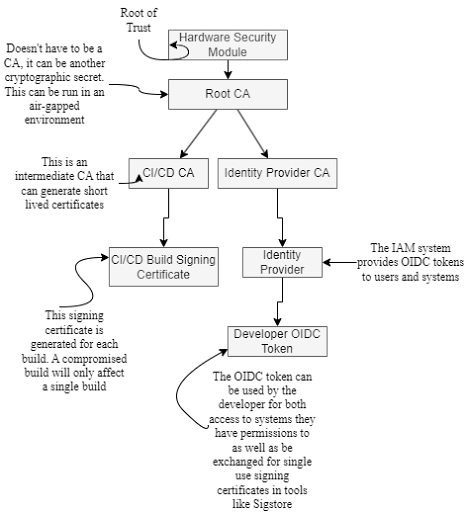
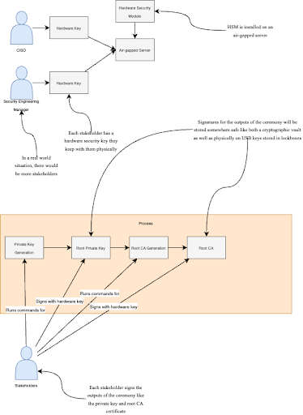

== Trust Foundation

This chapter covers:

* Determining who the key actors within your network are
* Defining the roles and responsibilities for the key actors
* Establishing a root of trust
* Delegating authority to the actors within your network
* Auditing your trust foundation
* Ensuring compliance with standards

Establishing a solid foundation for the trust in your IT environment is crucial to ensure the security and integrity of your software supply chain.
This chapter will focus on identifying key actors within your organization and establishing a root of trust through hardware keys, certificate management, and through processes run by critical stakeholders called root key signing ceremonies.
By implementing these practices, you can delegate authority safely for various actions, such as attesting to the output of builds and signing software bill of materials (SBOMs).
This ultimately promotes a secure and well-managed IT environment safer from supply chain compromise.

=== Overview

Let’s get to another day of work at Secure Bank, which previously had its software supply chain compromised.
This leads you to begin following the practices in the previous chapters.
You begin to threat model the various phases of our SDLC from planning through to maintenance.
You begin to design systems and processes that follow standards and best practices for securing the bank’s supply chain.
Where do you get started with actually implementing this more secure SDLC?

You start by establishing a root of trust!
A root of trust is a starting point for the security processes and mechanisms within the IT environment.
It serves as a basis for verifying the authenticity and integrity of various components in the system, such as software, hardware, or data.
It is the foundation from which all other trust within a system sprouts.
In a historical context this would be something like the seal of a monarch.
People could look at that seal and feel confident that a document with that seal was valid.
In the contemporary IT security context this is often a cryptographic certificate.
As you’ll learn, this root certificate can be based in hardware or software. 
This root certificate is then used to derive other certificates, keys, and cryptographic material that can be used for actions like authentication, encryption, and signing.

By establishing a new root of trust in the right way, the bank can better protect its environments from attack by ensuring the security processes and systems derive their authority from the root of trust.
This means there must be a chain of trust or a set of relationships between the root of trust and all the other processes, systems, and data.
If something appears within the network without a chain of trust that leads back to a root of trust, then something has gone very wrong.

Throughout this chapter, you’ll see how the bank can look at establishing new roots of trust and determine the roles and permissions that become the foundation for a new, more secure SDLC.
The bank might perform this in relation to an audit that determines their existing roots of trust are inadequate and prone to being compromised. This is found to be due to:

* Improperly secured root certificate authority (CA) private key
* Poor SDLC access controls potentially allowing attackers access to publish malicious packages to internal artifact repositories.

In Figure 7.1 you can see what the bank wants to achieve.
They want to establish trust in a root CA backed by a hardware root of trust that they can then use to create other certificates that can be utilized by other systems to delegate authority through various trust paths.
The bank can allow the team responsible for the CI and build systems to perform only the actions they’re supposed to.
The build systems can also connect identity through signing to the artifacts it produces through these same mechanisms.
This allows the bank to establish identities in the teams and systems utilized within the SDLC that can be utilized within the Identity and Access Management (IAM) systems within the bank.
This lowers the blast radius of any compromise into a piece of the SDLC while also making it easier to audit where a software artifact came from, also known as its provenance.

.Figure 7.1. Chains of trust from an established root of trust for the bank.

=== Establishing Roots of Trust

Now that you know how the bank wants to structure its trust paths, let’s explore how you can perform these operations.
You need to start by establishing roots of trust securely within the bank.
These are the cryptographic materials that would always be trusted within the environment.
Choosing and securing roots of trust are critical, because if you utilize a weak or improperly secured key or set of keys that are your roots of trust it leads to all the trust paths that come out of that root of trust to be potentially compromised.
This is an extraordinarily expensive operation that would require starting from nothing again and re-establishing trust with new roots of trust and generating all new keys and certificates for everything down the trust paths.

==== Key Signing Ceremonies

Key signing ceremonies (also called key signing parties) are important operations that involve security stakeholders gathering, often in person, to cryptographically sign for some purpose, in this case various bootstrapping elements for the SDLC.
There are multiple ways to perform this but let’s look at how it might be done for the bank.
The bank has discovered that its SDLC is inadequate and needs to redo its security infrastructure. 
his involves regenerating things like certificate authorities (CA), root certificates, private keys, and other things utilized in the security bootstrapping processes. It is expected that:

* The key signing ceremony happens in a secure physical location on secure air-gapped computers.
Air-gapped means that the computers have no access to the bank’s general networks and are kept on a network with other secure computers with absolutely no access to the internet.
* Important stakeholders for the bank like the CISO, principal security engineers, and other security personnel come together to perform and oversee the key signing ceremony.

In real world scenarios it’s also recommended to utilize hardware roots of trust like hardware security modules (HSMs) or hardware keys like Yubikeys.
These hardware-based devices are more secure because their security is baked into the hardware itself, unlike software which can be easier to compromise.
Important reasons for the bank to use a hardware key over software key would be:

* Physically tamper-resistant.
You would need to be able to physically access the hardware in order to get access to the cryptographic key.
* Isolated from software.
When using hardware keys to do signing the keys never make their way into memory with the hardware keys remaining in their devices and software only being able to request that the hardware perform the signing operation within that hardware.

This chapter will focus on software keys, as not everyone has access to hardware keys and there are differences between how you use the various hardware keys and hardware security modules.
In a real-world scenario, you should use keys rooted in hardware.

Listing 7.1 shows how to generate the root CA for the bank.
There are a lot of different flags that can be used based on the needs of the person generating the CA, however the set included is a standard baseline.
This creates an RSA 4096-bit root CA private key.
Longer keys are more computationally expensive but also more secure.
The cybersecurity community is debating an adequate bit-length for the root CA private key, the two most common ones being 2048 and 4096.
Anything less than that is not recommended.

Listing 7.1 also shows you generating the root certificate for the root CA.
You run an OpenSSL certificate request command that has OpenSSL generate a new x509 certificate utilizing the rootCA private key you created in the previous command.
Since this is a root certificate for a rootCA, it is common to have long expirations, in this case 10 years.
This provides ample time for the bank to be prepared when it does expire.
There are many flags that can be utilized with this command so read through the OpenSSL man pagefootnote:[https://docs.openssl.org/master/man1/openssl/] or other documentation if you want to know more information or have specific requirements.

.Listing 7.1. Creating a CA and root certificate using OpenSSL.
----
$ openssl genrsa -out rootCA.key 4096 #A
$ openssl req -x509 -new -nodes -key rootCA.key -sha256 -days 3650 -out rootCA.crt #B
You are about to be asked to enter information that will be incorporated
into your certificate request.
What you are about to enter is what is called a Distinguished Name or a DN.
There are quite a few fields but you can leave some blank
For some fields there will be a default value,
If you enter '.', the field will be left blank.
-----
Country Name (2 letter code) []:US #C
State or Province Name (full name) []:New York #C
Locality Name (eg, city) []:New York #C
Organization Name (eg, company) []:Secure Bank #C
Organizational Unit Name (eg, section) []:SDLC #C
Common Name (eg, fully qualified host name) []:securebank.example.com #C
Email Address []:admin@securebank.example.com #C
#A this generates the private key for the root CA
#B this generates the root CA’s certificate and sets its expiration to 10 years
#C when generating the root CA certificate, it will prompt you for details about the purpose of the certificate
----

Generating the root CA private key and root certificate for the root CA is not enough to establish the trust.
Since anyone could run these commands from anywhere, you need to have a way to ensure that these commands were run safely and securely under the close monitoring by key security stakeholders.
This is where the key signing ceremony itself comes in.

In order to ensure that the root CA private key and root certificate can be trusted, you need to ensure the process — from generation through to storage — was performed and overseen by trustworthy security stakeholders.
The actions performed in Listing 7.1 must be run on an air-gapped computer with only the software needed to perform certificate generation, signing, and other cryptographic operations.
These actions would be performed by a principal security engineer while other key security stakeholders look over their shoulder to ensure they’re performing the correct operations to generate the root CA private key and root certificate.

Once the key and certificate generation operations have been performed, the stakeholders need to sign off on these materials to prove that they were there during the generation process and approved of the output.
Figure 7.2 shows the process graphically.

.Figure 7.2. Security stakeholders overseeing the root CA process, then signing off on the outputs of that process and finally storing these outputs securely.

Listing 7.2 utilizes software keys for signing.
This isn’t nearly as secure as hardware keys but is useful for the example.
Cosign supports various hardware backed mechanisms for signing.
Those should be used when running a real key signing ceremony.
By signing the root CA key and root certificate, you are establishing that these stakeholders oversaw and approved the generation of the key and certificate artifacts.
In the future, you might want to use Rekor to store proof that the signing happened, but since this key signing ceremony happens in a simplified air-gapped environment, you can just save the signatures to files.

.Listing 7.2. Signing the root CA key and root certificate using Sigstore Cosign.
----
$ cosign sign-blob --key principal.key --tlog-upload=false rootCA.key > rootCA_key_principal.sig #A
$ cosign sign-blob --key ciso.key --tlog-upload=false rootCA.key > rootCA_key_ciso.sig #B
$ cosign sign-blob --key manager.key --tlog-upload=false rootCA.key > rootCA_key_manager.sig #C
$ cosign sign-blob --key principal.key --tlog-upload=false rootCA.crt > rootCA_crt_principal.sig
$ cosign sign-blob --key manager.key --tlog-upload=false rootCA.crt > rootCA_crt_ciso.sig
$ cosign sign-blob --key manager.key --tlog-upload=false rootCA.crt > rootCA_crt_manager.sig
#A this signs the rootCA key with the keys from the stakeholders
#B the .sig files are proof that the person who owns the key saw the root CA and signed off on it
#C –tlog-upload=false writes the signature to stdout instead of uploading it to the Rekor transparency log.
----

Now that you have these signatures, you need to store those signatures securely for future audit purposes.
You also want to distribute these signatures to other parties, like bank stakeholders who didn’t participate in the key signing ceremony.
These other stakeholders could then verify that well-known bank security personnel were the ones who generated the root certificate and not a malicious actor who had compromised the public key infrastructure (PKI).
You would never distribute the root CA’s private key since it’s private.
However, when downstream consumers of bank certificates want to verify the root certificate, they can verify that the root certificate was in fact signed by valid stakeholders of the bank as in Listing 7.3.

.Listing 7.3. Verifying the signatures on the root certificate using Sigstore Cosign.
----
$ cosign verify-blob --key principal.pub --signature rootCA_crt_principal.sig --insecure-ignore-tlog rootCA.crt #A
$ cosign verify-blob --key manager.pub --signature rootCA_crt_ciso.sig --insecure-ignore-tlog rootCA.crt #B
$ cosign verify-blob --key manager.pub --signature rootCA_crt_manager.sig --insecure-ignore-tlog rootCA.crt #C
#A we verify the signature on the blob by looking at the .sig file we generated when signing
#B take note that we are verifying against the .pub public key and we never distribute the private key
#C this would be insecure when running outside of a key signing ceremony 
----

Using the `--insecure-ignore-tlog` flag might scare you at first.
In most cases, signing without the Rekor transparency log is less secure, however there is a bootstrapping problem here.
You don’t have a Rekor that you trust yet because you’re bootstrapping your trust.
You are mitigating some of the security concerns by running this key signing ceremony as an in-person process in a physically-secured and air-gapped environment.

When looking at how this end-to-end key signing ceremony might work in the real world, there’s a bunch of things to consider:

* Number of participants in the ceremony
* Responsibilities for the participants
* Independent audit

You want to ensure there are enough participants in the ceremony and enough separation of responsibilities among the participants that it would require a conspiracy among several members in order to compromise this process.
You also want to ensure that someone external to the organization can audit your key signing ceremony process.
This gives peace of mind to the bank that they have developed a safe and secure process for establishing trust as well as enabling downstream consumers of bank systems and services, like banking customers, to be confident that the bank is doing the right things to keep them safe.

.Exercise 7.1
****
Which of the following is an essential component of a key signing ceremony for generating a root certificate?

[loweralpha]
.	Using a public Wi-Fi network 
.	Generating the root certificate with OpenSSL 
.	Having the ceremony in an open office environment 
.	Distributing the root CA private key to all participants 
.	Ignoring the need for independent audits
****

==== Providing Secure Updates with TUF

The Update Framework (TUF)footnote:[https://theupdateframework.io/] is a Cloud Native Computing Foundation (CNCF) project used to help secure the software supply chain.
TUF is a security framework designed to provide a secure and resilient method for distributing software updates.
TUF can be used to establish a set of keys along with metadata that the bank uses to inform downstream consumers about software updates.
The keys are associated with roles and those roles perform different functions.
For example, roles can be responsible for signing metadata about the artifacts and packages that get updated in a new release.

The bank will utilize the go-tuf library and CLI tool to create and manage its TUF implementation.
This can be installed through various package managers or through utilizing the go install command to install the latest version.
See the repofootnote:[https://github.com/theupdateframework/go-tuf] for more information.

Listing 7.4 shows a basic TUF repo.
It is a bit oversimplified.
In a real world scenario, the commands regarding the root role would be run on a secured computer, like an air-gapped machine.
Similar to actions you performed in the key signing ceremony, this protects the root keys from being compromised.
If the other roles get compromised, it’s still bad but you would just need to revoke the keys that were compromised and generate new ones.
If the root is compromised you would need to revoke and regenerate the root.
This can be mitigated by generating multiple root keys on other servers.
This could then be used to enforce root actions to require some number, but not all root keys.
This is often referred to as m-of-n, where m refers to some number less than the max.
For example, you can require 3 out of 5 keys to sign off on actions performed by the root.
This means it would take 3 root keys to be compromised before an attacker could impersonate the root.

.Listing 7.4. Creating an initial configuration of a TUF repo.
----
$ mkdir tuf-example
$ cd tuf-example
$ tuf init #A
$ tuf gen-key root #B
$ tuf gen-key targets #B
$ tuf gen-key snapshot #B
$ tuf gen-key timestamp #B
$ tuf sign root.json #C
#A this initializes the TUF repository creating directories and files required
#B this generates the 4 primary role keys for TUF
#C once you’ve generated your root metadata you sign it with the root key(s)
----

There are multiple attacks that the bank is worried about, that we’ve explored throughout the book thus far, that TUF helps prevent.
The core set of supply chain attacks are prevented through the 4 primary roles:

* Root.
This role is responsible for maintaining the root metadata.
It maintains the list of keys assigned to the other roles.
* Targets.
This role is responsible for maintaining the metadata for the files and artifacts you are updating.
This includes information like file hashes and version numbers.
* Snapshot.
This role is responsible for providing a consistent view into the TUF repo at a point in time.
It ensures that clients get a list of all TUF targets related to a particular version.
* Timestamp.
This role is responsible for ensuring that metadata is periodically resigned and refreshed so clients know whether or not an update hasn’t occurred or if the TUF process isn’t working.

These roles combined help protect against various attacks the bank is worried about.
They don’t need to worry so much about a single root key being stolen by an attacker because they can generate multiple TUF root keys across multiple isolated secured environments.
They don’t need to be worried about an attacker trying to convince consumers to download an older, known vulnerable version of the targets specified in the repo since the timestamp role would have generated new metadata pointing to a newer snapshot.

Listing 7.5 shows a very simple example of how a TUF repo is used to generate a new release of some artifacts, most often software.
In a real-world example, you’d have a compiled piece of bank software that gets staged in a network-accessible location instead of a file with just “hello world” in it.
The step-by-step flow would look like:

. A machine with the _targets_ role key adds the artifacts to the targets metadata and signs it.
If an attacker attempts to add files to a release without adding it to targets it would be caught.
. A machine with the _snapshot_ role key looks at the targets and any other roles’ metadata and adds it to the snapshot metadata and signs it.
If an attacker attempts to include different versions’ metadata to include older vulnerable targets in a new release, it would be caught.
. A machine with the _timestamp_ role key looks at the snapshot metadata frequently and creates metadata with the snapshot’s size and hash with a short expiration time.
If a consumer of the TUF metadata sees expired data they know that something has been compromised or isn’t working correctly.

.Listing 7.5. Utilizing the TUF repo.
----
$ cd tuf-example
$ echo "hello world" > staged/targets/hello #A
$ tuf add hello #B
$ tuf snapshot #C
$ tuf timestamp #D
$ tuf commit #E
#A this stages a file to be included into the other metadata
#B this adds the hello file to the targets
#C this stages the metadata showing the file that was added
#D this stages the timestamp metadata
#E verifies that all the signed metadata is there and accurate
----

Now that you’ve generated the metadata, you need to distribute that metadata to the users of the bank’s software.

TUF can do a lot more than what is described here, and it’s worthwhile to take the time to read through the documentation.
There are other features like delegations that would allow the bank to provide granular access to different personnel and systems to perform software supply chain actions without needing to share keys
As you know, key sharing introduces the risk of those keys being compromised.
It is a powerful framework utilized in high-security applications like over-the-air software updates for cars through an extension of TUF called Uptane.

.Exercise 7.2
****
Which of the following are the primary roles for TUF?

[loweralpha]
. Root – Maintains root metadata; Targets – Manages file metadata; Snapshot – Ensures consistent repository view; Timestamp – Ensures metadata freshness
. Root – Signs target files; Targets – Manages root metadata; Snapshot – Ensures metadata freshness; Timestamp – Ensures consistent repository view
. Root – Manages file metadata; Targets – Ensures consistent repository view; Snapshot – Ensures metadata freshness; Timestamp – Maintains root metadata
. Root – Ensures metadata freshness; Targets – Maintains root metadata; Snapshot – Manages file metadata; Timestamp – Ensures consistent repository view
****

=== Codifying the SDLC with in-toto

Like TUF, in-totofootnote:[https://in-toto.io/] is a CNCF project for supply chain security.
While TUF is a framework for distributing software updates, in-toto provides a framework for providing a set of rules for the steps within your software supply chain.
in-toto layouts should not be confused with in-toto attestations which are part of the same overall project but serve a separate purpose from layouts.

inn-toto layouts define the steps and the expected outcomes in the supply chain, effectively describing the workflow that must be followed to build, test, and deploy software.
It specifies what actors — called “functionaries” in in-toto — are allowed to perform what actions against what inputs.
This gives the bank a powerful set of rules by which they enforce that the core steps of the SDLC like writing code, building software, and publishing packages happens only on approved systems.

There are multiple implementations of the in-toto specification with varying feature sets and compliance with different parts of the spec.
Keep this in mind when choosing which one to use.
As of the writing of this book, the most popular are in-toto Pythonfootnote:[https://github.com/in-toto/in-toto] and in-toto Golang.footnote:[https://github.com/in-toto/in-toto-golang]
Both can be used for generating the metadata that describes the workflow you want to secure, known as layouts, as well as running the steps associated in those layouts. The examples will look at the JSON representation of those layouts for and use the Python-based command-line tool.

Listing 7.6 shows a simple example in-toto layout.
This layout shows a supply chain flow that consists of using Git to pull down some code and then turning it into a tarball.
The layout also describes who is allowed to perform what commands in the layout.

.Listing 7.6. In-toto layout for a simple project.
----
{
    "_type": "layout",
    "expires": "2023-06-20T15:15:24Z", #A
    "inspect": [
      {
        "_type": "inspection", #B
        "expected_materials": [
          ["MATCH", "test_project.tar.gz", "WITH", "PRODUCTS", "FROM", "package"], #C
          ["DISALLOW","*"]
        ],
        "expected_products": [
          ["MATCH", "test_project/output.file", "WITH", "PRODUCTS", "FROM", "update-version"],
          ["ALLOW", "test_project.tar.gz"],
          ["DISALLOW", "*"]
        ],
        "name": "untar",
        "run": ["tar", "xzf", "test_project.tar.gz"] #D
      }
    ],
    "keys": {
      "2f89b9272acfc8f4a0a0f094d789fdb0ba798b0fe41f2f5f417c12f0085ff498": {
        "keyid": "2f89b9272acfc8f4a0a0f094d789fdb0ba798b0fe41f2f5f417c12f0085ff498", #E
        "keyid_hash_algorithms": ["sha256", "sha512"],
        "keytype": "rsa",
        "keyval": {
          "private": "",
          "public": "<key>"
        },
        "scheme": "rsassa-pss-sha256"
      },
      "776a00e29f3559e0141b3b096f696abc6cfb0c657ab40f441132b345b08453f5": {
        "keyid": "776a00e29f3559e0141b3b096f696abc6cfb0c657ab40f441132b345b08453f5",
        "keyid_hash_algorithms": ["sha256", "sha512"],
        "keytype": "rsa",
        "keyval": {
          "private": "",
          "public": "<key>"
        },
        "scheme": "rsassa-pss-sha256"
      }
    },
    "readme": "",
    "steps": [
      {
        "_type": "step", #F
        "expected_command": ["git", "clone", "https://git/test_project.git"],
        "expected_materials": [],
        "expected_products": [ #G
          ["CREATE", "test_project/output.file"], 
          ["DISALLOW", "*"]
        ],
        "name": "clone",
        "pubkeys": [
          "776a00e29f3559e0141b3b096f696abc6cfb0c657ab40f441132b345b08453f5"
        ],
        "threshold": 1
      },
      {
        "_type": "step",
        "expected_command": [],
        "expected_materials": [
          ["MATCH", "test_project/*", "WITH", "PRODUCTS", "FROM", "clone"],
          ["DISALLOW", "*"]
        ],
        "expected_products": [
          ["MODIFY", "test_project/output.file"],
          ["DISALLOW", "*"]
        ],
        "name": "update-version",
        "pubkeys": [
          "776a00e29f3559e0141b3b096f696abc6cfb0c657ab40f441132b345b08453f5"
        ],
        "threshold": 1
      },
      {
        "_type": "step",
        "expected_command": ["tar", "--exclude", ".git", "-zcvf", "test_project.tar.gz", "test_project"], #H
        "expected_materials": [
          ["MATCH", "test_project/*", "WITH", "PRODUCTS", "FROM", "update-version"],
          ["DISALLOW", "*"]
        ],
        "expected_products": [
          ["CREATE", "test_project.tar.gz"],
          ["DISALLOW", "*"]
        ],
        "name": "package",
        "pubkeys": [
          "2f89b9272acfc8f4a0a0f094d789fdb0ba798b0fe41f2f5f417c12f0085ff498" #I
        ],
        "threshold": 1
      }
    ]
  }
#A the expires field is how long the layout is valid for
#B the inspection section lists rules around validating the output of a software supply chain flow
#C in-toto consists of match rules that expect inputs to match the outputs of other steps
#D inspections can consist of arbitrary commands that help with validation
#E in-toto expects different keys associated with different identities to be permissioned to perform software supply chain activities
#F in-toto steps are a key features that usually list a set of expected inputs, outputs, and commands for a given software supply chain flow.
#G expected_products are intended to be files that are allowed to be created or modified by a given step
#H expected_command is the command that is intended to be run in a step
#I pubkeys are the key ids of the identities allowed to perform a given step
----

Let’s take a closer look at the key elements in Listing 7.6:

* Owner: the identity associated with a key that signs the in-toto layout and who end users would validate against to ensure that the layout is valid and comes from an approved party.
* Functionaries: the name of the approved identities that are allowed to perform commands to satisfy an in-toto layout.
These functionaries are identified by their public keys.
* Expected Commands: the commands the layout expects an approved functionary to run for a step in the layout.
* Expected Materials: the rules for inputs used by an expected command in a step in the layout.
* Expected Products: the rules for outputs that are generated by an expected command in a step in the layout.
* Inspection: additional steps the end user consuming the in-toto output can take to verify elements of the supply chain.

In Listing 7.6, the owner would generate the layout, sign it, and distribute it.
The functionaries would perform the actions using in-toto tooling which generates metadata about input files input, what commands were run, and what files were output.
This is called link metadata.
Finally, when a user is consuming the final artifact generated as part of a supply chain flow, they would run commands to both validate that the link metadata conforms to the layout as well as run any validation commands that can be used as well.

This trivial example shows how the bank could then turn this into a much more realistic supply chain flow describing the process from source code to build, to packaging and eventually to deployment.
The bank could then setup functionaries for all the systems and actors involved from the developers writing the source code, to the individual build steps pulling down the code, compiling it, testing it, scanning it, packaging it, and publishing it to the artifact repo.
Finally, the deployment processes and systems could verify that the artifact has gone through all the right steps, in the right order, and performed by the right systems and actors.

==== Using an in-toto Layout

TUF and in-toto are two forward-thinking frameworks in helping secure the software supply chain.
Along with many of the tools, frameworks, best practices, etc. you’ve seen thus far on their own they help a bit.
When these tools are used together, they help secure the supply chain more completely.
The bank might use in-toto but be worried about how it can distribute the layouts and changes to the layouts securely.
What happens if the layout is compromised?
This is where TUF can help by setting up a system for securely providing updates to the layouts and ensuring downstream verifiers of the layouts ensure that only TUF validated updates to the layouts are consumed.
Conversely, TUF can be used to indicate to downstream systems that an update to software is ready.

=== Securing Trust Foundations with AI and for AI

As artificial intelligence becomes increasingly integral to software systems, it's crucial to consider how to secure the foundations of AI supply chains and how AI can enhance the security of traditional software supply chains.
As the bank continues to modernize its systems, it begins to incorporate AI into various aspects of its operations
Here's how the bank might apply the practices described throughout the chapter to securing the AI supply chain and leveraging AI to help secure their own supply chain.

==== Establishing Roots of Trust for AI Models

There is not any practical difference in generating the roots of trust of your SDLC as for your AI.
As a reminder, AI is software and should be treated like software.
The bank should ensure they have a root of trust for how they’ve built and ingested their AI to ensure they’re signing the models along with any attestations with trustworthy keys.
This helps with:

* AI Model Provenance.
The bank develops an AI model for fraud detection.
They want to ensure they have signed the provenance for how they trained that AI with keys with a secure root of trust.
* Training Data Integrity.
The bank looks to layoff its customer service team and replace them with a chatbot that doesn’t make the bank look bad.
They need to ensure that they are trained with good data, otherwise the AI could respond to a customer in an inappropriate way.
The bank would sign attestations after checking the datasets for any inappropriate content that come from the secure root of trust for the bank.

==== Applying TUF and in-toto for AI Systems

The bank would look to use frameworks like TUF and in-toto to enforce safe and secure AI system updates as well as enforce that various security steps were performed on a model before it gets deployed.

* TUF setup for AI
** The root role is managed by the bank's top-level security team.
** The targets role is assigned to the AI/ML team lead.
** The snapshot and timestamp roles are automated and run on separate, secured servers like any other TUF setup.
* In-toto setup for AI
** The bank defines an in-toto layout that covers data collection, preprocessing, model training, validation, and deployment.
** Each step in the pipeline is verified and logged, creating an auditable trail of the model's development and deployment.

.Exercise 7.3
****
Which of the following statements about using AI in securing trust foundations is correct, according to the bank's approach?

[loweralpha]
. AI can be used to make final decisions about trust foundation security without human oversight.
. The bank uses AI to replace human auditors entirely in verifying chains of trust.
. AI is currently unsuitable high security applications like establishing roots of trust without supervision.
. The bank's AI systems for key management operate independently of human security personnel.
****

=== Summary

* Choosing a secure root of trust is one of the most critical pieces of building the foundation to securing your SDLC.
* Every project and every organization’s risk tolerance will be different, so how you build your trust foundation will depend on how much time and resources you plan to spend building it out.
* Use a hardware root of trust in an air-gapped environment and conduct a key signing ceremony with key stakeholders for the project or organization.
* Offline secrets, like root certificate authorities, are among the most important secrets to protect, because most other secrets are derived from them so a compromise of an offline secret can often require revoking and regenerating all other secrets.
* Using hardware roots of trust make it extremely difficult if not impossible for an attacker to compromise cryptographic keys without physically stealing the hardware devices they are associated with.
* Delegating trust is important in ensuring that the keys used for signing the output of the steps in your SDLC are secured as well as controlling access to systems for running those steps.
* It is important to have automated systems for updates to your trust foundation to ensure that if cryptographic keys are rotated or revoked systems become aware of it. This can be done through tools like The Update Framework (TUF)
* It is useful to outline your SDLC process as code along with what roles should be allowed to perform the steps in your SDLC. This allows you to then automatically enforce rules against your SDLC. This can be done through tools like in-toto.
* When codifying the SDLC it is important to enforce granular permissions and delegations so that the blast radius of a compromise is minimized.

==== Answer Key

* Exercise 7.1 – B - Generating the root certificate with OpenSSL
* Exercise 7.2. – A - Root – Maintains root metadata; Targets – Manages file metadata; Snapshot – Ensures consistent repository view; Timestamp – Ensures metadata freshness
* Exercise 7.3 - C - AI is currently unsuitable high security applications like establishing roots of trust without supervision.
